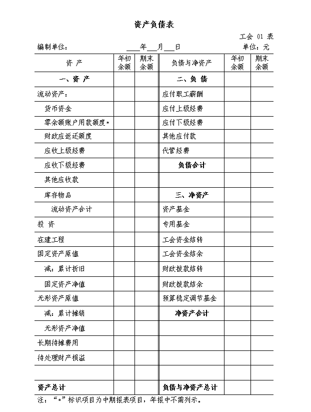
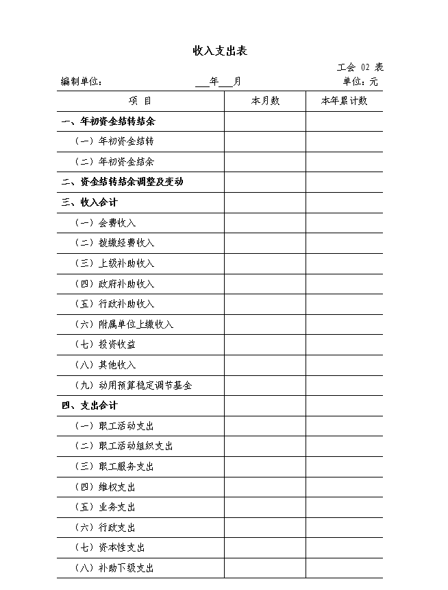
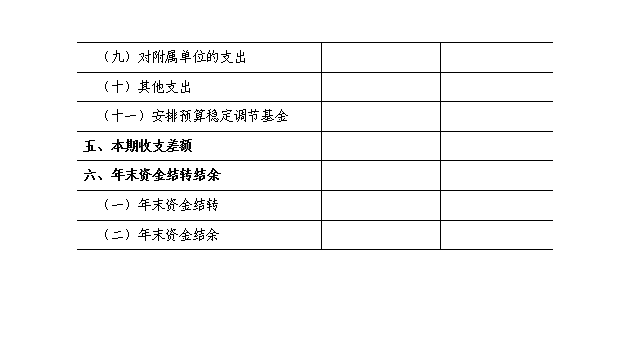
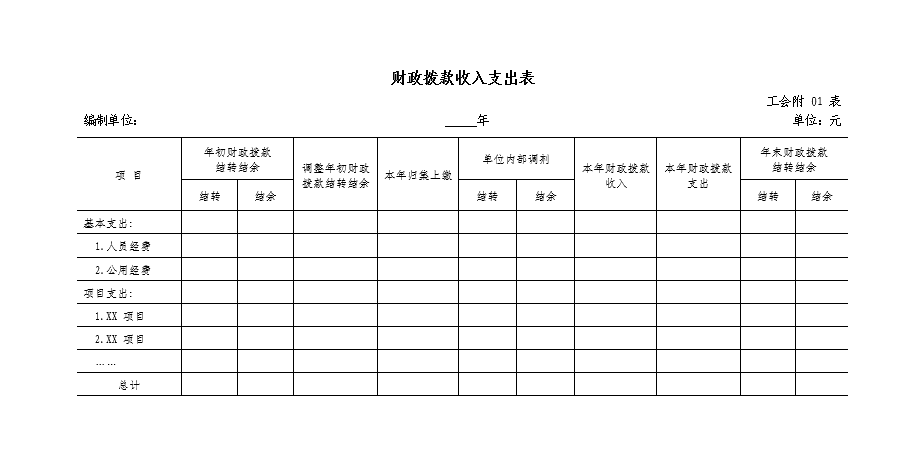
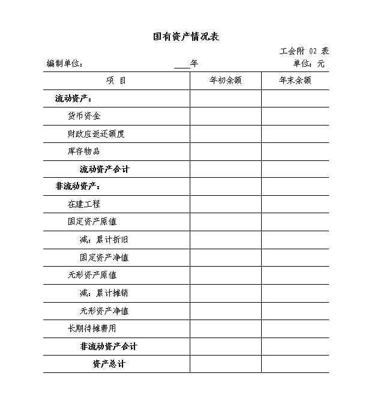
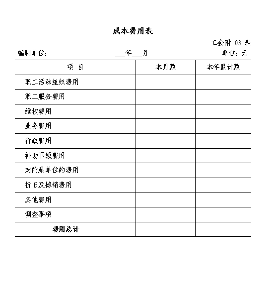

# 工会会计制度（2021）

> **关于印发《工会会计制度》的通知**
>
> **财会〔2021〕7号**
>
> 中华全国总工会，各省、自治区、直辖市、计划单列市财政厅（局），新疆生产建设兵团财政局：
>
> ​    为了适应工会组织财务改革的需要，进一步规范工会会计核算，提高会计信息质量，根据《中华人民共和国会计法》、《中华人民共和国工会法》等法律法规，我们对2009年颁布的《工会会计制度》进行了修订，现予印发，自2022年1月1日起施行。
>
> ​    执行中有何问题，请及时反馈我部。
>
> ​    [附件：工会会计制度](00.assets/P020210421580786767424.pdf)
>
> 　　
>
> 　　                                                                                            财 政 部
>
> 　                                                                                       　2021年4月14日

-----------------------------------

[TOC]

## 工会会计制度

### 第一章 总 则

 第一条 为了规范工会会计行为，保证会计信息质量，根据《中华人民共和国会计法》（以下简称会计法）、《中华人民共和国工会法》（以下简称工会法）等法律法规，制定本制度。

第二条 本制度适用于各级工会，包括基层工会及县级以上（含县级，下同）工会。工会所属事业单位、工会所属企业及挂靠工会管理的社会团体，不适用本制度。

第三条 工会会计是核算、反映、监督工会预算执行和经济活动的专业会计。工会依法建立独立的会计核算管理体系，与工会预算管理体制相适应。

第四条 工会应当对其自身发生的经济业务或者事项进行会计处理和报告。

第五条 工会会计处理应当以工会的持续运行为前提。

第六条 工会会计处理应当划分会计期间，分期结算账目和编制会计报表。

会计期间至少分为年度和月度。会计年度、月度等会计期间的起讫日期采用公历日期。

第七条 工会会计处理应当以货币计量，以人民币作为记账本位币。

第八条 工会会计处理一般采用收付实现制，部分经济业务或者事项应当按照本制度的规定采用权责发生制。

第九条 工会会计要素包括：资产、负债、净资产、收入和支出。其平衡公式为：资产 = 负债 + 净资产。

第十条 工会会计处理应当采用借贷记账法记账。

第十一条 工会会计记录的文字应当使用中文。在民族自治地方，会计记录可以同时使用当地通用的一种民族文字。

第十二条 县级以上工会应当设置会计机构，配备专职会计人员。基层工会应当根据会计业务的需要设置会计机构或者在有关机构中设置会计人员并指定会计主管人员；不具备设置条件的，应当委托经批准设立从事代理记账业务的中介机构代理记账。

第十三条 各级工会的法定代表人应当对本级工会的会计工作以及会计资料的真实性、完整性负责。

第十四条 各级工会应当建立健全内部控制制度，并确保内部控制有效施行。县级以上工会应当组织指导和检查下级工会会计工作， 负责制定有关实施细则；组织工会会计人员培训，不断提高政策、业务水平。

第十五条 工会应当重视并不断推进会计信息化的应用。工会开展会计信息化工作，应当符合财政部制定的相关会计信息化工作规范和标准，确保利用现代信息技术手段进行会计处理及生成的会计信息符合会计法和本制度的规定。

### 第二章 一般原则

第十六条 工会提供的会计信息应当符合工会管理工作的要求， 满足会计信息使用者的需要，满足本级工会加强财务管理的需要。

第十七条 工会应当以实际发生的经济业务或者事项为依据进行会计处理，如实反映工会财务状况和收支情况等信息，保证会计信息真实可靠、内容完整。

第十八条 工会提供的会计信息应当清晰明了，便于理解和使用。

第十九条 工会会计处理应当采用规定的会计政策，前后各期一致，不得随意变更，以确保会计信息口径一致，相互可比。

第二十条 工会会计处理应当遵循重要性原则。对于重要的经济业务或者事项，应当单独反映。

第二十一条 工会应当对已经发生的经济业务或者事项及时进行会计处理和报告，不得提前或者延后。

第二十二条 工会应当对指定用途的资金按规定的用途专款专用，并单独反映。

第二十三条 工会在发生会计政策变更、会计估计变更和会计差错更正时，除本制度另有规定外，一般采用未来适用法进行会计处理。

会计政策，是指工会在会计核算时所遵循的特定原则、基础以及所采用的具体会计处理方法。会计估计，是指工会对结果不确定的经济业务或者事项以最近可利用的信息为基础所作的判断，如固定资产、无形资产的预计使用年限等。会计差错，是指工会在会计核算时， 在确认、计量、记录、报告等方面出现的错误，通常包括计算或记录错误、应用会计政策错误、疏忽或曲解事实产生的错误、财务舞弊等。未来适用法，是指将变更后的会计政策应用于变更当期及以后各期发生的经济业务或者事项，或者在会计估计变更当期和未来期间确认会计估计变更的影响的方法。

###  第三章 资 产

 第二十四条 资产是工会过去的经济业务或者事项形成的，由工会控制的，预期能够产生服务潜力或者带来经济利益流入的经济资源。

服务潜力是指工会利用资产提供公共产品和服务以履行工会职能的潜在能力。

经济利益流入表现为现金及现金等价物的流入，或者现金及现金等价物流出的减少。

工会的资产包括流动资产、在建工程、固定资产、无形资产、投资和长期待摊费用等。

第二十五条 工会对符合本制度第二十四条规定的资产定义的经济资源，在同时满足以下条件时，应当确认为资产：

（一）与该经济资源相关的服务潜力很可能实现或者经济利益很可能流入工会;

（二）该经济资源的成本或者价值能够可靠地计量。

符合资产定义并确认的资产项目，应当列入资产负债表。

第二十六条 工会的资产按照国家有关规定依法确认为国有资产的，应当作为国有资产登记入账；依法确认为工会资产的，应当作为工会资产登记入账。

第二十七条 工会的资产在取得时应当按照实际成本计量。除国家另有规定外，工会不得自行调整其账面价值。

对于工会接受捐赠的现金资产，应当按照实际收到的金额入账。对于工会接受捐赠、无偿调入的非现金资产，其成本按照有关凭据注明的金额加上相关税费、运输费等确定；没有相关凭据、但按照规定经过资产评估的，其成本按照评估价值加上相关税费、运输费等确定； 没有相关凭据、也未经过评估的，其成本比照同类或类似资产的价格加上相关税费、运输费等确定。如无法采用上述方法确定资产成本的， 按照名义金额（人民币 1 元）入账，相关税费、运输费等计入当期支出。

工会盘盈的资产，其成本比照本条第二款确定。

####  第一节 流动资产

 第二十八条 流动资产是指预计在一年内（含一年）变现或者耗用的资产。主要包括货币资金、应收款项和库存物品等。

第二十九条 货币资金包括库存现金、银行存款等。

 货币资金应当按照实际发生额入账。工会应当设置库存现金和银行存款日记账，按照业务发生顺序逐日逐笔登记。库存现金应当做到日清月结，其账面余额应当与库存数相符；银行存款的账面余额应当与银行对账单定期核对，如有不符，应当编制银行存款余额调节表调节相符。

工会发生外币业务的，应当按照业务发生当日的即期汇率，将外币金额折算为人民币金额记账，并登记外币金额和汇率。期末，各种外币账户的期末余额，应当按照期末的即期汇率折算为人民币，作为外币账户期末人民币余额。调整后的各种外币账户人民币余额与原账面余额的差额，作为汇兑损益计入当期支出。

第三十条 应收款项包括应收上级经费、应收下级经费和其他应收款等。

应收上级经费是本级工会应收未收的上级工会应拨付（或转拨） 的工会拨缴经费和补助。

应收下级经费是县级以上工会应收未收的下级工会应上缴的工会拨缴经费。

其他应收款是工会除应收上下级经费以外的其他应收及暂付款项。

应收款项应当按照实际发生额入账。年末，工会应当分析各项应收款项的可收回性，对于确实不能收回的应收款项应报经批准认定后及时予以核销。

第三十一条 库存物品指工会取得的将在日常活动中耗用的材料、物品及达不到固定资产标准的工具、器具等。

库存物品在取得时应当按照其实际成本入账。工会购入、有偿调入的库存物品以实际支付的价款记账。工会接受捐赠、无偿调入的库存物品按照本制度第二十七条规定所确定的成本入账。

库存物品在发出（领用或出售等）时，工会应当根据实际情况在先进先出法、加权平均法、个别计价法中选择一种方法确定发出库存物品的实际成本。库存物品发出方法一经选定，不得随意变更。

工会应当定期对库存物品进行清查盘点，每年至少全面盘点一次。对于盘盈、盘亏或报废、毁损的库存物品，应当及时查明原因， 报经批准认定后及时进行会计处理。

工会盘盈的库存物品应当按照确定的成本入账，报经批准后相应增加资产基金；盘亏的库存物品，应当冲减其账面余额，报经批准后相应减少资产基金。对于报废、毁损的库存物品，工会应当冲减其账面余额，报经批准后相应减少资产基金，清理中取得的变价收入扣除清理费用后的净收入（或损失）计入当期收入（或支出），按规定应当上缴财政的计入其他应付款。

#### 第二节 固定资产

 第三十二条 固定资产是指工会使用年限超过 1 年（不含 1 年）， 单位价值在规定标准以上，并在使用过程中基本保持原有物质形态的资产，一般包括：房屋及构筑物；专用设备；通用设备；文物和陈列品；图书、档案；家具、用具、装具及动植物。

通用设备单位价值在 1000 元以上，专用设备单位价值在 1500 元

以上的，应当确认为固定资产。单位价值虽未达到规定标准，但是使用时间超过 1 年（不含 1 年）的大批同类物资，应当按照固定资产进行核算和管理。

第三十三条 固定资产在取得时应当按照其实际成本入账。

工会购入、有偿调入的固定资产，其成本包括实际支付的买价、运输费、保险费、安装费、装卸费及相关税费等。

工会自行建造的固定资产，其成本包括该项资产至交付使用前所发生的全部必要支出。

工会接受捐赠、无偿调入的固定资产，按照本制度第二十七条规定所确定的成本入账。

工会在原有固定资产基础上进行改建、扩建、大型修缮后的固定资产，其成本按照原固定资产账面价值加上改建、扩建、大型修缮发生的支出，再扣除固定资产被替换部分的账面价值后的金额确定。

已交付使用但尚未办理竣工决算手续的固定资产，工会应当按照估计价值入账，待办理竣工决算后再按照实际成本调整原来的暂估价值。

第三十四条 在建工程是工会已经发生必要支出，但尚未交付使用的建设项目工程。工会作为建设单位的基本建设项目应当按照本制度规定统一进行会计核算。

工会对在建工程应当按照实际发生的支出确定其工程成本，并单独核算。在建工程的工程成本应当根据以下具体情况分别确定：

（一）对于自营工程，按照直接材料、直接人工、直接机械施工费等确定其成本；

 （二）对于出包工程，按照应支付的工程价款等确定其成本；

 （三）对于设备安装工程，按照所安装设备的价值、工程安装费用、工程试运转等所发生的支出等确定其成本。

建设项目完工交付使用时，工会应当将在建工程成本转入固定资产等进行核算。

第三十五条 工会应当对固定资产计提折旧，但文物和陈列品， 动植物，图书、档案，单独计价入账的土地和以名义金额计量的固定资产除外。

工会应当根据相关规定以及固定资产的性质和使用情况，合理确定固定资产的使用年限。固定资产的使用年限一经确定，不得随意变更。

工会一般应当采用年限平均法或者工作量法计提固定资产折旧， 计提折旧时不考虑预计净残值。在确定固定资产折旧方法时，应当考虑与固定资产相关的服务潜力或经济利益的预期实现方式。固定资产的折旧方法一经确定，不得随意变更。

工会应当按月对固定资产计提折旧。当月增加的固定资产，当月计提折旧；当月减少的固定资产，当月不再计提折旧。固定资产提足折旧后，无论是否继续使用，均不再计提折旧；提前报废的固定资产， 也不再补提折旧。

固定资产因改建、扩建或大型修缮等原因而延长其使用年限的， 工会应当按照重新确定的固定资产成本以及重新确定的折旧年限计 算折旧额。

工会应当对暂估入账的固定资产计提折旧，实际成本确定后不需调整原已计提的折旧额。

第三十六条 工会处置（出售）固定资产时，应当冲减其账面价值并相应减少资产基金，处置中取得的变价收入扣除处置费用后的净收入（或损失）计入当期收入（或支出），按规定应当上缴财政的计入其他应付款。

第三十七条 工会应当定期对固定资产进行清查盘点，每年至少全面盘点一次。对于盘盈、盘亏或报废、毁损的固定资产，工会应当及时查明原因，报经批准认定后及时进行会计处理。

工会盘盈的固定资产，应当按照确定的成本入账，报经批准后相应增加资产基金；盘亏的固定资产，应当冲减其账面余额，报经批准后相应减少资产基金。对于报废、毁损的固定资产，工会应当冲减其账面余额，报经批准后相应减少资产基金，清理中取得的变价收入扣除清理费用后的净收入（或损失）计入当期收入（或支出），按规定应当上缴财政的计入其他应付款。

####  第三节 无形资产

第三十八条 无形资产是指工会控制的没有实物形态的可辨认非货币性资产，包括专利权、商标权、著作权、土地使用权、非专利技术等。工会购入的不构成相关硬件不可缺少组成部分的应用软件， 应当确认为无形资产。

第三十九条 无形资产在取得时应当按照其实际成本入账。

工会外购的无形资产，其成本包括购买价款、相关税费以及可归属于该项资产达到预定用途前所发生的其他支出。工会委托软件公司开发的软件，视同外购无形资产确定其成本。

工会接受捐赠、无偿调入的无形资产，按照本制度第二十七条规定所确定的成本入账。

对于非大批量购入、单价小于 1000 元的无形资产，工会可以于购买的当期将其成本直接计入支出。

第四十条 工会应当按月对无形资产进行摊销，使用年限不确定的、以名义金额计量的无形资产除外。

工会应当按照以下原则确定无形资产的摊销年限：法律规定了有效年限的，按照法律规定的有效年限作为摊销年限；法律没有规定有效年限的，按照相关合同中的受益年限作为摊销年限；上述两种方法无法确定有效年限的，应当根据无形资产为工会带来服务潜力或者经济利益的实际情况，预计其使用年限。

工会应当采用年限平均法或工作量法对无形资产进行摊销，应摊销金额为其成本，不考虑预计净残值。

工会应当按月进行摊销。当月增加的无形资产，当月进行摊销； 当月减少的无形资产，当月不再进行摊销。无形资产提足摊销后，无论是否继续使用，均不再进行摊销；核销的无形资产，也不再补提摊销。

因发生后续支出而增加无形资产成本的，对于使用年限有限的无形资产，工会应当按照重新确定的无形资产成本以及重新确定的摊销年限计算摊销额。

第四十一条 工会处置（出售）无形资产时，应当冲减其账面价值并相应减少资产基金，处置中取得的变价收入扣除处置费用后的净收入（或损失）计入当期收入（或支出），按规定应当上缴财政的计入其他应付款。

第四十二条 工会应当定期对无形资产进行清查盘点，每年至少全面盘点一次。工会在资产清查盘点过程中发现的无形资产盘盈、盘亏等，参照本制度固定资产相关规定进行处理。

#### 第四节 其他资产

第四十三条 投资是指工会按照国家有关法律、行政法规和工会的相关规定，以货币资金、实物资产等方式向其他单位的投资。投资按其流动性分为短期投资和长期投资；按其性质分为股权投资和债权投资。

投资在取得时应当按照其实际成本入账。工会以货币资金方式对外投资的，以实际支付的款项（包括购买价款以及税金、手续费等相关税费）作为投资成本记账。工会以实物资产和无形资产方式对外投资的，以评估确认或合同、协议确定的价值记账。

对于投资期内取得的利息、利润、红利等各项投资收益，工会应当计入当期投资收益。

工会处置（出售）投资时，实际取得价款与投资账面余额的差额， 应当计入当期投资收益。

对于因被投资单位破产、被撤销、注销、吊销营业执照或者被政府责令关闭等情况造成难以收回的未处置不良投资，工会应当在报经批准后及时核销。

第四十四条 长期待摊费用是工会已经支出，但应由本期和以后各期负担的分摊期限在 1 年以上（不含 1 年）的各项支出，如对以经营租赁方式租入的固定资产发生的改良支出等。

长期待摊费用应当在对应资产的受益年限内平均摊销。如果某项长期待摊费用已经不能使工会受益，应当将其摊余金额一次性转销。

### 第四章 负 债

第四十五条 负债是指工会过去的经济业务或者事项形成的，预期会导致经济资源流出的现时义务。

现时义务是指工会在现行条件下已承担的义务。未来发生的经济业务或者事项形成的义务不属于现时义务，不应当确认为负债。

工会的负债包括应付职工薪酬、应付款项等。

第四十六条 工会对于符合本制度第四十五条规定的现时义务， 在同时满足以下条件时，应当确认为负债：

（一）履行该义务很可能导致含有服务潜力或者经济利益的经济资源流出工会；

（二）该义务的金额能够可靠计量。

符合负债定义并确认的负债项目，应当列入资产负债表。

第四十七条 应付职工薪酬是工会按照国家有关规定应付给本单位职工及为职工支付的各种薪酬，包括基本工资、国家统一规定的津贴补贴、规范津贴补贴（绩效工资）、改革性补贴、社会保险费(如职工基本养老保险费、职业年金、基本医疗保险费等）和住房公积金等。

第四十八条 应付款项包括应付上级经费、应付下级经费和其他应付款。

应付上级经费指本级工会按规定应上缴上级工会的工会拨缴经费。

应付下级经费指本级工会应付下级工会的各项补助以及应转拨下级工会的工会拨缴经费。

其他应付款指除应付上下级经费之外的其他应付及暂存款项，包括工会按规定收取的下级工会筹建单位交来的建会筹备金等。

第四十九条 工会的各项负债应当按照实际发生额入账。

### 第五章 净资产

第五十条 净资产是指工会的资产减去负债后的余额，包括资产基金、专用基金、工会资金结转、工会资金结余、财政拨款结转、财政拨款结余和预算稳定调节基金。

第五十一条 资产基金指工会库存物品、固定资产、在建工程、无形资产、投资和长期待摊费用等非货币性资产在净资产中占用的金额。

资产基金应当在取得库存物品、固定资产、在建工程、无形资产、投资及发生长期待摊费用时确认。资产基金应当按照实际发生额入账。

第五十二条 专用基金指县级以上工会按规定依法提取和使用的有专门用途的基金。

工会提取专用基金时，应当按照实际提取金额计入当期支出；使用专用基金时，应当按照实际支出金额冲减专用基金余额；专用基金未使用的余额，可以滚存下一年度使用。

第五十三条 工会资金结转是指工会预算安排项目的支出年终尚未执行完毕或者因故未执行，且下年需要按原用途继续使用的工会资金。

工会资金结余是指工会年度预算执行终了，预算收入实际完成数扣除预算支出和工会结转资金后剩余的工会资金。

第五十四条 财政拨款结转是指县级以上工会预算安排项目的支出年终尚未执行完毕或者因故未执行，且下年需要按原用途继续使用的财政拨款资金。

财政拨款结余是指县级以上工会年度预算执行终了，预算收入实际完成数扣除预算支出和财政拨款结转资金后剩余的财政拨款资金。

第五十五条 预算稳定调节基金是县级以上工会为平衡年度预算按规定设置的储备性资金。

### 第六章 收 入

第五十六条 收入是指工会根据工会法以及有关政策规定开展业务活动所取得的非偿还性资金。收入按照来源分为会费收入、拨缴经费收入、上级补助收入、政府补助收入、行政补助收入、附属单位上缴收入、投资收益和其他收入。

会费收入指工会会员依照规定向基层工会缴纳的会费。

拨缴经费收入指基层单位行政拨缴、下级工会按规定上缴及上级工会按规定转拨的工会拨缴经费中归属于本级工会的经费。

上级补助收入指本级工会收到的上级工会补助的款项，包括一般性转移支付补助和专项转移支付补助。

政府补助收入指各级人民政府按照工会法和国家有关规定给予县级以上工会的补助款项。

行政补助收入指基层工会取得的所在单位行政方面按照工会法和国家有关规定给予工会的补助款项。

附属单位上缴收入指工会所属的企事业单位按规定上缴的收入。投资收益指工会对外投资发生的损益。

其他收入指工会除会费收入、拨缴经费收入、上级补助收入、政府补助收入、行政补助收入、附属单位上缴收入和投资收益之外的各项收入。

第五十七条 工会各项收入应当按照实际发生额入账。

### 第七章 支 出

第五十八条 支出是指工会为开展各项工作和活动所发生的各项资金耗费和损失。支出按照功能分为职工活动支出、职工活动组织支出、职工服务支出、维权支出、业务支出、行政支出、资本性支出、补助下级支出、对附属单位的支出和其他支出。

职工活动支出指基层工会开展职工教育活动、文体活动、宣传活动、劳模疗休养活动、会员活动等发生的支出。

职工活动组织支出指县级以上工会组织开展职工教育活动、文体活动、宣传活动和劳模疗休养活动等发生的支出。

职工服务支出指工会开展职工劳动和技能竞赛活动、职工创新活动、建家活动、职工书屋、职工互助保障、心理咨询等工作发生的支出。

维权支出指工会用于维护职工权益的支出，包括劳动关系协调、劳动保护、法律援助、困难职工帮扶、送温暖和其他维权支出。

业务支出指工会培训工会干部、加强自身建设及开展业务工作发生的各项支出。

行政支出指县级以上工会为行政管理、后勤保障等发生的各项日常支出。

资本性支出指工会从事建设工程、设备工具购置、大型修缮和信息网络购建等而发生的实际支出。

补助下级支出指县级以上工会为解决下级工会经费不足或根据有关规定给予下级工会的各类补助款项。

对附属单位的支出指工会按规定对所属企事业单位的补助。

其他支出指工会除职工活动支出、职工活动组织支出、职工服务支出、维权支出、业务支出、行政支出、资本性支出、补助下级支出和对附属单位的支出以外的各项支出。

第五十九条 工会各项支出应当按照实际发生额入账。

### 第八章 财务报表

第六十条 工会财务报表是反映各级工会财务状况、业务活动和预算执行结果的书面文件。工会财务报表是各级工会领导、上级工会及其他财务报表使用者了解情况、掌握政策、指导工作的重要资料。

第六十一条 工会财务报表包括会计报表和附注。会计报表分为主表和附表，主表包括资产负债表和收入支出表，附表包括财政拨款收入支出表、国有资产情况表和成本费用表。

资产负债表，是反映工会某一会计期末全部资产、负债和净资产情况的报表。

收入支出表，是反映工会某一会计期间全部收入、支出及结转结余情况的报表。

财政拨款收入支出表，是反映县级以上工会某一会计期间从同级政府财政部门取得的财政拨款收入、支出及结转结余情况的报表。

国有资产情况表，是反映县级以上工会某一会计期间持有的国有资产情况的报表。

成本费用表，是反映县级以上工会某一会计期间成本费用情况的报表。

附注是对在资产负债表、收入支出表等报表中列示项目所作的进一步说明，以及未能在这些报表中列示项目的说明。

第六十二条 工会财务报表分为年度财务报表和中期财务报表。以短于一个完整的会计年度的期间（如半年度、季度和月度）编制的财务报表称为中期财务报表。年度财务报表是以整个会计年度为基础编制的财务报表。

第六十三条 工会要负责对所属单位财务报表和下级工会报送的年度财务报表进行审核、核批和汇总工作，定期向本级工会领导和上级工会报告本级工会预算执行情况。

第六十四条 工会财务报表要根据登记完整、核对无误的账簿记录和其他有关资料编制，做到数字准确、内容完整、报送及时。工会财务报表应当由各级工会的法定代表人和主管会计工作的负责人、会计机构负责人（会计主管人员）签名并盖章。

### 第九章 附 则

第六十五条 工会填制会计凭证、登记会计账簿、管理会计档案等，应当按照《会计基础工作规范》、《会计档案管理办法》等规定执行。

第六十六条 本制度从 2022 年 1 月 1 日起实施。2009 年 5 月 31 日财政部印发的《工会会计制度》（财会〔2009〕7 号）同时废止。

## 附录 1 工会会计科目和财务报表

###  第一部分 总说明

 一、本制度统一规定工会会计科目的名称和编号，以便于编制会计凭证，登记会计账簿，查阅账目，实行会计信息化管理。本制度已规定的一级科目，不得减并、自行增设；本制度已规定的明细科目， 不得减并，不得擅自更改科目名称，不需要的科目可以不用。各省级工会可以根据需要自行增设未规定的明细科目，或将相应权限授权给所属下级工会。

二、对于本制度中规定的各支出类会计科目，除“安排预算稳定调节基金”科目外，工会应当分别按照“基本支出”和“项目支出” 进行明细核算，在“项目支出”下按照具体项目进行明细核算；同时， 按照《政府收支分类科目》中“部门预算支出经济分类科目”的款级科目进行明细核算。

从同级政府财政部门取得财政拨款的县级以上工会，除“安排预算稳定调节基金”科目外，还应当在其他各支出类科目下根据资金来源按照“财政拨款”、“工会资金”进行明细核算；同时，在“财政拨款”明细科目下按照《政府收支分类科目》中“支出功能分类科目” 的项级科目进行明细核算。

三、县级以上工会的部分资产依法确认为国有资产的，应当根据实际情况在资产类科目、“资产基金”科目下设置“国有资产”、“工会资产”明细科目，分别核算工会持有的国有资产和工会资产。对于同时使用财政拨款和工会资金购建的资产，县级以上工会应当设置备查簿登记资金来源及其金额和比例。

四、工会在填制会计凭证、登记会计账簿时，应当填列会计科目的名称，或者同时填列会计科目的名称和编号，不得只填列科目编号、不填列科目名称。

五、工会应当根据本制度有关财务报表的编制基础、编制依据、编制原则和方法的要求，提供真实、完整的财务报表。工会不得违反规定，随意改变财务报表的编制基础、编制依据、编制原则和方法， 不得随意改变本制度规定的财务报表有关数据的会计口径。

### 第二部分 会计科目名称和编号

 

#### 基层工会主要会计科目名称和编号

 

| 序号         | 科目编号 | 名 称          |
| ------------ | -------- | -------------- |
| 一、资产类   |          |                |
| 1            | 101      | 库存现金       |
| 2            | 102      | 银行存款       |
| 3            | 131      | 应收上级经费   |
| 4            | 135      | 其他应收款     |
| 5            | 141      | 库存物品       |
| 6            | 162      | 固定资产       |
| 7            | 163      | 累计折旧       |
| 8            | 182      | 待处理财产损溢 |
| 二、负债类   |          |                |
| 9            | 211      | 应付上级经费   |
| 10           | 215      | 其他应付款     |
| 三、净资产类 |          |                |
| 11           | 301      | 资产基金       |
| 12           | 321      | 工会资金结转   |
| 13           | 322      | 工会资金结余   |
| 四、收入类   |          |                |
| 14           | 401      | 会费收入       |
| 15           | 402      | 拨缴经费收入   |
| 16           | 403      | 上级补助收入   |
| 17           | 405      | 行政补助收入   |
| 18           | 408      | 其他收入       |
| 五、支出类   |          |                |
| 19           | 501      | 职工活动支出   |
| 20           | 503      | 职工服务支出   |
| 21           | 504      | 维权支出       |
| 22           | 505      | 业务支出       |
| 23           | 507      | 资本性支出     |
| 24           | 510      | 其他支出       |

  注：对于本表未列出的会计科目，基层工会可以根据实际需要按照县级以上工会的会计科目进行账务处理。

 

#### 县级以上工会会计科目名称和编号

 

| 序号         | 科目编号 | 名称                 |
| :----------- | -------- | -------------------- |
| 一、资产类   |          |                      |
| 1            | 101      | 库存现金             |
| 2            | 102      | 银行存款             |
| 3            | 111      | 零余额账户用款额度   |
| 4            | 121      | 财政应返还额度       |
| 5            | 131      | 应收上级经费         |
| 6            | 132      | 应收下级经费         |
| 7            | 135      | 其他应收款           |
| 8            | 141      | 库存物品             |
| 9            | 151      | 投资                 |
| 10           | 161      | 在建工程             |
| 11           | 162      | 固定资产             |
| 12           | 163      | 累计折旧             |
| 13           | 171      | 无形资产             |
| 14           | 172      | 累计摊销             |
| 15           | 181      | 长期待摊费用         |
| 16           | 182      | 待处理财产损溢       |
| 二、负债类   |          |                      |
| 17           | 201      | 应付职工薪酬         |
| 18           | 211      | 应付上级经费         |
| 19           | 212      | 应付下级经费         |
| 20           | 215      | 其他应付款           |
| 21           | 221      | 代管经费             |
| 三、净资产类 |          |                      |
| 22           | 301      | 资产基金             |
|              | 30101    | 库存物品             |
|              | 30102    | 投资                 |
|              | 30103    | 在建工程             |
|              | 30104    | 固定资产             |
|              | 30105    | 无形资产             |
|              | 30106    | 长期待摊费用         |
| 23           | 311      | 专用基金             |
| 24           | 321      | 工会资金结转         |
| 25           | 322      | 工会资金结余         |
| 26           | 331      | 财政拨款结转         |
| 27           | 332      | 财政拨款结余         |
| 28           | 341      | 预算稳定调节基金     |
| 四、收入类   |          |                      |
| 29           | 402      | 拨缴经费收入         |
| 30           | 403      | 上级补助收入         |
| 31           | 404      | 政府补助收入         |
| 32           | 406      | 附属单位上缴收入     |
| 33           | 407      | 投资收益             |
| 34           | 408      | 其他收入             |
| 35           | 411      | 动用预算稳定调节基金 |
| 五、支出类   |          |                      |
| 36           | 502      | 职工活动组织支出     |
| 37           | 503      | 职工服务支出         |
| 38           | 504      | 维权支出             |
| 39           | 505      | 业务支出             |
| 40           | 506      | 行政支出             |
| 41           | 507      | 资本性支出           |
| 42           | 508      | 补助下级支出         |
| 43           | 509      | 对附属单位的支出     |
| 44           | 510      | 其他支出             |
| 45           | 521      | 安排预算稳定调节基金 |

 

### 第三部分 会计科目使用说明

####  一、资产类科目

 第 101 号科目 库存现金

一、本科目核算工会的库存现金。

二、各级工会应当严格按照国家有关现金管理的规定收支现金， 并按照本制度规定核算现金的各项收支业务。

工会有受托代管资金业务的，应当在本科目下设置“代管经费” 明细科目，核算工会受托代管的现金。

三、库存现金的主要账务处理如下：

（一）从银行等金融机构提取现金，按照实际提取的金额，借记本科目，贷记“银行存款”科目；将现金存入银行等金融机构，按照实际存入的金额，借记“银行存款”科目，贷记本科目。

（二）因支付内部职工出差等原因所需的现金，按照实际借出的金额，借记“其他应收款”科目，贷记本科目；收到出差人员交回的差旅费剩余款并结算时，按照实际收回的现金，借记本科目，按照应报销的金额，借记“行政支出”等有关科目，按照实际借出的现金， 贷记“其他应收款”科目。

（三）因其他业务收到现金，按照实际收到的金额，借记本科目， 贷记有关科目；支出现金，按照实际支出的金额，借记有关科目，贷记本科目。

（四）收到受托代管的现金时，按照实际收到的金额，借记本科目（代管经费），贷记“代管经费”科目；支付受托代管的现金时，按照实际支付的金额，借记“代管经费”科目，贷记本科目（代管经费）。

四、本科目应设置“现金日记账”，由出纳人员根据收付款凭证， 按照业务发生顺序，逐笔登记，每日终了，应计算当日的现金收入合计数、支出合计数和结余数，并将结余数与实际库存数进行核对，做到账款相符。

每日账款核对中发现有待查明原因的现金短缺或溢余的，应当通过“待处理财产损溢”科目核算。属于现金短缺的，应当按照实际短缺的金额，借记“待处理财产损溢”科目，贷记本科目；属于现金溢余的，应当按照实际溢余的金额，借记本科目，贷记“待处理财产损溢”科目。待查明原因后及时进行账务处理，具体内容参见“待处理财产损溢”科目。

五、有外币现金的工会，按照折算后的人民币金额记账，并设立辅助账登记外币现金的币种、外币金额、即期汇率、折算后的人民币金额及来源简要说明等。有关外币现金业务的账务处理参见“银行存款”科目的相关规定。

六、本科目期末借方余额，反映工会实际持有的库存现金。

#####  第 102 号科目 银行存款

一、本科目核算工会存入银行或其他金融机构的各种款项。包括活期存款、定期存款等。

二、工会应当严格按照国家有关支付结算办法的规定办理银行存款收支业务的结算，并按照本制度规定核算银行存款的各项收支业务。

工会可以根据实际情况在本科目下设置经费集中户等明细科目。

设置经费集中户的工会，应当先在经费集中户中归集工会拨缴经费， 再按规定将属于本级工会的经费转入本级工会基本户，属于上级或下级工会的经费上缴上级工会或转拨下级工会。

工会有受托代管资金业务的，应当在本科目下设置“代管经费” 明细科目，核算工会受托代管的银行存款。

三、银行存款的主要账务处理如下：

（一）将现金存入银行等金融机构，按照实际存入的金额，借记本科目，贷记“库存现金”科目。从银行等金融机构提取现金，按照实际提取的金额，借记“库存现金”科目，贷记本科目。

（二）通过银行转账方式取得工会拨缴经费和其他相关收入，按照实际收到的金额，借记本科目，按照应确认收入的金额，贷记“拨缴经费收入”、“上级补助收入”、“政府补助收入”、“行政补助收入”等科目，按照应付上下级工会的金额，贷记“应付上级经费”、“应付下级经费”科目。

（三）通过银行转账方式支付各项支出，按照实际支出的金额， 借记“职工活动支出”、“维权支出”、“业务支出”等科目，贷记本科目。

（四）收到银行存款利息，按照实际收到的金额，借记本科目， 贷记“其他收入”科目。

（五）收到受托代管的银行存款时，按照实际收到的金额，借记本科目（代管经费），贷记“代管经费”科目；支付受托代管的银行存款时，按照实际支付的金额，借记“代管经费”科目，贷记本科目（代管经费）。

四、工会发生外币业务的，主要账务处理如下：

（一）以外币购买物资、设备等，按照购入当日的即期汇率将支付的外币折算为人民币金额，借记“职工活动支出”、“维权支出” 等科目，贷记本科目的外币账户；同时，借记“库存物品”等科目， 贷记“资产基金”科目。

（二）以外币收取相关款项等，按照收入确认当日的即期汇率将收取的外币折算为人民币金额，借记本科目的外币账户，贷记有关收入科目。

（三）期末，根据各外币银行存款账户按照期末汇率调整后的人民币余额与原账面人民币余额的差额，作为汇兑损益，借记或贷记本科目，贷记或借记“其他支出”科目。

五、各级工会应当按照开户银行、存款种类分别设置“银行存款日记账”，由出纳人员根据收付款凭证，按照业务的发生顺序逐笔登记，每日终了应结出余额。“银行存款日记账”应当定期与银行对账， 至少每月核对一次，如有差额，应当编制“银行存款余额调节表”， 调节相符。

六、本科目期末借方余额，反映工会实际存在银行或其他金融机构的款项。

 

##### 第 111 号科目 零余额账户用款额度

一、本科目核算实行国库集中支付的县级以上工会根据财政部门批复的用款计划收到和支用的零余额账户用款额度。

二、零余额账户用款额度的主要账务处理如下：

（一）收到代理银行转来的“授权支付到账通知书”时，根据通知书所列金额，借记本科目，贷记“政府补助收入”科目。

（二）实际发生支出时，按照实际支出的金额，借记“维权支出”、“行政支出”、“资本性支出”等科目，贷记本科目。

（三）年末，根据代理银行提供的对账单作注销额度的相关账务处理，借记“财政应返还额度——财政授权支付”科目，贷记本科目。如果工会本年度财政授权支付预算指标数大于零余额账户用款额度下达数，根据未下达的用款额度，借记“财政应返还额度——财政授权支付”科目，贷记“政府补助收入”科目。

下年初，根据代理银行提供的额度恢复到账通知书作相关恢复额度的账务处理，借记本科目，贷记“财政应返还额度——财政授权支付”科目。工会收到财政部门批复的上年未下达零余额账户用款额度，借记本科目，贷记“财政应返还额度——财政授权支付”科目。

三、本科目期末借方余额，反映县级以上工会尚未支用的零余额账户用款额度。年度终了注销零余额账户用款额度后，本科目应无余额。

 

##### 第 121 号科目 财政应返还额度

一、本科目核算实行国库集中支付的县级以上工会年终应收财政返还的资金额度。

二、本科目应当设置“12101 财政直接支付”、“12102 财政授权支付”两个明细科目，进行明细核算。

三、财政应返还额度的主要账务处理如下：

（一）财政直接支付。

年末，根据本年度财政直接支付预算指标数大于当年财政直接支付实际支出数的差额，借记本科目（财政直接支付），贷记“政府补助收入”科目。

工会使用以前年度财政直接支付额度支付款项时，借记“维权支出”、“行政支出”、“资本性支出”等科目的相关明细科目，贷记本科目（财政直接支付）。

（二）财政授权支付。

年末，根据代理银行提供的对账单注销额度，具体账务处理参见“零余额账户用款额度”科目。下年初，根据代理银行提供的额度恢复到账通知书恢复额度，具体账务处理参见“零余额账户用款额度” 科目。

四、本科目期末借方余额，反映县级以上工会应收财政返还的资金额度。

 

##### 第 131 号科目 应收上级经费

一、本科目核算工会应收未收的上级工会应拨付（或转拨）的工会拨缴经费和补助。

二、工会可以根据需要在本科目下设置以下明细科目：

13101 应收上级补助：核算上级工会应拨付给本级工会的各项补助收入。

13102 应收上级转拨经费：核算上级工会采用税务代收、财政划拨形式收缴的工会经费中应划转给本级工会的部分。

三、应收上级经费的主要账务处理如下：

（一）年末，根据上级工会补助通知中的相关金额，借记本科目

（应收上级补助），贷记“上级补助收入”科目。

收到上级工会拨来的补助时，按照实际收到的金额，借记“银行存款”科目，贷记本科目（应收上级补助）。

（二）年末，根据上级工会经费转拨通知中的相关金额，借记本科目（应收上级转拨经费），按规定属于本级工会的部分，贷记“拨缴经费收入”科目，按规定应转拨下级工会的部分，贷记“应付下级经费——应付下级转拨经费”科目。

收到上级工会转拨的工会经费时，按照实际收到的金额，借记“银行存款”科目，贷记本科目（应收上级转拨经费）。

四、本科目期末借方余额，反映工会应收未收的上级拨缴经费和补助。

 

##### 第 132 号科目 应收下级经费

一、本科目核算县级以上工会应收未收的下级工会应上缴的工会拨缴经费。

二、应收下级经费的主要账务处理如下：

（一）年末，根据下级工会经费收缴报告表中的相关金额，借记本科目，按规定属于本级工会的部分，贷记“拨缴经费收入”科目， 按规定应上缴上级工会的部分，贷记“应付上级经费”科目。

（二）收到下级工会的上缴经费时，借记“银行存款”科目，贷记本科目。

三、本科目期末借方余额，反映县级以上工会应收未收的下级工会应上缴的工会拨缴经费。

 

##### 第 135 号科目 其他应收款

一、本科目核算工会除应收上下级经费以外的其他应收及暂付款项。

二、本科目应当按照其他应收款的类别以及债务单位（或个人） 设置明细账，进行明细核算。

三、其他应收款的主要账务处理如下：

（一）发生其他应收及暂付款项，借记本科目，贷记“库存现金”、“银行存款”等科目。

结算收回或核销转列支出时，按照收回的金额，借记“库存现金”、“银行存款”等科目，按照列入支出的金额，借记有关支出科目，按照结算总额，贷记本科目。

（二）逾期三年以上、因债务人原因尚未收回的其他应收款，报经批准认定确实无法收回的应予以核销。

转入待处理资产时，按照待核销的其他应收款金额，借记“待处理财产损溢”科目，贷记本科目。

报经批准予以核销时，借记“其他支出”科目，贷记“待处理财产损溢”科目。

核销的呆账，应在备查簿中保留登记。

已核销呆账重新收回的，按照实际收到的款项，借记“银行存款” 等科目，贷记“其他收入”科目。

四、各级工会应对其他应收及暂付款项严格控制，健全手续，及时清理，不得长期挂账。

五、本科目期末借方余额，反映工会尚未收回的其他应收及暂付款项。

 

##### 第 141 号科目 库存物品

一、本科目核算工会取得的将在日常活动中耗用的材料、物品及达不到固定资产标准的工具、器具等。

工会随买随用的物品，可以在购入时直接计入支出，不通过本科目核算。

二、本科目应当按照库存物品的类别、品名设置明细账，并根据出入库单逐笔核算。

三、库存物品的主要账务处理如下：

（一）取得库存物品时。

1. 购入物品验收入库，按照确定的成本，借记本科目，贷记“资产基金——库存物品”科目；同时，按照实际支付的金额，借记“职工活动支出”、“维权支出”、“行政支出”等科目，贷记“银行存款”、“零余额账户用款额度”、“政府补助收入”等科目。

2. 接受捐赠、无偿调入的库存物品，按照确定的成本，借记本科目，贷记“资产基金——库存物品”科目；同时，按照实际支付的相关税费、运输费等金额，借记“其他支出”科目，贷记“银行存款”、“零余额账户用款额度”、“政府补助收入”等科目。

（二）发出库存物品时。

1. 开展业务活动等领用、发出库存物品时，按照领用、发出库存物品的实际成本，借记“资产基金——库存物品”科目，贷记本科目。

2. 经批准对外出售库存物品时，按照出售库存物品的实际成本， 借记“资产基金——库存物品”科目，贷记本科目。按照出售过程中取得的价款，借记“银行存款”等科目，贷记“其他收入”科目，按规定应上缴同级财政的，贷记“其他应付款”科目。出售过程中工会发生的税费等支出，借记“其他支出”科目，贷记“银行存款”等科目。

3. 经批准对外捐赠、无偿调出库存物品时，按照对外捐赠、无偿调出库存物品的实际成本，借记“资产基金——库存物品”科目，贷记本科目。对外捐赠、无偿调出库存物品发生的由工会承担的运输费等支出，借记“职工活动支出”、“维权支出”、“行政支出”等科目，贷记“银行存款”、“零余额账户用款额度”等科目。

4. 经批准以库存物品对外进行股权投资时，按照投出库存物品的实际成本，借记“资产基金——库存物品”科目，贷记本科目；同时， 按照确定的投资成本，借记“投资”科目，贷记“资产基金——投资” 科目。按照发生的相关税费，借记“其他支出”科目，贷记“银行存款”等科目。

四、库存物品每年至少盘点一次，盘盈、盘亏或报废、毁损应查明原因，按规定程序批准后及时处理。

（一）盘盈的库存物品，按照确定的成本，借记本科目，贷记“待处理财产损溢”科目。

（二）盘亏或者报废、毁损的库存物品，按照账面余额，借记“待处理财产损溢”科目，贷记本科目。

五、本科目期末借方余额，反映工会尚未使用的库存物品的实际成本。

 

##### 第 151 号科目 投 资

一、本科目核算工会按照国家有关法律、行政法规和工会的相关规定，以货币资金、实物资产等方式向其他单位的投资。

二、本科目应当按照投资类别、投资单位等设置明细账，进行明细核算。

三、投资的主要账务处理如下：

（一）债券投资。

1. 购入国债等债券，按照确定的成本，借记本科目，贷记“资产基金——投资”科目；同时，按照投资成本金额，借记“工会资金结余——累计结余”科目，贷记“银行存款”等科目。

2. 债券投资持有期间收到利息时，按照实际收到的金额，借记“银行存款”等科目，贷记“投资收益”科目。

3. 对外转让或到期收回债券投资本息，按照收回投资的账面余额，借记“资产基金——投资”科目，贷记本科目；同时，按照实际收到的金额，借记“银行存款”科目，按照收回投资的账面余额，贷记“工会资金结余——累计结余”科目，按照其差额，贷记或借记“投资收益”科目。

（二）股权投资。

1. 以货币资金对外进行股权投资，按照确定的成本，借记本科目， 贷记“资产基金——投资”科目；同时，按照投资成本金额，借记“工会资金结余——累计结余”科目，贷记“银行存款”等科目。

以库存物品、固定资产、无形资产对外进行股权投资，按照确定的成本，借记本科目，贷记“资产基金——投资”科目；按照发生的的相关税费，借记“其他支出”科目，贷记“银行存款”等科目；同时，按照投出资产的账面价值，借记“资产基金”科目，按照已经计提的折旧、摊销金额，借记“累计折旧”、“累计摊销”科目，按照投出资产的账面余额，贷记“库存物品”、“固定资产”、“无形资产”科目。

2. 投资持有期间实际收到股利等投资收益时，按照实际收到的金额，借记“银行存款”等科目，贷记“投资收益”科目。

3. 转让股权投资时，按照转让股权投资的账面余额，借记“资产基金——投资”科目，贷记本科目。按照实际取得的价款，借记“银行存款”等科目，按照投资的账面余额，贷记“工会资金结余——累计结余”科目，按照其差额，贷记或借记“投资收益”科目。

4. 因被投资单位破产清算等原因，有确凿证据表明股权投资发生损失，按规定报经批准后予以核销。按照待核销的股权投资账面余额， 借记“待处理财产损溢”科目，贷记本科目。

报经批准予以核销时，按照已核销的股权投资账面余额，借记“资产基金——投资”科目，贷记“待处理财产损溢”科目。

已经核销的投资呆账，保留备查账簿。

已经核销的投资呆账，重新收回的，借记“银行存款”等科目， 贷记“其他收入”科目。收回实物的，需重新进行评估，按照评估价值入账。

四、本科目期末借方余额，反映工会持有投资的金额。

#####  第 161 号科目 在建工程

一、本科目核算工会在建的建设项目工程的实际成本。工会在建的信息系统项目工程，也通过本科目核算。

二、本科目应当设置“建筑安装工程投资”、“设备投资”、“待摊投资”、“其他投资”、“待核销基建支出”、“基建转出投资”、“预付工程款”等明细科目，并按照具体项目进行明细核算。

（一）“建筑安装工程投资”明细科目，核算工会发生的构成建设项目实际支出的建筑工程和安装工程的实际成本，不包括被安装设备本身的价值以及按照合同规定支付给施工单位的预付备料款和预付工程款。本明细科目应当设置“建筑工程”和“安装工程”两个明细科目进行明细核算。

（二）“设备投资”明细科目，核算工会发生的构成建设项目实际支出的各种设备的实际成本。

（三）“待摊投资”明细科目，核算工会发生的构成建设项目实际支出的、按照规定应当分摊计入有关工程成本和设备成本的各项间接费用和税费支出。本明细科目应当按照具体费用项目进行明细核算。

（四）“其他投资”明细科目，核算工会发生的构成建设项目实际支出的房屋购置支出，基本畜禽、林木等购置、饲养、培育支出， 办公生活用家具、器具购置支出，软件研发和不能计入设备投资的软件购置等支出。工会为进行可行性研究而购置的固定资产，以及取得土地使用权支付的土地出让金，也通过本明细科目核算。本明细科目应当设置“房屋购置”、“基本畜禽支出”、“林木支出”、“办公生活用家具、器具购置”、“可行性研究固定资产购置”、“无形资产”等明细科目。

（五）“待核销基建支出”明细科目，核算建设项目发生的江河清障、航道清淤、飞播造林、补助群众造林、水土保持、城市绿化、取消项目的可行性研究费以及项目整体报废等不能形成资产部分的基建投资支出。本明细科目应当按照待核销基建支出的类别进行明细核算。

（六）“基建转出投资”明细科目，核算为建设项目配套而建成的、产权不归属本工会的专用设施的实际成本。本明细科目应当按照转出投资的类别进行明细核算。

（七）“预付工程款”明细科目，核算工会预付给施工企业或代建单位的工程款。本明细科目应当按照收取预付款的单位进行明细核算。

三、在建工程的主要账务处理如下：

（一）建筑安装工程投资。

1.将固定资产转入改建、扩建等时，按照固定资产的账面价值， 借记本科目（建筑安装工程投资），贷记“资产基金——在建工程” 科目；同时，按照固定资产的账面价值，借记“资产基金——固定资产”科目，按照已计提的折旧金额，借记“累计折旧”科目，按照固定资产的账面余额，贷记“固定资产”科目。

固定资产改建、扩建过程中涉及到替换（或拆除）原资产的某些组成部分的，按照被替换（或拆除）部分的账面价值，借记“待处理财产损溢”科目，贷记本科目（建筑安装工程投资）。

2.对于发包建筑安装工程，预付工程款时，根据实际支付的金额， 借记本科目（预付工程款），贷记“资产基金——在建工程”科目； 同时，借记“资本性支出”科目，贷记“银行存款”、“零余额账户用款额度”、“政府补助收入”等科目。根据建筑安装工程价款结算账单与施工企业结算工程价款时，按照应承付的工程价款，借记本科目（建筑安装工程投资），贷记本科目（预付工程款）。涉及补付价款的，按照补付的金额，借记本科目（建筑安装工程投资），贷记“资产基金——在建工程”科目；同时，借记“资本性支出”科目，贷记“银行存款”、“零余额账户用款额度”、“政府补助收入”等科目。

3.对于自行施工的小型建筑安装工程，按照发生的各项支出金额，借记本科目（建筑安装工程投资），贷记“资产基金——在建工程”科目；同时，借记“资本性支出”科目，贷记“银行存款”、“零余额账户用款额度”、“政府补助收入”、“应付职工薪酬”等科目。

4.工程竣工，办妥竣工验收交接手续并交付使用时，按照建筑安装工程成本（含应分摊的待摊投资），借记“资产基金——在建工程” 科目，贷记本科目（建筑安装工程投资）；同时，借记“固定资产” 等科目，贷记“资产基金——固定资产”等科目。

（二）设备投资。

1.购入设备时，按照购入成本，借记本科目（设备投资），贷记“资产基金——在建工程”科目；同时，借记“资本性支出”科目， 贷记“银行存款”、“零余额账户用款额度”、“政府补助收入”等科目。采用预付款方式购入设备的，有关预付款的账务处理参照本科目有关“建筑安装工程投资”明细科目的规定。

2.设备安装完毕，办妥竣工验收交接手续并交付使用时，按照设备投资成本（含设备安装工程成本和分摊的待摊投资），借记“资产基金——在建工程”科目，贷记本科目（设备投资、建筑安装工程投资——安装工程）；同时，借记“固定资产”科目，贷记“资产基金——固定资产”科目。

将不需要安装的设备和达不到固定资产标准的工具、器具交付使用时，按照相关设备、工具、器具的实际成本，借记“资产基金—— 在建工程”科目，贷记本科目（设备投资）；同时，借记“固定资产”、“库存物品”科目，贷记“资产基金——固定资产”、“资产基金——库存物品”科目。

（三）待摊投资。

建设工程发生的构成建设项目实际支出的，按照规定应当分摊计入有关工程成本和设备成本的各项间接费用和税费支出，先在本明细科目中归集；建设工程办妥竣工验收手续并交付使用时，按照合理的分配方法，摊入相关工程成本、在安装设备成本等。

1.工会发生的构成待摊投资的各类费用，按照实际发生金额，借记本科目（待摊投资），贷记“资产基金——在建工程”科目；同时， 借记“资本性支出”、“资产基金”科目，贷记“银行存款”、“零余额账户用款额度”、“政府补助收入”、“累计折旧”、“累计摊销”等科目。

2.对于建设过程中试生产、设备调试等产生的收入，按照依据有关规定应当冲减建设工程成本的部分，借记“资产基金——在建工程” 科目，贷记本科目（待摊投资）；同时，按照取得的收入金额，借记“银行存款”等科目，按照依据有关规定应当冲减建设工程成本的部分，贷记“资本性支出”科目，按照其差额，贷记“其他应付款”或“其他收入”科目。

3.由于自然灾害、管理不善等原因造成的单项工程或单位工程报废或毁损，扣除残料价值和过失人或保险公司等赔款后的净损失，报经批准后计入继续施工的工程成本的，按照工程成本扣除残料价值和过失人或保险公司等赔款后的净损失，借记本科目（待摊投资），按照报废或毁损的工程成本，贷记本科目（建筑安装工程投资），按照其差额，借记“资产基金——在建工程”科目；同时，按照残料变价收入、过失人或保险公司赔款等，借记“银行存款”、“其他应收款” 等科目，贷记“资本性支出”科目。

4.工程交付使用时，按照合理的分配方法分配待摊投资，借记本科目（建筑安装工程投资、设备投资），贷记本科目（待摊投资）。待摊投资中有按规定应当分摊计入待核销基建支出和转出投资价值的，应当借记本科目（待核销基建支出、基建转出投资），贷记本科目（待摊投资）。

待摊投资的分配方法，可按照下列公式计算：

（1） 按照实际分配率分配。适用于建设工期较短、整个项目的所有单项工程一次竣工的建设项目。

实际分配率=待摊投资明细科目余额÷（建筑工程明细科目余额+ 安装工程明细科目余额+设备投资明细科目余额）×100％

（2） 按照概算分配率分配。适用于建设工期长、单项工程分期分批建成投入使用的建设项目。

概算分配率=（概算中各待摊投资项目的合计数-其中可直接分配部分）÷（概算中建筑工程、安装工程和设备投资合计）×100％

（3） 某项固定资产应分配的待摊投资=该项固定资产的建筑工程成本或该项固定资产（设备）的采购成本和安装成本合计×分配率

（四）其他投资。

1.工会为建设工程发生的房屋购置支出，基本畜禽、林木等的购置、饲养、培育支出，办公生活用家具、器具购置支出，软件研发和不能计入设备投资的软件购置等支出，按照实际发生金额，借记本科 目（其他投资），贷记“资产基金——在建工程”科目；同时，借记“资本性支出”科目，贷记“银行存款”、“零余额账户用款额度”、“政府补助收入”等科目。

2.工程完成将形成的房屋、基本畜禽、林木等各种财产以及无形资产交付使用时，按照其实际成本，借记“资产基金——在建工程” 科目，贷记本科目（其他投资）；同时，借记“固定资产”、“无形资产”等科目，贷记“资产基金——固定资产”、“资产基金——无形资产”等科目。

（五）待核销基建支出。

1.建设项目发生的江河清障、航道清淤、飞播造林、补助群众造林、水土保持、城市绿化等不能形成资产的各类待核销基建支出，按照实际发生金额，借记本科目（待核销基建支出），贷记“资产基金——在建工程”科目；同时，借记“资本性支出”科目，贷记“银行存款”、“零余额账户用款额度”、“政府补助收入”等科目。

2.取消的建设项目发生的可行性研究费，按照实际发生金额，借记本科目（待核销基建支出），贷记本科目（待摊投资）。

3.由于自然灾害等原因发生的建设项目整体报废所形成的净损失，报经批准后转入待核销基建支出，按照项目整体报废所形成的净损失，借记本科目（待核销基建支出），按照报废的工程成本，贷记本科目（建筑安装工程投资等），按照其差额，借记“资产基金—— 在建工程”科目；同时，按照报废工程回收的残料变价收入、保险公司赔款等，借记“银行存款”、“其他应收款”等科目，贷记“资本性支出”科目。

4.建设项目竣工验收并交付使用时，对发生的待核销基建支出进行冲销，借记“资产基金——在建工程”科目，贷记本科目（待核销基建支出）。

（六）基建转出投资。

为建设项目配套而建成的、产权不归属本工会的专用设施，在项目竣工验收并交付使用时，按照转出的专用设施的成本，借记本科目

（基建转出投资），贷记本科目（建筑安装工程投资）；同时，借记“资产基金——在建工程”科目，贷记本科目（基建转出投资）。

（七）代建制项目的会计处理。

1.拨付代建单位工程款时，按照拨付的款项金额，借记本科目（预付工程款），贷记“资产基金——在建工程”科目；同时，借记“资本性支出”科目，贷记“银行存款”、“零余额账户用款额度”、“政府补助收入”等科目。

2.按照工程进度结算工程款或年终代建单位对账确认在建工程成本时，按照确定的金额，借记本科目下的“建筑安装工程投资”等明细科目，贷记本科目（预付工程款）。

3.确认代建管理费时，按照确定的金额，借记本科目（待摊投资），贷记本科目（预付工程款）。

4.项目完工交付使用资产时，按照代建单位转来在建工程成本中尚未确认入账的金额，借记本科目“建筑安装工程投资”等明细科目， 贷记本科目（预付工程款）。按照在建工程成本，借记“资产基金——在建工程”科目，贷记本科目（建筑安装工程投资）；同时，借记“固定资产”等科目，贷记“资产基金——固定资产”等科目。

工程结算、确认代建费或竣工决算时涉及补付资金的，应当在确认在建工程和资产基金的同时，按照补付的金额，借记“资本性支出” 科目，贷记“银行存款”、“零余额账户用款额度”、“政府补助收入”等科目。

四、本科目的期末借方余额，反映工会尚未完工的各项在建工程发生的实际成本。

##### 第 162 号科目 固定资产

一、本科目核算工会各项固定资产的原值。

二、工会应当设置固定资产明细账，按照类别和项目进行明细核算。

三、固定资产核算时，应当考虑以下情况：

（一）购入需要安装的固定资产，应当先通过“在建工程”科目核算，安装完毕交付使用时再转入本科目核算。

（二）单位行政方面提供工会使用的、工会以经营租赁方式取得的固定资产，不通过本科目核算，应当设置备查簿进行登记。

四、固定资产的主要账务处理如下：

（一）固定资产在取得时，应当分以下情况进行处理：

1.购入、有偿调入固定资产，按照确定的成本，借记本科目[不 需安装]或“在建工程”科目[需安装]，贷记“资产基金——固定资 产”[不需安装]或“资产基金——在建工程”[需安装]科目；同时， 按照实际支付的金额，借记“资本性支出”科目，贷记“银行存款”、“零余额账户用款额度”、“政府补助收入”等科目。

购入固定资产扣留质量保证金的，在取得固定资产时，按照确定的固定资产成本，借记本科目[不需安装]或“在建工程”科目[需安装]，贷记“资产基金——固定资产”[不需安装]或“资产基金—— 在建工程”[需安装]科目。同时取得固定资产全款发票的，按照构成资产成本的全部支出金额，借记“资本性支出”科目，按照实际支付的金额，贷记“银行存款”、“零余额账户用款额度”、“政府补助收入”等科目，按照扣留的质量保证金金额，贷记“其他应付款”科目；取得的发票金额不包括质量保证金的，按照不包括质量保证金的支出金额，借记“资本性支出”科目，贷记“银行存款”、“零余额账户用款额度”、“政府补助收入”等科目。

实际支付质量保证金时，借记“其他应付款”科目或“资本性支出”科目，贷记“银行存款”、“零余额账户用款额度”、“政府补助收入”等科目。

2.自行建造固定资产，工程完工交付使用时，按照自行建造过程中发生的实际支出，借记本科目，贷记“资产基金——固定资产”科目；同时，借记“资产基金——在建工程”科目，贷记“在建工程” 科目。

已交付使用但尚未办理竣工决算手续的固定资产，按照估计价值入账，待办理竣工决算后再按照实际成本调整原来的暂估价值。按照实际成本与暂估价值的差额，借记或贷记本科目，贷记或借记“资产基金——固定资产”科目。

3.接受捐赠、无偿调入的固定资产，按照确定的成本，借记本科目[不需安装]或“在建工程”科目[需安装]，贷记“资产基金——固定资产”[不需安装]或“资产基金——在建工程”[需安装]科目；按照发生的相关税费、运输费等，借记“其他支出”科目，贷记“银行存款”、“零余额账户用款额度”等科目。

4.在原有固定资产基础上进行改建、扩建、大型修缮的固定资产， 将固定资产转入改建、扩建、大型修缮时，按照固定资产的账面价值， 借记“资产基金——固定资产”科目，按照固定资产已计提折旧金额， 借记“累计折旧”科目，按照固定资产的账面余额，贷记本科目；同时，按照固定资产的账面价值，借记“在建工程”科目，贷记“资产基金——在建工程”科目。工程完工交付使用时，按照确定的固定资产成本，借记本科目，贷记“资产基金——固定资产”科目；同时， 借记“资产基金——在建工程”科目，贷记“在建工程”科目。

（二）按月计提固定资产折旧时，按照应计提的金额，借记“资产基金——固定资产”科目，贷记“累计折旧”科目。

（三）与固定资产有关的后续支出，应当分以下情况进行处理： 1.为增加固定资产使用效能或延长其使用寿命而发生的改建、扩建或大型修缮等后续支出，应当计入固定资产成本，通过“在建工程” 科目核算，完工交付使用时转入本科目。有关账务处理参见“在建工程”科目。

2.为维护固定资产正常使用而发生的日常修理等后续支出，应当计入当期支出但不计入固定资产成本，借记“行政支出”等科目，贷记“银行存款”、“零余额账户用款额度”等科目。

（四）按规定报经批准处置固定资产，应当分以下情况进行处理： 1.以固定资产对外进行股权投资，按照投出固定资产的账面价值，借记“资产基金——固定资产”科目，按照已计提折旧，借记“累计折旧”科目，按照固定资产的账面余额，贷记本科目。同时，按照确定的投资成本，借记“投资”科目，贷记“资产基金——投资”科目。

2.出售固定资产，按照出售固定资产的账面价值，借记“资产基金——固定资产”科目，按照已计提折旧，借记“累计折旧”科目， 按照固定资产的账面余额，贷记本科目。按照出售过程中取得的价款， 借记“银行存款”等科目，贷记“其他收入”科目，按规定应上缴同级财政的，贷记“其他应付款”科目。出售过程中工会发生的税费等支出，借记“其他支出”科目，贷记“银行存款”等科目。

3.对外捐赠、无偿调出固定资产，按照固定资产的账面价值，借记“资产基金——固定资产”科目，按照已计提折旧，借记“累计折旧”科目，按照固定资产的账面余额，贷记本科目。发生的由工会承担的运输费、装卸费等，按照实际支付的金额，借记“其他支出”科目，贷记“银行存款”等科目。

五、固定资产应当每年至少盘点一次，对盘盈、盘亏、毁损或报废的，应当查明原因，写出书面报告，按规定报经批准认定后及时进行账务处理，同时将有关情况在会计报表附注中予以披露。

（一）盘盈的固定资产，按照确定的入账成本，借记本科目，贷记“待处理财产损溢”科目。

（二）盘亏或者毁损、报废的固定资产，按照账面价值，借记“待处理财产损溢”科目，按照已计提折旧，借记“累计折旧”科目，按照固定资产的账面余额，贷记本科目。

六、本科目期末借方余额，反映工会固定资产的原值。

##### 第 163 号科目 累计折旧

一、本科目核算工会计提的固定资产累计折旧。

二、本科目应当按照所对应固定资产的类别、项目进行明细核算。三、固定资产累计折旧的主要账务处理如下：

（一）按月计提固定资产折旧时，按照应计提折旧金额，借记“资产基金——固定资产”科目，贷记本科目。

（二）经批准处置固定资产时，按照所处置固定资产的账面价值， 借记“资产基金——固定资产”[对外捐赠、无偿调出等]或“待处理财产损溢”[盘亏、毁损、报废等]科目，按照固定资产已计提折旧， 借记本科目，按照固定资产的账面余额，贷记“固定资产”科目。

四、本科目期末贷方余额，反映工会计提的固定资产折旧累计数。

##### 第 171 号科目 无形资产

一、本科目核算工会各项无形资产的原值。

二、工会应当设置无形资产明细账，按照类别、项目等进行明细核算。

三、无形资产的主要账务处理如下：

（一）无形资产在取得时，应当分以下情况进行处理：

1.外购的无形资产，按照确定的成本，借记本科目，贷记“资产基金——无形资产”科目；同时，按照实际支付的金额，借记“资本性支出”科目，贷记“银行存款”、“零余额账户用款额度”、“政府补助收入”等科目。

2.委托软件公司开发软件视同外购无形资产进行处理。支付软件开发费时，按照实际支付的金额，借记“资本性支出”科目，贷记“银行存款”、“零余额账户用款额度”、“政府补助收入”等科目。软件开发完成交付使用时，按照确定的成本，借记本科目，贷记“资产基金——无形资产”科目。

3.接受捐赠、无偿调入的无形资产，按照确定的成本，借记本科目，贷记“资产基金——无形资产”科目；按照发生的相关税费等，借记“其他支出”科目，贷记“银行存款”、“零余额账户用款额度” 等科目。

（二）按月摊销无形资产时，按照应摊销的金额，借记“资产基金——无形资产”科目，贷记“累计摊销”科目。

（三）按规定报经批准处置无形资产时，应当分以下情况进行处理：

1.以无形资产对外进行股权投资，按照投出无形资产的账面价值，借记“资产基金——无形资产”科目，按照已计提摊销，借记“累计摊销”科目，按照无形资产的账面余额，贷记本科目；同时，按照确定的投资成本，借记“投资”科目，贷记“资产基金——投资”科目。

2.出售无形资产，按照出售无形资产的账面价值，借记“资产基金——无形资产”科目，按照已计提摊销，借记“累计摊销”科目， 按照无形资产的账面余额，贷记本科目。按照取得的价款金额，借记“银行存款”等科目，贷记“其他收入”科目，按规定应上缴同级财政的，贷记“其他应付款”科目。出售过程中发生的税费等支出，借记“其他支出”科目，贷记“银行存款”等科目。

3.对外捐赠、无偿调出无形资产，按照无形资产的账面价值，借记“资产基金——无形资产”科目，按照已计提摊销，借记“累计摊销”科目，按照无形资产的账面余额，贷记本科目。

4.无形资产预期不能为工会带来服务潜力或经济利益，应当按规定报经批准后将该无形资产的账面价值予以核销。转入待处理资产时，按照待核销无形资产的账面价值，借记“待处理财产损溢”科目， 按照已计提摊销，借记“累计摊销”科目，按照无形资产的账面余额， 贷记本科目。报经批准予以核销时，按照核销无形资产的账面价值，借记“资产基金——无形资产”科目，贷记“待处理财产损溢”科目。四、无形资产应当每年至少盘点一次，对盘盈、盘亏的无形资产，参照“固定资产”科目相关规定进行账务处理。

五、本科目期末借方余额，反映工会无形资产的原值。

##### 第 172 号科目 累计摊销

一、本科目核算工会对使用年限有限的无形资产计提的累计摊销。

二、本科目应当按照所对应无形资产的类别、项目进行明细核算。三、无形资产累计摊销的主要账务处理如下：

（一）按月对无形资产进行摊销时，按照应摊销的金额，借记“资产基金——无形资产”科目，贷记本科目。

（二）经批准处置无形资产时，按照所处置无形资产的账面价值， 借记“资产基金——无形资产”[对外捐赠、无偿调出等]或“待处理财产损溢”[盘亏、待核销等]科目，按照已计提摊销，借记本科目， 按照无形资产的账面余额，贷记“无形资产”科目。

四、本科目期末贷方余额，反映工会计提的无形资产摊销累计数。

##### 第 181 号科目 长期待摊费用

一、本科目核算工会已经支出，但应由本期和以后各期负担的分摊期限在 1 年以上（不含 1 年）的各项支出。如对以经营租赁方式租入的固定资产的改良支出等。

二、本科目应当按照对应资产的类别进行明细核算。三、长期待摊费用的主要账务处理如下：

（一）发生长期待摊费用时，按照支出金额，借记本科目，贷记
“资产基金——长期待摊费用”科目；同时，按照实际支付的金额， 借记“资本性支出”科目，贷记“银行存款”、“零余额账户用款额度”、“政府补助收入”等科目。

（二）在受益期间摊销长期待摊费用时，按照摊销金额，借记“资产基金——长期待摊费用”科目，贷记本科目。

（三）如果某项长期待摊费用已经不能使工会受益，应当将其摊余金额一次性转销。按照剩余待摊销金额，借记“资产基金——长期待摊费用”科目，贷记本科目。

四、本科目期末借方余额，反映工会尚未摊销完毕的长期待摊费用。

 

##### 第 182 号科目 待处理财产损溢

一、本科目核算工会待处理财产的价值及财产处理损溢。

工会财产的处理包括资产的盘盈、盘亏、报废、毁损以及非实物资产损失核销等。

二、本科目应当按照待处理的资产项目进行明细核算；对于在资产处理过程中取得收入或发生相关费用的项目，还应当设置“待处理财产价值”、“处理净收入”明细科目，进行明细核算。

三、工会财产的处理，一般应当先记入本科目，按照规定报经批准后及时进行账务处理。年末结账前一般应处理完毕。

四、待处理财产损溢的主要账务处理如下：

（一）账款核对时发现短缺或溢余的库存现金。

1.每日账款核对中发现现金短缺或溢余，属于现金短缺的，按照实际短缺的金额，借记本科目，贷记“库存现金”科目；属于现金溢余的，按照实际溢余的金额，借记“库存现金”科目，贷记本科目。

2.如为现金短缺，属于应由责任人等赔偿的，借记“其他应收款” 科目，贷记本科目；属于无法查明原因的，报经批准核销时，借记“其他支出”科目，贷记本科目。

3.如为现金溢余，属于应支付给有关人员或单位的，借记本科目， 贷记“其他应付款”科目；属于无法查明原因的，报经批准后，借记本科目，贷记“其他收入”科目。

（二）按规定报经批准予以核销的其他应收款、股权投资、无形资产。

1.转入待处理资产时，按照资产的账面价值，借记本科目[核销无形资产的，还应按照计提的摊销金额，借记“累计摊销”科目]， 按照资产的账面余额，贷记“其他应收款”、“投资”、“无形资产” 科目。

2.报经批准予以核销时，借记“其他支出”科目[其他应收款核销]或“资产基金——投资”、“资产基金——无形资产”科目[投资、无形资产核销]，贷记本科目。

（三）资产清查过程中发现的盘盈、盘亏或报废、毁损的库存物品、固定资产、无形资产等各种资产。

1.盘盈的各类资产。

（1）转入待处理资产时，按照确定的成本，借记“库存物品”、“固定资产”、“无形资产”等科目，贷记本科目（待处理财产价值）。

（2）按照规定报经批准后处理时，借记本科目（待处理财产价值），贷记“资产基金”科目。

2.盘亏或者毁损、报废的各类资产。

（1）转入待处理资产时，借记本科目（待处理财产价值）[盘亏、毁损、报废固定资产、无形资产的，还应借记“累计折旧”、“累计摊销”科目]，贷记“库存物品”、“在建工程”、“固定资产”、“无形资产”等科目。

报经批准处理时，借记“资产基金”科目，贷记本科目（待处理财产价值）。

（2）处理毁损、报废实物资产过程中取得的残值或残值变价收入、保险理赔和过失人赔偿等，借记“库存现金”、“银行存款”、“其他应收款”等科目，贷记本科目（处理净收入）；处理毁损、报废实物资产过程中发生的相关费用，借记本科目（处理净收入），贷记“库存现金”、“银行存款”等科目。

处理收支结清，如果处理收入大于相关费用的，按照处理收入减去相关费用后的净收入，借记本科目（处理净收入），贷记“其他收入”科目，需按规定上缴同级政府财政的，贷记“其他应付款”科目； 如果处理收入小于相关费用的，按照相关费用减去处理收入后的净支出，借记“其他支出”科目，贷记本科目（处理净收入）。

五、本科目期末如为借方余额，反映工会尚未处理完毕的各种资产的净损失；期末如为贷方余额，反映尚未处理完毕的各种资产净溢余。年末，经批准处理后，本科目一般应无余额。

#### 二、负债类科目

##### 第 201 号科目 应付职工薪酬

一、本科目核算县级以上工会按照有关规定应付给本单位职工及为职工支付的各种薪酬，包括基本工资、国家统一规定的津贴补贴、规范津贴补贴（绩效工资）、改革性补贴、社会保险费(如职工基本养老保险费、职业年金、基本医疗保险费等）和住房公积金等。

二、本科目应当根据国家有关规定按照“基本工资”（含离休费及退休人员统筹外养老保险待遇)、“国家统一规定的津贴补贴”、 “规范津贴补贴（绩效工资）”、“改革性补贴”、“社会保险费”、“住房公积金”、“其他个人收入”等进行明细核算。其中，“社会保险费”、“住房公积金”明细科目核算内容包括工会从职工工资中代扣代缴的社会保险费、住房公积金，以及工会为职工计算缴纳的社会保险费、住房公积金。

三、应付职工薪酬的主要账务处理如下：

（一）计算确认当期应付职工薪酬（含工会为职工计算缴纳的社会保险费、住房公积金)时，借记“行政支出”科目，贷记本科目。

（二）向职工支付工资、津贴补贴等薪酬时，按照实际支付的金额，借记本科目，贷记“银行存款”等科目。

（三）按照税法规定代扣职工个人所得税时，借记本科目，贷记“其他应付款”科目。

从应付职工薪酬中代扣为职工垫付的水电费、房租等费用时，按照实际扣除的金额，借记本科目（基本工资），贷记“其他应收款” 等科目。

从应付职工薪酬中代扣社会保险费和住房公积金，按照代扣的金额，借记本科目（基本工资），贷记本科目（社会保险费、住房公积金)。

（四）按照国家有关规定缴纳职工社会保险费和住房公积金时， 按照实际支付的金额，借记本科目（社会保险费、住房公积金)，贷记“银行存款”等科目。

（五）从应付职工薪酬中支付的其他款项，借记本科目，贷记“银行存款”等科目。

四、本科目期末贷方余额，反映县级以上工会应付未付的职工薪酬。

##### 第 211 号科目 应付上级经费

一、本科目核算工会按规定应上缴的工会拨缴经费。

二、应付上级经费的主要账务处理如下：

（一）本级工会确认工会拨缴经费时，按照下级工会经费收缴报告表中的相关金额或实际收到的总金额，借记“应收下级经费”、“银行存款”等科目，按规定属于本级工会的部分，贷记“拨缴经费收入” 科目，按规定应上缴上级工会的部分，贷记本科目，按规定应转拨下级工会的部分，贷记“应付下级经费——应付下级转拨经费”科目。

（二）实际上缴工会经费时，借记本科目，贷记“银行存款”科目。

三、本科目期末贷方余额，反映工会应缴上级但尚未上缴的工会拨缴经费。

##### 第 212 号科目 应付下级经费

一、本科目核算县级以上工会应付下级工会的各项补助和应转拨下级工会的工会拨缴经费。

二、工会可以根据需要在本科目下设置以下明细科目：

21201 应付下级补助：核算县级以上工会应拨付给下级工会的一般性转移支付补助和专项转移支付补助。

21202 应付下级转拨经费：核算县级以上工会采用税务代收、财政划拨的形式收缴的应划转给下级工会作为下级工会拨缴经费收入的工会拨缴经费。

三、应付下级经费的主要账务处理如下：

（一）本级工会年末清算对下级工会的补助时，根据补助通知中的相关金额，借记“补助下级支出”科目，贷记本科目（应付下级补助）。

次年，实际拨付补助时，借记本科目（应付下级补助），贷记“银行存款”科目。

（二）采用税务代收、财政划拨方式收缴工会经费的：

1.本级工会通过税务部门代收、财政部门划拨的工会经费，按照实际收到的总金额，借记“银行存款”科目，按规定属于本级工会的部分，贷记“拨缴经费收入”科目，按规定应上缴上级工会的部分， 贷记“应付上级经费”科目，按规定应转拨下级工会的部分，贷记本科目（应付下级转拨经费）。

实际转拨下级工会经费时，借记本科目，贷记“银行存款”科目。

3.2.本级工会确认上级工会通过税务部门代收、财政部门划拨的工会经费，按照上级工会经费转拨通知中的金额或实际收到的总金额， 借记“应收上级经费——应收上级转拨经费”、“银行存款”科目， 按规定属于本级工会的部分，贷记“拨缴经费收入”科目，按规定应转拨下级工会的部分，贷记本科目（应付下级转拨经费）。

实际转拨下级工会经费时，借记本科目，贷记“银行存款”科目。四、本科目期末贷方余额，反映县级以上工会应拨付下级但尚未拨付的补助和工会拨缴经费。

##### 第 215 号科目 其他应付款

一、本科目核算工会除应付上下级经费之外的其他应付及暂存款项，包括工会按规定收取的下级工会的建会筹备金、应支付的税金等。

二、本科目应按对方单位或个人设置明细账，进行明细核算。

三、其他应付款的主要账务处理如下：

（一）本级工会收到筹建单位交来的建会筹备金，按照实际收到的总金额，借记“银行存款”科目，贷记本科目。

在筹建单位建立工会后，本级工会按照规定对建会筹备金进行处理。按照对应的金额，借记本科目，按规定属于本级工会的部分，贷记“拨缴经费收入”科目，按规定应上缴上级工会的部分，贷记“应付上级经费”科目，按规定需返还筹建单位工会的部分，贷记“应付下级经费”科目。

（二）发生房产税等纳税义务，以及按照税法规定应代扣代缴个人所得税的，按照应交税费金额，借记“行政支出”、“应付职工薪酬”等科目，贷记本科目。工会实际缴纳上述各种税费时，借记本科目，贷记“银行存款”等科目。

（三）发生其他应付及暂存款项，借记“库存现金”、“银行存款”等科目，贷记本科目。支付款项时，借记本科目，贷记“库存现金”、“银行存款”等科目。

四、本科目期末贷方余额，反映工会尚未支付的其他应付及暂存款项。

##### 第 221 号科目 代管经费

一、本科目核算其他组织委托工会代管的有指定用途的、不属于工会收入的资金，如代管的社团活动费、职工互助保险等。

二、本科目应当按照拨入代管经费的项目或单位设置明细账。

三、代管经费的主要账务处理如下：

（一）收到代管的资金时，按照实际收到的金额，借记“库存现金”、“银行存款”科目，贷记本科目。

（二）实际支出时，按照实际支出的金额，借记本科目，贷记“库存现金”、“银行存款”科目。

四、本科目期末贷方余额，反映工会受托代管的资金。

#### 三、净资产类科目

##### 第 301 号科目 资产基金

一、本科目核算工会库存物品、投资、在建工程、固定资产、无形资产、长期待摊费用等非货币性资产在净资产中占用的金额。

二、本科目应当设置“库存物品”、“投资”、“在建工程”、“固定资产”、“无形资产”、“长期待摊费用”等明细科目，进行明细核算。

三、资产基金的主要账务处理如下：

（一）确认资产基金时，按照确定的成本或金额，借记“库存物品”、“投资”、“在建工程”、“固定资产”、“无形资产”、“长期待摊费用”科目，贷记本科目；同时，按照实际发生的支出，借记“职工活动支出”、“行政支出”、“资本性支出”、“工会资金结余”等科目，贷记“银行存款”、“零余额账户用款额度”等科目。

（二）领用和发出库存物品时，按照领用和发出库存物品的成本， 借记本科目（库存物品），贷记“库存物品”科目。

（三）在建工程完工交付使用时，按照确定的固定资产成本，借记“固定资产”科目，贷记本科目（固定资产）；同时，借记本科目（在建工程），贷记“在建工程”科目。

（四）计提固定资产折旧、无形资产摊销及分摊长期待摊费用时，按照计提的折旧、摊销及分摊的长期待摊费用的金额，借记本科目（固定资产、无形资产、长期待摊费用），贷记“累计折旧”、“累计摊销”、“长期待摊费用”科目。

（五）以库存物品、固定资产、无形资产对外进行股权投资时， 按照确定的投资成本，借记“投资”科目，贷记本科目（投资）；同时，按照投出资产的账面价值，借记本科目（库存物品、固定资产、无形资产），按照已计提的折旧、摊销金额，借记“累计折旧”、“累计摊销”科目，按照投出资产的账面余额，贷记“库存物品”、“固定资产”、“无形资产”科目。

收回投资时，按照收回投资的账面余额，借记本科目（投资）， 贷记“投资”科目；同时，按照实际取得的价款，借记“银行存款” 等科目，按照收回投资的账面余额，贷记“工会资金结余”科目，按照其差额，贷记或借记“投资收益”科目。

（六）对外捐赠、无偿调出库存物品、固定资产、无形资产时， 按照资产的账面价值，借记本科目（库存物品、固定资产、无形资产），按照已计提的折旧、摊销金额，借记“累计折旧”、“累计摊销”科目，按照资产的账面余额，贷记“库存物品”、“固定资产”、“无形资产”科目。

（七）通过“待处理财产损溢”科目核算的资产处置，有关本科目的账务处理参见“待处理财产损溢”科目。

四、本科目期末贷方余额，反映工会非货币性资产在净资产中占用的金额。

##### 第 311 号科目 专用基金

一、本科目核算县级以上工会根据国家和全国总工会有关规定，依法提取和使用的有专门用途的基金，包括权益保障金、住房改革支出等。

二、专用基金的主要账务处理如下：

（一）提取专用基金时，借记“维权支出”、“其他支出”等科目，贷记本科目。

（二）实际使用专用基金时，借记本科目，贷记“库存现金”、“银行存款”等科目。

三、本科目期末贷方余额，反映县级以上工会专用基金的数额。

##### 第 321 号科目 工会资金结转

一、本科目核算工会资金结转资金的调整、结转和滚存情况。

二、本科目应当设置以下明细科目：

32101 年初余额调整：核算工会因发生会计差错更正、以前年度支出收回等原因，需要调整工会资金结转的金额。

32102 单位内部调剂：核算工会经批准对工会结余资金改变用途，调整用于工会其他未完成项目等的金额。

32103 本年收支结转：核算工会本期专项工会资金收支相抵后的余额。

32104 累计结转：核算工会滚存的工会资金专项资金结转金额。三、工会资金结转的主要账务处理如下：

（一）因发生会计差错更正、以前年度支出收回的，按照调整或收回的属于工会资金结转的金额，借记或贷记“银行存款”等科目， 贷记或借记本科目（年初余额调整）。

（二）经批准对工会资金结余资金改变用途，调整用于工会其他未完成项目的，按照批准的金额，借记“工会资金结余——单位内部调剂”科目，贷记本科目（单位内部调剂）。

（三）期末，将各类财政拨款以外的工会经费专项资金的收入、支出本期发生额转入本科目，借记“拨缴经费收入”、“上级补助收入”、“政府补助收入——非同级财政拨款收入”、“行政补助收入”、“附属单位上缴收入”、“投资收益”、“其他收入”科目下各专项资金收入明细科目，贷记本科目（本年收支结转）；借记本科目（本年收支结转），贷记“职工活动支出”、“职工活动组织支出”、“职工服务支出”、“维权支出”、“业务支出”、“行政支出”、“资本性支出”、“补助下级支出”、“对附属单位的支出”、“其他支出”的“工会资金”明细科目下各专项资金支出明细科目。

（四）年末，冲销有关明细科目余额。将本科目（本年收支结转、年初余额调整、单位内部调剂）余额转入本科目（累计结转）。结转后，本科目除“累计结转”明细科目外，其他明细科目应无余额。

（五）年末，对工会结转资金各项目执行情况进行分析，按照有关规定将符合结余资金性质的剩余资金转入“工会资金结余”科目。借记本科目（累计结转），贷记“工会资金结余——结转转入”科目。

四、本科目期末贷方余额，反映工会滚存的工会资金结转资金数额。

##### 第 322 号科目 工会资金结余

一、本科目核算工会资金结余资金的调整、结余和滚存情况。

二、本科目应当设置以下明细科目：

32201 年初余额调整：核算工会因发生会计差错更正、以前年度支出收回等原因，需要调整工会资金结余的金额。

32202 单位内部调剂：核算工会经批准对工会结余资金改变用途，调整用于工会其他未完成项目等的金额。

32203 本年收支结转：核算工会本期各非专项工会资金收支相抵后的余额。

32204 结转转入：核算工会按规定转入工会资金结余的工会结转资金。

32205 累计结余：核算工会滚存的工会结余资金。

三、工会资金结余的主要账务处理如下：

（一）因发生会计差错更正、以前年度支出收回的，按照调整或收回的属于工会资金结余的金额，借记或贷记“银行存款”等科目， 贷记或借记本科目（年初余额调整）。

（二）经批准对工会结余资金改变用途，调整用于工会其他未完成项目的，按照批准的金额，借记本科目（单位内部调剂），贷记“工会资金结转——单位内部调剂”科目。

（三）以货币资金对外投资时，按照投资成本金额，借记本科目（累计结余），贷记“银行存款”等科目；同时，按照确定的投资成本，借记“投资”科目，贷记“资产基金——投资”科目。

转让或收回投资时，按照实际取得的价款，借记“银行存款”等科目，按照转让或收回投资的账面余额，贷记本科目（累计结余）， 按照其差额，贷记或借记“投资收益”科目；同时，按照转让或收回投资的账面余额，借记“资产基金——投资”科目，贷记“投资”科目。

（四）期末，将除财政拨款以外的各工会经费非专项资金的收入、支出本期发生额转入本科目，借记“会费收入”、“拨缴经费收入”、“上级补助收入”、“政府补助收入——非同级财政拨款收入”、“行政补助收入”、“附属单位上缴收入”、“投资收益”、“其他收入”科目下各非专项资金收入明细科目和“动用预算稳定调节基金”科目， 贷记本科目（本年收支结转）；借记本科目（本年收支结转），贷记“职工活动支出”、“职工活动组织支出”、“职工服务支出”、“维权支出”、“业务支出”、“行政支出”、“资本性支出”、“补助下级支出”、“对附属单位的支出”、“其他支出”的“工会资金” 明细科目下各非专项资金支出明细科目和“安排预算稳定调节基金” 科目。

（五）年末，对工会结转资金各明细项目执行情况进行分析，按照有关规定将符合结余资金性质的项目余额转入本科目，借记“工会资金结转——累计结转”科目，贷记本科目（结转转入）。

（六）年末，冲销有关明细科目余额。将本科目（本年收支结转、年初余额调整、单位内部调剂、结转转入）余额转入本科目（累计结余）。结转后，本科目除“累计结余”明细科目外，其他明细科目应无余额。

四、本科目期末贷方余额，反映工会滚存的工会资金结余资金数额。

##### 第 331 号科目 财政拨款结转

一、本科目核算从同级政府财政部门取得财政拨款的县级以上工会财政拨款结转资金的调整、结转和滚存情况。

二、本科目应当设置以下明细科目：

33101 年初余额调整：核算工会因发生会计差错更正、以前年度支出收回等原因，需要调整财政拨款结转的金额。

33102 单位内部调剂：核算工会经财政部门批准对财政拨款结余资金改变用途，调整用于工会其他未完成项目等的金额。

33103 本年收支结转：核算工会本期财政拨款收支相抵后的余额。

33104 累计结转：核算工会滚存的财政拨款结转资金。

本科目还应按照“基本支出结转”和“项目支出结转”进行明细核算，在“基本支出结转”明细科目下按照“人员经费”和“公用经费”进行明细核算，在“项目支出结转”明细科目下按照具体项目进行明细核算；同时，按照《政府收支分类科目》中“支出功能分类科目”的项级科目进行明细核算。

三、财政拨款结转的主要账务处理如下：

（一）因发生会计差错更正、以前年度支出收回的，按照调整或收回的金额，借记或贷记“零余额账户用款额度”、“财政应返还额度”等科目，贷记或借记本科目（年初余额调整）。

（二）经财政部门批准对财政拨款结余资金改变用途，调整用于工会其他未完成项目的，按照批准的金额，借记“财政拨款结余—— 单位内部调剂”科目，贷记本科目（单位内部调剂）。

（三）期末，将财政拨款收入、支出的本期发生额转入本科目， 借记“政府补助收入——财政拨款收入”科目，贷记本科目（本年收支结转）；借记本科目（本年收支结转），贷记“职工活动组织支出”、“职工服务支出”、“维权支出”、“业务支出”、“行政支出”、“资本性支出”、“补助下级支出”、“对附属单位的支出”和“其他支出”科目的“财政拨款”明细科目。

（四）年末，冲销有关明细科目余额。将本科目（本年收支结转、年初余额调整、单位内部调剂）余额转入本科目（累计结转）。结转后，本科目除“累计结转”明细科目外，其他明细科目应无余额。

（五）年末，对各项目执行情况进行分析，按照有关规定将符合结余资金性质的金额转入“财政拨款结余”科目。借记本科目（累计结转），贷记“财政拨款结余——结转转入”科目。

四、本科目期末贷方余额，反映县级以上工会滚存的财政拨款结转资金数额。

#####  第 332 号科目 财政拨款结余

一、本科目核算从同级政府财政部门取得财政拨款的县级以上工会财政拨款项目支出结余资金的调整、结转和滚存情况。

二、本科目应当设置以下明细科目：

33201 年初余额调整：核算工会因发生会计差错更正、以前年度支出收回等原因，需要调整财政拨款结余的金额。

33202 归集上缴：核算工会按规定上缴财政拨款结余资金时，实际核销的额度数额或上缴的资金数额。

33203 单位内部调剂：核算工会经财政部门批准对财政拨款结余资金改变用途，调整用于工会其他未完成项目等的金额。

33204 结转转入：核算工会按规定转入财政拨款结余的财政拨款结转资金。

33205 累计结余：核算工会滚存的财政拨款结余资金。

本科目还应当按照具体项目、《政府收支分类科目》中“支出功能分类科目”的项级科目进行明细核算。

三、结余资金的主要账务处理如下：

（一）因发生会计差错更正、以前年度支出收回的，按照调整或收回的金额，借记或贷记“零余额账户用款额度”、“财政应返还额度”等科目，贷记或借记本科目（年初余额调整）。

（二）按规定上缴财政拨款结余资金或注销财政拨款结余资金额度的，按照实际上缴资金数额或注销资金额度，借记本科目（归集上缴），贷记“零余额账户用款额度”、“财政应返还额度”等科目。

（三）经财政部门批准对财政拨款结余资金改变用途，调整用于工会其他未完成项目的，按照批准的金额，借记本科目（单位内部调剂），贷记“财政拨款结转——单位内部调剂”科目。

（四）年末，对财政拨款结转各项目执行情况进行分析，按照有关规定将符合结余资金性质的金额转入本科目。借记“财政拨款结转——累计结转”科目，贷记本科目（结转转入）。

（五）年末，冲销有关明细科目余额。将本科目（年初余额调整、归集上缴、单位内部调剂、结转转入）余额转入本科目（累计结余）。结转后，本科目除“累计结余”明细科目外，其他明细科目应无余额。

四、本科目期末贷方余额，反映县级以上工会滚存的财政拨款结余资金数额。

##### 第 341 号科目 预算稳定调节基金

一、本科目核算县级以上工会按照工会预算管理规定设置的预算稳定调节基金的滚存情况。

二、预算稳定调节基金的主要账务处理如下：

（一）按规定使用超收的拨缴经费收入设置和补充预算稳定调节基金时，按照计提的金额，借记“安排预算稳定调节基金”科目，贷记本科目。

（二）按规定动用预算稳定调节基金用于弥补本年预算收入的不足时，按照动用的金额，借记本科目，贷记“动用预算稳定调节基金” 科目。

三、本科目期末贷方余额，反映县级以上工会预算稳定调节基金的滚存金额。

#### 四、收入类科目

##### 第 401 号科目 会费收入

一、本科目核算基层工会会员依照规定向工会组织缴纳的会费。

二、会费收入的主要账务处理如下：

（一）取得会费时，按照实际收到的金额，借记“库存现金”、“银行存款”科目，贷记本科目。

（二）期末结转时，将本科目本年发生额转入工会资金结余，借记本科目，贷记“工会资金结余——本年收支结转”科目。

三、本科目期末结转后无余额。

##### 第 402 号科目 拨缴经费收入

一、本科目核算基层单位行政拨缴、下级工会按规定上缴及上级工会按规定转拨的工会拨缴经费中归属于本级工会的经费。

二、工会可以根据需要在本科目下设置明细科目，进行明细核算。拨缴经费收入中如有专项资金收入，还应当按照具体项目进行明细核算。

三、拨缴经费收入的主要账务处理如下：

（一）采用自主拨缴方式收缴工会经费的：

收到工会经费，按照实际收到的总金额，借记“银行存款”科目， 按规定属于本级工会的部分，贷记本科目，按规定应上缴上级工会的部分，贷记“应付上级经费”科目。

年末，存在应收未收的拨缴经费收入的，按照下级工会经费收缴报告表中的金额，借记“应收下级经费”科目，按规定属于本级工会的部分，贷记本科目，按规定应上缴上级工会的部分，贷记“应付上级经费”科目。

（二）采用税务代收、财政划拨方式收取工会经费的：

1.本级工会通过税务部门代收、财政部门划拨的工会经费，按实际收到的总金额，借记“银行存款”科目，按规定属于本级工会的部分，贷记本科目，按规定应上缴上级工会的部分，贷记“应付上级经费”科目，按规定应转拨下级工会的部分，贷记“应付下级经费—— 应付下级转拨经费”科目。

2.本级工会收到上级工会转拨的通过税务部门代收、财政部门划拨的工会经费，按照实际收到的总金额，借记“银行存款”科目，按规定属于本级工会的部分，贷记本科目，按规定属于下级工会的部分， 贷记“应付下级经费——应付下级转拨经费”科目。

年末，存在应收未收的拨缴经费收入的，按照上级工会经费转拨通知中的金额，借记“应收上级经费——应收上级转拨经费”科目， 按规定属于本级工会的部分，贷记本科目，按规定属于下级工会的部分，贷记“应付下级经费——应付下级转拨经费”科目。

（三）期末结转时，将本科目本期发生额中的专项资金收入转入工会资金结转，借记本科目各专项资金收入明细科目，贷记“工会资金结转——本年收支结转”科目；将本科目本期发生额中的非专项资金收入转入工会资金结余，借记本科目各非专项资金收入明细科目， 贷记“工会资金结余——本年收支结转”科目。

四、本科目期末结转后无余额。

##### 第 403 号科目 上级补助收入

一、本科目核算本级工会收到的上级工会补助的款项。

二、本科目应当设置以下明细科目：

40301 一般性转移支付补助：核算上级工会按照有关规定拨付给下级工会的未指定专门用途的补助。

40302 专项转移支付补助：核算上级工会拨付的指定专门用途的项目补助，包括帮扶困难职工的补助、用于开展向困难职工和家庭送温暖活动的补助、救灾补助等。

三、上级补助收入的主要账务处理如下：

（一）收到上级补助收入时，按照银行收款单的金额，借记“银行存款”科目，贷记本科目。

（二）年末清算时，存在上级应付未付补助款项的，借记“应收上级经费——应收上级补助”科目，贷记本科目。

（三）期末结转时，将本科目本期发生额中的专项资金收入转入工会资金结转，借记本科目（专项转移支付补助），贷记“工会资金结转——本年收支结转”科目；将本科目本期发生额中的非专项资金收入转入工会资金结余，借记本科目（一般性转移支付补助），贷记“工会资金结余——本年收支结转”科目。

四、本科目期末结转后无余额。 

##### 第 404 号科目 政府补助收入

一、本科目核算县级以上工会收到的各级人民政府按照工会法和国家的有关规定给予工会的补助款项，包括工会收到财政拨付的离退休人员离退休费和生活补贴、帮扶资金、送温暖经费、疗养事业补助、劳模补助、基建、维修及大型活动补助等。

二、本科目应当设置以下明细科目:

40401 财政拨款收入：核算县级以上工会从同级政府财政部门取得的财政拨款。

本明细科目下应当设置“基本支出”和“项目支出”两个明细科目，在“基本支出”明细科目下按照“人员经费”和“公用经费”进行明细核算，在“项目支出”明细科目下按照具体项目进行明细核算； 同时，按照《政府收支分类科目》中“支出功能分类科目”的项级科目进行明细核算。

40402 非同级财政拨款收入：核算县级以上工会从非同级政府财政部门取得的政府补助收入。

本明细科目应当按照非同级财政拨款收入的类别、来源等进行明细核算。如有专项资金收入，还应按照具体项目进行明细核算。

三、政府补助收入的主要账务处理如下：

（一）财政拨款收入。

1.财政直接支付方式下，根据收到的“财政直接支付入账通知书” 及相关原始凭证，按照通知中直接支付的入账金额，借记有关支出科目，贷记本科目（财政拨款收入）。形成非货币性资产的，应当同时按照确定的资产成本，借记相关资产科目，贷记“资产基金”科目。

年末，根据本年度财政直接支付预算指标数与当年财政直接支付实际支出数的差额，借记“财政应返还额度”科目，贷记本科目（财政拨款收入）。

2.财政授权支付方式下，根据收到的“授权支付到账通知书”， 按照通知书中的授权支付额度，借记“零余额账户用款额度”科目， 贷记本科目（财政拨款收入）。

年末，工会本年度财政授权支付预算指标数大于零余额账户用款额度下达数的，按照两者差额，借记“财政应返还额度”科目，贷记本科目（财政拨款收入）。

3.其他方式下，按照本期预算收到财政拨款收入时，按照实际 收到的金额，借记“银行存款”科目，贷记本科目（财政拨款收入）。

4.因差错更正、购货退回等发生国库直接支付款项退回的，属 于本年度支付的款项，按照退回金额，借记本科目（财政拨款收入）， 贷记“维权支出”、“资本性支出”等科目。

（二）非同级财政拨款收入。

取得非同级财政拨款收入时，按照实际收到的金额，借记“银行存款”科目，贷记本科目（非同级财政拨款收入）。

（三）期末结转时，将本科目本期发生额中的财政拨款收入转入财政拨款结转，借记本科目（财政拨款收入），贷记“财政拨款结转——本年收支结转”科目；将本科目本期发生额中的非同级财政拨款专项资金收入转入工会资金结转，借记本科目（非同级财政拨款收入），贷记“工会资金结转——本年收支结转”科目；将本科目本期发生额中的非同级财政拨款非专项资金收入转入工会资金结余，借记本科目（非同级财政拨款收入），贷记“工会资金结余——本年收支结转”科目。

四、本科目期末结转后无余额。

##### 第 405 号科目 行政补助收入

一、本科目核算基层工会取得的所在单位行政方面按照工会法和国家的有关规定给予工会的补助款项，包括工会收到行政拨付的劳动竞赛经费、工会开展活动的费用补助等，不包括行政方面按规定向工会拨缴的工会经费。

二、行政补助收入中如有专项资金收入，应当按照具体项目进行明细核算。

三、行政补助收入的主要账务处理如下：

（一）收到行政补助时，按照实际收到的金额，借记“银行存款” 等科目，贷记本科目。

（二）期末结转时，将本科目本期发生额中的专项资金收入转入工会资金结转，借记本科目各专项资金收入明细科目，贷记“工会资金结转——本年收支结转”科目；将本科目本期发生额中的非专项资金收入转入工会资金结余，借记本科目各非专项资金收入明细科目， 贷记“工会资金结余——本年收支结转”科目。

四、本科目期末结转后无余额。

##### 第 406 号科目 附属单位上缴收入

一、本科目核算工会所属的企事业单位按规定上缴的收入。

二、本科目应当按照缴款项目或缴款单位名称设明细账。

所属单位上缴收入中如有专项资金收入，还应当按照具体项目进行明细核算。

三、附属单位上缴收入的主要账务处理如下：

（一）收到相关收入时，按照实际收到的金额，借记“银行存款” 等科目，贷记本科目。

（二）期末结转时，将本科目本期发生额中的专项资金收入转入工会资金结转，借记本科目各专项资金收入明细科目，贷记“工会资金结转——本年收支结转”科目；将本科目本期发生额中的非专项资金收入转入工会资金结余，借记本科目各非专项资金收入明细科目， 贷记“工会资金结余——本年收支结转”科目。

四、本科目期末结转后无余额。

 

##### 第 407 号科目 投资收益

一、本科目核算工会对外投资发生的损益。

二、投资收益中如有专项资金收入，应当按照具体项目进行明细核算。

三、投资收益的主要账务处理如下：

（一）投资持有期间，收到利息、股利等投资收益时，按照实际收到的金额，借记“银行存款”科目，贷记本科目。

（二）对外转让或到期收回债券投资本息，按照实际收到的金额， 借记“银行存款”科目，按照收回投资的账面余额，贷记“工会资金结余”科目，按照其差额，贷记或借记本科目；同时，按照收回投资的账面余额，借记“资产基金——投资”科目，贷记“投资”科目。

（三）期末结转时，将本科目本期发生额中的专项资金收入转入工会资金结转，借记本科目各专项资金收入明细科目，贷记“工会资金结转——本年收支结转”科目；将本科目本期发生额中的非专项资金收入转入工会资金结余，借记本科目各非专项资金收入明细科目， 贷记“工会资金结余——本年收支结转”科目。

四、本科目期末结转后无余额。

##### 第 408 号科目 其他收入

一、本科目核算除上述收入以外的各项收入，如资产盘盈、固定资产处置净收入、接受捐赠收入、银行存款利息收入等。

二、其他收入中如有专项资金收入，应当按照具体项目进行明细核算。

三、其他收入的主要账务处理如下：

（一）取得银行存款利息收入，借记“银行存款”等科目，贷记本科目。

（二）接受捐赠的款项，借记“银行存款”等科目，贷记本科目。

（三）每日现金账款核对中如发现现金溢余，属于无法查明原因的，报经批准后处理时，借记“待处理财产损益”科目，贷记本科目。

（四）已核销其他应收款在以后期间收回的，按照实际收回的金额，借记“银行存款”等科目，贷记本科目。

（五）盘亏或者毁损、报废的各类资产，报经批准处理后收支结清时，如果处理收入大于相关费用的，按照处理收入减去相关费用后的净收入，借记“待处理财产损溢”科目，贷记本科目，需按规定上缴同级政府财政的，贷记“其他应付款”科目。

（六）有偿调出、出售的固定资产和无形资产，按照有偿调出、出售过程中取得的价款，借记“银行存款”等科目，贷记本科目，按规定应上缴同级财政的，贷记“其他应付款”科目；同时，按照有偿调出、出售资产的账面价值，借记“资产基金”科目，按照已计提折旧或摊销，借记“累计折旧”、“累计摊销”科目，按照资产的账面余额，贷记“固定资产”、“无形资产”科目。

（七）期末结转时，将本科目本期发生额中的专项资金收入转入工会资金结转，借记本科目各专项资金收入明细科目，贷记“工会资金结转——本年收支结转”科目；将本科目本期发生额中的非专项资金收入转入工会资金结余，借记本科目各非专项资金收入明细科目， 贷记“工会资金结余——本年收支结转”科目。

四、本科目期末结转后无余额。

##### 第 411 号科目 动用预算稳定调节基金

一、本科目核算县级以上工会按照工会预算管理规定动用的预算稳定调节基金。

二、动用预算稳定调节基金的主要账务处理如下：

（一）按规定动用预算稳定调节基金时，按照动用的金额，借记“预算稳定调节基金”科目，贷记本科目。

（二）期末结转时，将本科目本期发生额转入工会资金结余科目， 借记本科目，贷记“工会资金结余——本年收支结转”科目。

三、本科目期末结转后无余额。

#### 五、支出类科目

##### 第 501 号科目 职工活动支出

一、本科目核算基层工会开展职工教育活动、文体活动、宣传活动、劳模疗休养活动、会员活动等发生的支出。

二、本科目应当设置以下明细科目：

50101 职工教育支出：核算基层工会用于开展政治、法律、科技、业务等专题培训和职工技能培训所需的教材资料、教学用品、场地租金等方面的支出，用于支付职工教育活动聘请授课人员的酬金，用于基层工会开展的职工素质提升补助和职工教育培训优秀学员的奖励。

50102 文体活动支出：核算基层工会用于开展或参加上级工会组织的职工业余文体活动所需器材、服装、用品等购置、租赁与维修方面的支出以及活动场地、交通工具的租金支出等，用于文体活动优胜者的奖励支出，用于文体活动中必要的伙食补助费。

50103 宣传活动支出：核算基层工会用于开展重点工作、重大主题和重大节日宣传活动所需的材料消耗、场地租金、购买服务等方面的支出，用于培育和践行社会主义核心价值观，弘扬劳模精神、劳动精神、工匠精神等经常性宣传活动方面的支出，用于基层工会开展或参加上级工会举办的知识竞赛、宣讲、演讲比赛、展览等宣传活动的支出。

50104 劳模职工疗休养支出：核算基层工会用于组织和开展的劳动模范和先进职工疗休养活动的公杂费等补助。

50105 会员活动支出：核算基层工会用于组织会员观看电影、文艺演出、开展春游秋游，为会员购买当地公园年票等的支出；用于基层工会在重大节日（传统节日）和会员生日、婚丧嫁娶、退休离岗的慰问支出。

50106 其他活动支出：核算基层工会用于开展其他活动的各项职工活动支出。

三、职工活动支出的主要账务处理如下：

（一）发生职工活动支出时，按照实际支付的金额，借记本科目， 贷记“库存现金”、“银行存款”等科目。支出的款项中有形成库存物品等资产的，应当同时按照确定的成本借记“库存物品”等科目， 贷记“资产基金”科目。

（二）期末结转时，将本科目本期发生额中的工会资金专项资金支出转入工会资金结转，借记“工会资金结转——本年收支结转”科目，贷记本科目；将本科目本期发生额中的工会资金非专项资金支出转入工会资金结余，借记“工会资金结余——本年收支结转”科目， 贷记本科目。

四、本科目期末结转后无余额。

##### 第 502 号科目 职工活动组织支出

一、本科目核算县级以上工会组织开展职工教育活动、文体活动、宣传活动、劳模疗休养活动等发生的支出。

二、本科目应当按照工会预算管理等规定，参照“职工活动支出” 科目设置明细科目。

三、职工活动组织支出的主要账务处理如下：

（一）发生职工活动组织支出时，按照实际支付的金额，借记本科目，贷记“库存现金”、“银行存款”、“零余额账户用款额度” 等科目。支出的款项中有形成库存物品等资产的，应当同时按照确定的成本借记“库存物品”等科目，贷记“资产基金”科目。

（二）期末结转时，将本科目本期发生额中的财政拨款支出转入财政拨款结转，借记“财政拨款结转——本年收支结转”科目，贷记本科目；将本科目本期发生额中的工会资金专项资金支出转入工会资金结转，借记“工会资金结转——本年收支结转”科目，贷记本科目； 将本科目本期发生额中的工会资金非专项资金支出转入工会资金结余，借记“工会资金结余——本年收支结转”科目，贷记本科目。

四、本科目期末结转后无余额。

##### 第 503 号科目 职工服务支出

一、本科目核算工会开展职工劳动和技能竞赛活动、职工创新活动、建家活动、职工书屋、职工互助保障、心理咨询等工作发生的支出。

二、本科目应当设置以下明细科目：

50301 劳动和技能竞赛活动支出：核算工会组织开展合理化建议、技术革新、发明创造、岗位练兵、技术比武、技术培训等劳动和技能竞赛活动支出及其奖励支出。

50302 建家活动支出：核算工会组织建设、建家活动方面的支出。

50303 职工创新活动支出：核算工会开展的劳模和工匠人才创新工作、职工创新工作活动发生的支出。

50304 职工书屋活动支出：核算工会为建设职工书屋而发生的图书购置以及维护的支出。

50305 其他服务支出:核算工会组织和开展会员和职工普惠制服务、心理咨询、互助保障等其他方面的职工服务支出。

三、职工服务支出主要账务处理如下：

（一）发生职工服务支出时，按照实际支付的金额，借记本科目， 贷记“库存现金”、“银行存款”、“零余额账户用款额度”等科目。支出的款项中有形成库存物品等资产的，应当同时按照确定的成本借记“库存物品”等科目，贷记“资产基金”科目。

（二）期末结转时，将本科目本期发生额中的财政拨款支出转入财政拨款结转，借记“财政拨款结转——本年收支结转”科目，贷记本科目；将本科目本期发生额中的工会资金专项资金支出转入工会资金结转，借记“工会资金结转——本年收支结转”科目，贷记本科目； 将本科目本期发生额中的工会资金非专项资金支出转入工会资金结余，借记“工会资金结余——本年收支结转”科目，贷记本科目。

四、本科目期末结转后无余额。 

##### 第 504 号科目 维权支出

一、本科目核算工会用于维护职工权益的支出，包括劳动关系协调、劳动保护、法律援助、困难职工帮扶、送温暖和其他维权支出。

二、本科目应当设置以下明细科目：

50401 劳动关系协调支出：核算工会用于推进创建劳动关系和谐企业活动、加强劳动争议调解和队伍建设、开展劳动合同咨询活动、集体合同示范文本印制与推广等方面的支出。

50402 劳动保护支出：核算工会用于开展群众性安全生产和职业病防治活动、加强群众安全监督检查员队伍建设、开展职工心理健康维护等以促进安全健康生产、保护职工生命安全为宗旨开展的职工劳动保护发生的支出。

50403 法律援助支出：核算工会用于向职工群众提供法律咨询、法律服务等发生的支出。

50404 困难职工帮扶支出：核算工会用于对困难职工提供资金和物质帮助等发生的支出。

50405 送温暖支出：核算工会用于开展春送岗位、夏送清凉、金秋助学和送温暖等活动发生的支出。

50406 其他维权支出：核算工会用于补助职工等其他方面的维权支出。

三、维权支出的主要账务处理如下：

（一）发生维权支出时，按照实际支付的金额，借记本科目，贷记“库存现金”、“银行存款”、“零余额账户用款额度”等科目。支出的款项中有形成库存物品等资产的，应当同时按照确定的成本借记“库存物品”等科目，贷记“资产基金”科目。

（二）县级以上工会提取工会干部权益保障金时，按照提取的金额，借记本科目，贷记“专用基金”科目。

（三）期末结转时，将本科目本期发生额中的财政拨款支出转入财政拨款结转，借记“财政拨款结转——本年收支结转”科目，贷记本科目；将本科目本期发生额中的工会资金专项资金支出转入工会资金结转，借记“工会资金结转——本年收支结转”科目，贷记本科目；

将本科目本期发生额中的工会资金非专项资金支出转入工会资金结余，借记“工会资金结余——本年收支结转”科目，贷记本科目。

四、本科目期末结转后无余额。

##### 第 505 号科目 业务支出

一、本科目核算工会培训工会干部、加强自身建设及开展业务工作发生的各项支出。

二、本科目应当设置以下明细科目：

50501 培训支出：核算工会用于开展工会干部和积极分子培训发生的支出。

50502 会议支出：核算工会用于工会会员大会或会员代表大会、委员会、常委会、经费审查委员会以及其他专业工作会议的各项支出。

50503 专项业务支出：核算工会用于开展组织建设、专题调研、专项工作、劳模津贴、劳模专项补助、扶贫活动及外事活动的支出。

50504 其他业务支出：核算工会发生的不属于以上业务开支的其他业务支出，如工会用于发放兼职工会干部和专职社会化工会工作者补贴的支出等。

三、业务支出主要账务处理如下：

（一）发生业务支出时，按照实际支付的金额，借记本科目，贷记“库存现金”、“银行存款”、“零余额账户用款额度”等科目。支出的款项中有形成库存物品等资产的，应当同时按照确定的成本借记“库存物品”等科目，贷记“资产基金”科目。

（二）期末结转时，将本科目本期发生额中的财政拨款支出转入财政拨款结转，借记“财政拨款结转——本年收支结转”科目，贷记本科目；将本科目本期发生额中的工会资金专项资金支出转入工会资金结转，借记“工会资金结转——本年收支结转”科目，贷记本科目； 将本科目本期发生额中的工会资金非专项资金支出转入工会资金结余，借记“工会资金结余——本年收支结转”科目，贷记本科目。

四、本科目期末结转后无余额。

##### 第 506 号科目 行政支出

一、本科目核算县级以上工会为行政管理、后勤保障等发生的各项日常支出。

二、本科目应当设置以下明细科目：

50601 工资福利支出：核算工会开支的专职工作人员和长期聘用人员的各类劳动报酬，以及为上述人员缴纳的各项社会保险费等。包括：基本工资、津贴补贴、奖金、社会保障缴费、伙食补助费、住房公积金等。

50602 商品和服务支出：核算工会购买商品和服务的支出（不包括用于购置固定资产、无形资产的支出）。包括：办公费、印刷费、咨询费、手续费、水费、电费、邮电费、物业管理费、公务用车运行维护费（燃料费、维修费、过桥过路费、保险费、安全奖励费用等）、其他交通费用、差旅费（住宿费、城市间交通费、市内交通费、伙食补助费、杂费）、维修（护）费、租赁费、公务接待费、专用材料费、劳务费、委托业务费、工会经费、福利费等。

50603 对个人和家庭的补助支出：核算工会用于对个人和家庭的补助支出。包括：离休费、退休费、退职费、抚恤金、生活补助、医疗费补助等。

50604 其他行政支出：核算不能划分到上述明细科目的其他行政支出。

三、行政支出的主要账务处理如下：

（一）计算确认当期人员经费时，按照计算确定的金额，借记本科目，贷记“应付职工薪酬”科目。

（二）支出公用经费时，按照实际支付的金额，借记本科目，贷记“库存现金”、“银行存款”、“零余额账户用款额度”等科目。支出的款项中有购入库存物品的，应当同时按照确定的成本借记“库存物品”科目，贷记“资产基金”科目。

（三）期末结转时，将本科目本期发生额中的财政拨款支出转入财政拨款结转，借记“财政拨款结转——本年收支结转”科目，贷记本科目；将本科目本期发生额中的工会资金专项资金支出转入工会资金结转，借记“工会资金结转——本年收支结转”科目，贷记本科目； 将本科目本期发生额中的工会资金非专项资金支出转入工会资金结余，借记“工会资金结余——本年收支结转”科目，贷记本科目。

四、本科目期末结转后无余额。

##### 第 507 号科目 资本性支出

一、本科目核算工会从事建设工程、设备工具购置、大型修缮和信息网络购建而发生的实际支出。

二、本科目应当设置以下明细科目：

50701 房屋建筑物购建：核算工会用于购买、自行建造办公用房、仓库、食堂等建筑物（含附属设施，如电梯、通讯线路、电缆、水气管道等）的支出。

50702 办公设备购置：核算工会购置纳入固定资产核算范围的办公家具和办公设备的支出。

50703 专用设备购置：核算工会购置具有专门用途、纳入固定资产核算范围的各类专用设备的支出。

50704 交通工具购置：核算工会用于购置各类交通工具的支出（含车辆购置税）。

50705 大型修缮：核算工会各类设备、建筑物等的大型修缮支出。

50706 信息网络购建：核算工会用于信息网络方面的支出。如计算机硬件、软件购置、开发、应用支出等。购建的计算机硬件、软件等不符合固定资产、无形资产确认标准的，不在此科目核算。

50707 其他资本性支出：核算工会其他上述科目中未包括的资本性支出。

三、资本性支出的主要账务处理如下：

（一）购置、有偿调入固定资产、无形资产等时，按照实际支出的金额，借记本科目，贷记“银行存款”、“零余额账户用款额度”、“政府补助收入”等科目；同时，按照确定的资产成本，借记“固定资产”、“无形资产”科目，贷记“资产基金”科目。

（二）自行建造房屋建筑物等固定资产、对固定资产进行大型修缮等时，按照自行建造过程中发生的实际支出，借记本科目，贷记“银行存款”、“零余额账户用款额度”、“政府补助收入”等科目；同时，借记“在建工程”科目，贷记“资产基金——在建工程”科目。

（三）发生长期待摊费用时，按照实际支出的金额，借记本科目， 贷记“银行存款”、“零余额账户用款额度”、“政府补助收入”等科目；同时，借记“长期待摊费用”科目，贷记“资产基金——长期待摊费用”科目。

（四）期末结转时，将本科目本期发生额中的财政拨款支出转入财政拨款结转，借记“财政拨款结转——本年收支结转”科目，贷记本科目；将本科目本期发生额中的工会资金专项资金支出转入工会资
金结转，借记“工会资金结转——本年收支结转”科目，贷记本科目； 将本科目本期发生额中的工会资金非专项资金支出转入工会资金结余，借记“工会资金结余——本年收支结转”科目，贷记本科目。

四、本科目期末结转后无余额。

##### 第 508 号科目 补助下级支出

一、本科目核算县级以上工会为解决下级工会经费不足或根据有关规定给予下级工会的各类补助款项。

二、本科目应当设置以下明细科目：

50801 一般性转移支付补助：核算工会按有关规定对下级未指定用途的补助。

50802 专项转移支付补助：核算工会按有关规定对下级指定专门用途的项目补助，包括对下级的帮扶困难职工的补助、用于开展向困难职工和家庭送温暖活动的补助、救灾补助等。

三、补助下级支出的主要账务处理如下：

（一）发生补助下级支出时，按照实际支付的金额，借记本科目， 贷记“银行存款”、“零余额账户用款额度”等科目。

（二）年末清算时，存在应付未付下级补助款项的，借记本科目， 贷记“应付下级经费——应付下级补助”科目。

（三）期末结转时，将本科目本期发生额中的财政拨款支出转入财政拨款结转，借记“财政拨款结转——本年收支结转”科目，贷记本科目；将本科目本期发生额中的工会资金专项资金支出转入工会资金结转，借记“工会资金结转——本年收支结转”科目，贷记本科目； 将本科目本期发生额中的工会资金非专项资金支出转入工会资金结余，借记“工会资金结余——本年收支结转”科目，贷记本科目。

四、本科目期末结转后无余额。

##### 第 509 号科目 对附属单位的支出

一、本科目核算工会按规定对所属企事业单位的补助。

二、本科目应当按照单位设置明细科目。

三、对附属单位的支出的主要账务处理如下：

（一）发生相关支出时，按照实际支付的金额，借记本科目，贷记“银行存款”、“零余额账户用款额度”等科目。

（二）期末结转时，将本科目本期发生额中的财政拨款支出转入财政拨款结转，借记“财政拨款结转——本年收支结转”科目，贷记本科目；将本科目本期发生额中的工会资金专项资金支出转入工会资金结转，借记“工会资金结转——本年收支结转”科目，贷记本科目； 将本科目本期发生额中的工会资金非专项资金支出转入工会资金结余，借记“工会资金结余——本年收支结转”科目，贷记本科目。

四、本科目期末结转后无余额。

##### 第 510 号科目 其他支出

一、本科目核算工会除上述支出以外的各项支出，如资产盘亏、资产处置净损失、捐赠支出、汇兑损益以及按规定计提有关专用基金等。

二、其他支出的主要账务处理如下：

（一）每日现金账款核对中如发现现金短缺，属于无法查明原因的部分，报经批准后，借记本科目，贷记“待处理财产损溢”科目。

（二）核销预计无法收回的其他应收款时，报经批准后，借记本科目，贷记“待处理财产损溢”科目。

（三）接受捐赠、无偿调入或对外捐赠、无偿调出实物资产、无形资产时，发生应由本级工会承担的相关税费、运输费等的，借记本科目，贷记“银行存款”、“零余额账户用款额度”等科目。

（四）报废、毁损的实物资产，处理收支结清时，如果处理收入小于相关费用的，按照相关费用减去处理收入后的净支出，借记本科目，贷记“待处理财产损溢”科目。

（五）对外捐赠支出，借记本科目，贷记“库存现金”、“银行存款”等科目。

（六）提取权益保障金以外的专用基金时，借记本科目，贷记“专用基金”科目。

（七）期末确认外币汇兑损益时，借记或贷记本科目，贷记或借记“银行存款”等科目。

（八）期末结转时，将本科目本期发生额中的财政拨款支出转入财政拨款结转，借记“财政拨款结转——本年收支结转”科目，贷记本科目；将本科目本期发生额中的工会资金专项资金支出转入工会资金结转，借记“工会资金结转——本年收支结转”科目，贷记本科目；将本科目本期发生额中的工会资金非专项资金支出转入工会资金结余，借记“工会资金结余——本年收支结转”科目，贷记本科目。

三、本科目期末结转后无余额。

##### 第 521 号科目 安排预算稳定调节基金

一、本科目核算县级以上工会按照工会预算管理规定使用超收的拨缴经费收入安排的预算稳定调节基金。

二、安排预算稳定调节基金的主要账务处理如下：

（一）按规定安排预算稳定调节基金时，按照计提的金额，借记本科目，贷记“预算稳定调节基金”科目。

（二）期末，将本科目本期发生额转入工会资金结余科目，借记“工会资金结余——本年收支结转”科目，贷记本科目。

三、本科目期末结转后无余额。

#### 第四部分 会计报表格式

| **编 号**    | **会计报表名称**   | **编制期** | **编制主体** |
| ------------ | ------------------ | ---------- | ------------ |
| 工会 01 表   | 资产负债表         | 月度、年度 | 各级工会     |
| 工会 02 表   | 收入支出表         | 月度、年度 | 各级工会     |
| 工会附 01 表 | 财政拨款收入支出表 | 年度       | 县级以上工会 |
| 工会附 02 表 | 国有资产情况表     | 年度       | 县级以上工会 |
| 工会附 03 表 | 成本费用表         | 月度、年度 | 县级以上工会 |

##### 资产负债表

##### 收入支出表

##### 财政拨款收入支出表

##### 国有资产情况表

##### 成本费用表

#### 第五部分 会计报表编制说明

#####  一、资产负债表编制说明

（一）本表反映工会某一特定日期全部资产、负债和净资产的情况。工会至少应当编制月度、年度资产负债表，可以根据需要编制季度、半年度资产负债表。

（二）编制年度资产负债表时，将“期末余额”栏改为“年末余额”栏。

（三）本表“年初余额”栏内各项目，应当根据上年度资产负债表“年末余额”栏内各对应项目数字填列。

（四）本表“期末余额”栏各项目的内容和填列方法。

1.资产类项目。

（1） “货币资金”项目，反映工会期末库存现金、银行存款的合计数。本项目应当根据“库存现金”、“银行存款”科目的期末余额的合计数填列。

（2） “零余额账户用款额度”项目，反映县级以上工会期末尚未支用的零余额账户用款额度金额。本项目仅在中期报表中列示，年度报表中不列示。本项目应当根据“零余额账户用款额度”科目的期末余额填列。

（3） “财政应返还额度”项目，反映县级以上工会期末财政应返还额度的金额。本项目应当根据“财政应返还额度”科目的期末余额填列。

（4） “应收上级经费”项目，反映工会期末应收未收的上级工会应转拨（或拨付）的工会拨缴经费及补助金额。本项目应当根据“应收上级经费”科目的期末余额填列。

（5） “应收下级经费”项目，反映县级以上工会期末应收未收的下级工会应上缴的工会拨缴经费金额。本项目应当根据“应收下级经费”科目的期末余额填列。

（6） “其他应收款”项目，反映工会期末尚未收回的其他应收款金额。本项目应当根据“其他应收款”科目的期末余额填列。

（7） “库存物品”项目，反映工会期末存储的库存物品的实际成本。本项目应当根据“库存物品”科目的期末余额填列。

（8） “流动资产合计”项目，反映工会期末流动资产的合计数。本项目应当根据本表中“货币资金”、“零余额账户用款额度”[ 中期报表]、“财政应返还额度”、“应收上级经费”、“应收下级经费”、“其他应收款”和“库存物品”项目金额的合计数填列。

（9） “投资”项目，反映工会期末持有的投资账面余额。本项目应当根据“投资”科目的期末余额填列。

（10） “在建工程”项目，反映工会期末所有的建设项目工程的实际成本。本项目应当根据“在建工程”科目的期末余额填列。

（11） “固定资产原值”项目，反映工会期末固定资产的原值。本项目应当根据“固定资产”科目的期末余额填列。

“累计折旧”项目，反映工会期末固定资产已计提的累计折旧金额。本项目应当根据“累计折旧”科目的期末余额填列。

“固定资产净值”项目，反映工会期末固定资产的账面价值。本项目应当根据“固定资产”科目期末余额减去“累计折旧”科目期末余额后的金额填列。

（12） “无形资产原值”项目，反映工会期末无形资产的原值。本项目应当根据“无形资产”科目的期末余额填列。

“累计摊销”项目，反映工会期末无形资产已计提的累计摊销金额。本项目应当根据“累计摊销”科目的期末余额填列。

“无形资产净值”项目，反映工会期末无形资产的账面价值。本项目应当根据“无形资产”科目期末余额减去“累计摊销”科目期末余额后的金额填列。

（13） “长期待摊费用”项目，反映工会期末已经支出，但应由本期和以后各期负担的分摊期限在 1 年以上（不含 1 年）的各项支出金额。本项目应当根据“长期待摊费用”科目的期末余额填列。

（14） “待处理财产损溢”项目，反映工会期末尚未处理完毕的各种资产的净损失或净溢余。本项目应当根据“待处理财产损溢”科目的期末借方余额填列；如“待处理财产损溢”科目期末为贷方余额， 以“-”号填列。

（15） “资产总计”项目，反映工会期末资产的合计数。本项 目应当根据本表中“流动资产合计”、“投资”、“在建工程”、“ 固定资产净值”、“无形资产净值”、“长期待摊费用”和“待处理财产损溢”项目金额的合计数填列。

2. 负债类项目。

（1） “应付职工薪酬”项目，反映县级以上工会期末按有关规定应付给职工及为职工支付的各种薪酬金额。本项目应当根据“应付职工薪酬”科目的期末余额填列。

（2） “应付上级经费”项目，反映工会期末应缴未缴上级的工会拨缴经费金额。本项目应当根据“应付上级经费”科目的期末余额填列。

（3） “应付下级经费”项目，反映县级以上工会期末应付未付下级的转拨（或拨付）工会拨缴经费及补助金额。本项目应当根据“应付下级经费”科目的期末余额填列。

（4） “其他应付款”项目，反映工会期末尚未支付的其他应付及暂收款项金额。本项目应当根据“其他应付款”科目的期末余额填列。

（5） “代管经费”项目，反映工会期末受托代管的其他组织的资金金额。本项目应当根据“代管经费”科目的期末余额填列。

（6） “负债合计”项目，反映工会期末负债的合计数。本项目应当根据本表中“应付职工薪酬”、“应付上级经费”、“应付下级经费”、“其他应付款”和“代管经费”项目金额的合计数填列。

3. 净资产类项目。

（1） “资产基金”项目，反映工会期末库存物品、投资、在建工程、固定资产、无形资产、长期待摊费用等非货币性资产在净资产中占用的金额。本项目应当根据“资产基金”科目的期末余额填列。

（2） “专用基金”项目，反映县级以上工会期末累计提取但尚未使用的专用基金余额。本项目应当根据“专用基金”科目的期末余额填列。

（3） “工会资金结转”项目，反映工会累计滚存的除财政拨款外的工会经费结转金额。本项目应当根据“工会资金结转”科目的期末余额填列。

（4） “工会资金结余”项目，反映工会累计滚存的除财政拨款外的工会经费结余金额。本项目应当根据“工会资金结余”科目的期末余额填列。

（5） “财政拨款结转”项目，反映县级以上工会累计滚存的财政拨款结转金额。本项目应当根据“财政拨款结转”科目的期末余额填列。

（6） “财政拨款结余”项目，反映县级以上工会累计滚存的财政拨款结余金额。本项目应当根据“财政拨款结余”科目的期末余额填列。

（7） “预算稳定调节基金”项目，反映县级以上工会累计滚存的预算稳定调节基金金额。本项目应当根据“预算稳定调节基金”科目的期末余额填列。

（8） “净资产合计”项目，反映工会期末净资产合计数。本项 目应当根据本表中“资产基金”、“专用基金”、“工会资金结转”、“工会资金结余”、“财政拨款结转”、“财政拨款结余”和“预算稳定调节基金”项目金额的合计数填列。

（9） “负债与净资产总计”项目，应当根据本表中“负债合计”和“净资产合计”项目金额的合计数填列。

##### 二、收入支出表编制说明

（一）本表反映工会某一会计期间全部收入、支出和结转结余的情况。工会至少应当编制月度、年度收入支出表，可以根据需要编制季度、半年度收入支出表。

（二）编制年度收入支出表时，将“本月数”栏改为“本年数” 栏，将“本年累计数”栏改为“上年数”栏。

（三）本表“本月数”栏内各项目，根据本月各项目的实际发生额填列。年度收入支出表“本年数”栏内各项目，根据本年度各项目的实际发生额填列。

本表“本年累计数”栏内各项目，根据自年初至本期期末各项目的累计实际发生额填列，也可以根据上月收入支出表“本年累计数” 加上本月收入支出表“本月数”后的金额填列。

年度收入支出表“上年数”栏内各项目，根据上年度收入支出表“本年数”栏内各对应项目数字填列。

（四）本表“本月数”栏各项目的内容和填列方法。

1. “年初资金结转结余”项目及其所属各明细项目，反映工会 本年初所有资金结转结余的金额。本项目及其所属各明细项目，仅在编制年度收入支出表时填列。

“年初资金结转结余”项目根据各明细项目的合计数填列。“年初资金结转”项目根据“工会资金结转”、“财政拨款结转”科目年初余额的合计数填列。“年初资金结余”项目根据“工会资金结余”、“财政拨款结余”科目年初余额的合计数填列。

本项目及其所属各明细项目的数额，应当与上年年度收入支出表中“年末资金结转结余”中各项目的金额相等。

2. “资金结转结余调整及变动”项目，反映工会因发生需要调 整以前年度各项资金结转结余的事项导致各项资金结转结余发生变动的金额。本项目根据“工会资金结转”、“工会资金结余”、“财政拨款结转”、“财政拨款结余”科目下“年初余额调整”、“归集上缴”科目本期发生额的合计数填列。若为负数，以“-”号填列。

3. 收入类项目。

（1） “收入合计”项目，反映工会本期收入总额。本项目应当根据本表中“会费收入”、“拨缴经费收入”、“上级补助收入”、“政府补助收入”、“行政补助收入”、“附属单位上缴收入”、“投资收益”、“其他收入”和“动用预算稳定调节基金”项目金额的合计数填列。

（2） “会费收入”项目，反映基层工会收到的工会会员会费的金额。本项目应当根据“会费收入”科目的本期发生额填列。

（3） “拨缴经费收入”项目，反映工会收到的基层单位行政拨缴、下级工会按规定上缴及上级工会按规定转拨的工会拨缴经费中归属于本级工会的经费金额。本项目应当根据“拨缴经费收入”科目的本期发生额填列。

（4） “上级补助收入”项目，反映工会收到的上级工会给予的补助金额。本项目应当根据“上级补助收入”科目的本期发生额填列。

（5） “政府补助收入”项目，反映县级以上工会收到的各级人民政府按照工会法和国家的有关规定给予工会的补助金额。本项目应当根据“政府补助收入”科目的本期发生额填列。

（6） “行政补助收入”项目，反映基层工会收到的所在单位行政方面按照工会法和国家的有关规定给予工会的补助金额。本项目应当根据“行政补助收入”科目的本期发生额填列。

（7） “附属单位上缴收入”项目，反映工会收到的所属企事业单位按规定上缴的金额。本项目应当根据“附属单位上缴收入”科目的本期发生额填列。

（8） “投资收益”项目，反映工会收到的对外投资发生的损益金额。本项目应当根据“投资收益”科目的本期发生额填列；如为投资净损失，以“-”号填列。

（9） “其他收入”项目，反映工会收到的各类其他收入的金额。本项目应当根据“其他收入”科目的本期发生额填列。

（10） “动用预算稳定调节基金”项目，反映县级以上工会按照工会预算管理规定动用的预算稳定调节基金金额。本项目应当根据 “动用预算稳定调节基金”科目的本期发生额填列。

4. 支出类项目。

（1） “支出合计”项目，反映工会本期支出总额。本项目应当根据本表中“职工活动支出”、“职工活动组织支出”、“职工服务支出”、“维权支出”、“业务支出”、“行政支出”、“资本性支出”、“补助下级支出”、“对附属单位的支出”、“其他支出”和“安排预算稳定调节基金”项目金额的合计数填列。

（2） “职工活动支出”项目，反映基层工会开展职工教育活动、文体活动、宣传活动、劳模疗休养活动、会员活动等发生的支出金额。本项目应当根据“职工活动支出”科目的本期发生额填列。

（3） “职工活动组织支出”项目，反映县级以上工会组织开展职工教育活动、文体活动、宣传活动、劳模疗休养活动等发生的支出金额。本项目应当根据“职工活动组织支出”科目的本期发生额填列。

（4） “职工服务支出”项目，反映工会开展职工劳动和技能竞赛活动、职工创新活动、建家活动、职工书屋、职工互助保障、心理咨询等工作发生的支出金额。本项目应当根据“职工服务支出”科目的本期发生额填列。

（5） “维权支出”项目，反映工会用于维护职工权益的支出金额。本项目应当根据“维权支出”科目的本期发生额填列。

（6） “业务支出”项目，反映工会培训工会干部、加强自身建设及开展业务工作发生的支出金额。本项目应当根据“业务支出”科目的本期发生额填列。

（7） “行政支出”项目，反映县级以上工会为行政管理、后勤保障等发生的各项日常支出金额。本项目应当根据“行政支出”科目的本期发生额填列。

（8） “资本性支出”项目，反映工会从事建设工程、设备工具购置、大型修缮和信息网络购建而发生的实际支出金额。本项目应当根据“资本性支出”科目的本期发生额填列。

（9） “补助下级支出”项目，反映县级以上工会为解决下级工会经费不足或根据有关规定给予下级工会的各类补助金额。本项目应当根据“补助下级支出”科目的本期发生额填列。

（10） “对附属单位的支出”项目，反映工会按规定对所属企事业单位的补助金额。本项目应当根据“对附属单位的支出”科目的本期发生额填列。

（11） “其他支出”项目，反映工会发生的各项其他支出的金额。本项目应当根据“其他支出”科目的本期发生额填列；如为贷方发生额，以“－”号填列。

（12） “安排预算稳定调节基金”项目，反映县级以上工会按照有关规定使用超收的拨缴经费收入安排的预算稳定调节基金金额。本项目应当根据“安排预算稳定调节基金”科目的本期发生额填列。

5. “本期收支差额”项目，反映工会本期发生的各项资金收入和支出相抵后的余额。本项目应当根据本表中“收入合计”项目金额减去“支出合计”项目金额后的余额填列。如为负数，以“－”号填列。

6. “年末资金结转结余”项目及其所属各明细项目，反映工会 本年各项资金结转结余的年末余额。本项目及其所属各明细项目，仅在编制年度收入支出表时填列。

“年末资金结转结余”项目根据各明细项目的合计数填列。“年末资金结转”项目根据“工会资金结转”、“财政拨款结转”科目年末余额的合计数填列。“年末资金结余”项目根据“工会资金结余”、“财政拨款结余”科目年末余额的合计数填列。

##### 三、财政拨款收入支出表编制说明

（一）本表反映县级以上工会本年财政拨款的收入、支出和结转结余的情况。县级以上工会应当按年度编制财政拨款收入支出表。

不从同级政府财政部门取得财政拨款的县级以上工会，不填列本表。

（二）本表“项目”栏内各项目，应当根据县级以上工会取得的财政拨款分项设置。其中“项目支出”项目下，根据每个项目设置。

（三）本表各栏及其对应项目的内容和填列方法。

1. “年初财政拨款结转结余”栏中各项目，反映县级以上工会年初各项财政拨款结转结余的金额。各项目应当根据“财政拨款结转”、“财政拨款结余”科目及其明细科目的年初余额填列。本栏中各项目的数额应当与上年度财政拨款收入支出表中“年末财政拨款结转结 余”栏中各项目的数额相等。

2. “调整年初财政拨款结转结余”栏中各项目，反映县级以上工会对年初财政拨款结转结余的调整金额。各项目应当根据“财政拨款结转”、“财政拨款结余”科目下“年初余额调整”明细科目及其所属明细科目的本年发生额填列；如调整减少年初财政拨款结转结余， 以“-”号填列。

3. “本年归集上缴”栏中各项目，反映县级以上工会本年按规定实际上缴的财政拨款结余资金金额。各项目应当根据“财政拨款结余” 科目下“归集上缴”科目及其所属明细科目的本年发生额，以“-” 号填列。

4. “单位内部调剂”栏中各项目，反映县级以上工会本年财政拨款结转结余资金在工会内部不同项目等之间的调剂金额。各项目应当根据“财政拨款结转”和“财政拨款结余”科目下的“单位内部调剂” 明细科目及其所属明细科目的本年发生额填列；对工会内部调剂减少的财政拨款结余金额，以“-”号填列。

5. “本年财政拨款收入”栏中各项目，反映县级以上工会本年 从同级政府部门取得的财政预算拨款金额。各项目应当根据“政府补助收入”科目下“财政拨款收入”明细科目及其所属明细科目的本年发生额填列。

6. “本年财政拨款支出”栏中各项目，反映县级以上工会本年发生的财政拨款支出金额。各项目应当根据除“安排预算稳定调节基金” 科目以外的各支出类科目下“财政拨款”明细科目及其所属明细科目的本年发生额填列。

7. “年末财政拨款结转结余”栏中各项目，反映县级以上工会 年末财政拨款结转结余的金额。各项目应当根据“财政拨款结转”、“ 财政拨款结余”科目及其所属明细科目的年末余额填列。

##### 四、国有资产情况表编制说明

（一）本表反映县级以上工会年末持有的国有资产情况。县级以上工会应当按年度编制国有资产情况表。

（二）本表“年初余额”栏各项目金额，应当根据上年度国有资产情况表“年末余额”栏内各对应项目数字填列。

（三）本表“年末余额”栏各项目的内容和填列方法。

1. “货币资金”项目，反映县级以上工会年末库存现金及银行存款中财政拨款的合计数。本项目应当根据“库存现金”、“银行存款” 科目下“国有资产”明细科目年末余额的合计数填列。

2. “财政应返还额度”项目，反映县级以上工会年末财政应返 还额度的金额。本项目应当根据“财政应返还额度”科目的年末余额填列。

3. “库存物品”项目，反映县级以上工会年末存储的财政拨款 形成的库存物品的实际成本。本项目应当根据“库存物品”科目下“ 国有资产”明细科目的年末余额填列。

4. “流动资产合计”项目，反映工会期末流动资产中国有资产的合计数。本项目应当根据本表中“货币资金”、“财政应返还额度”、“库存物品”项目金额的合计数填列。

5. “在建工程”项目，反映县级以上工会年末所有的建设项目 工程中国有资产部分的实际成本。本项目应当根据“在建工程”科目下 “国有资产”明细科目的年末余额填列。

6. “固定资产原值”项目，反映县级以上工会年末固定资产中国有资产部分的原值。本项目应当根据“固定资产”科目下“国有资产” 明细科目的年末余额填列。

“累计折旧”项目，反映县级以上工会年末固定资产中国有资产部分已计提的累计折旧金额。本项目应当根据“累计折旧”科目下“国有资产”明细科目的年末余额填列。

“固定资产净值”项目，反映县级以上工会年末固定资产中国有资产部分的账面价值。本项目应当根据“固定资产原值”项目减去“累计折旧”项目后的金额填列。

7. “无形资产原值”项目，反映县级以上工会年末无形资产中国有资产部分的原值。本项目应当根据“无形资产”科目下“国有资产” 明细科目的年末余额填列。

“累计摊销”项目，反映县级以上工会年末无形资产中国有资产部分已计提的累计摊销金额。本项目应当根据“累计摊销”科目下“国有资产”明细科目的年末余额填列。

“无形资产净值”项目，反映县级以上工会年末无形资产中国有资产部分的账面价值。本项目应当根据“无形资产原值”项目减去“累计摊销”项目后的金额填列。

8. “长期待摊费用”项目，反映县级以上工会年末已经支出的， 应由本期和以后各期负担的分摊期限在 1 年以上（不含 1 年）的财政拨款支出。本项目应当根据“长期待摊费用”科目下“国有资产”明细科目的年末余额填列。

9. “非流动资产合计”项目，反映县级以上工会年末非流动资 产中国有资产的合计数。本项目应当根据本表中“在建工程”、“固定资产净值”、“无形资产净值”、“长期待摊费用”项目金额的合计数填列。

10. “资产总计”项目，反映县级以上工会年末国有资产的合计数。本项目应当根据“流动资产合计”项目与“非流动资产合计”项目金额的合计数填列。

##### 五、成本费用表编制说明

（一）本表反映县级以上工会某一会计期间内的成本费用情况。县级以上工会至少应当编制月度、年度成本费用表，可以根据需要编制季度、半年度成本费用表。

（二）编制年度成本费用表时，将“本月数”栏改为“本年数” 栏，将“本年累计数”栏改为“上年数”栏。

（三）本表“本月数”栏内各项目，根据本月各项目的实际发生额填列。年度成本费用表“本年数”栏内各项目，根据本年度各项目的实际发生额填列。

本表“本年累计数”栏内各项目，根据自年初至本期期末各项目的累计实际发生额填列，也可以根据上月成本费用表“本年累计数” 加上本月成本费用表“本月数”后的金额填列。

年度成本费用表“上年数”栏内各项目，根据上年度成本费用表“本年数”栏内各对应项目数字填列。

（四）本表“本月数”栏各项目的内容和填列方法。

1. “职工活动组织费用”项目，反映县级以上工会组织开展职工

教育活动、文体活动、宣传活动、劳模疗休养活动等所发生的费用。本项目根据“职工活动组织支出”科目的本期发生额填列。

2. “职工服务费用”项目，反映县级以上工会开展职工劳动和技能竞赛活动、职工创新活动、建家活动、职工书屋、职工互助保障、心理咨询等工作发生的费用。本项目根据“职工服务支出”科目的本期发生额填列。

3. “维权费用”项目，反映县级以上工会用于维护职工权益的 费用。本项目根据“维权支出”科目的本期发生额填列。

4. “业务费用”项目，反映县级以上工会培训工会干部、加强 自身建设及开展业务工作发生的费用。本项目根据“业务支出”科目的本期发生额填列。

5. “行政费用”项目，反映县级以上工会为行政管理、后勤保障等发生的各项费用。本项目根据“行政支出”科目的本期发生额填列。

6. “补助下级费用”项目，反映县级以上工会补助下级发生的 费用。本项目根据“补助下级支出”科目的本期发生额填列。

7. “对附属单位的费用”项目，反映县级以上工会按规定对附 属企事业单位补助发生的费用。本项目根据“对附属单位的支出”科目的本期发生额填列。

8. “折旧及摊销费用”项目，反映县级以上工会应承担的折旧、摊销及待摊费用。本项目根据“累计折旧”、“累计摊销”、“长期待摊费用”科目本期贷方发生额的合计数填列。

9. “其他费用”项目，反映县级以上工会发生的除以上费用项 目外的其他费用。本项目根据“其他支出”科目的本期发生额填列。

10. “调整事项”项目，反映由于会计核算基础差异导致的费用调整金额。本项目根据本期调整事项的实际发生额填列，若为调减事项，以“-”号填列。

11. “费用总计”项目，反映县级以上工会发生的成本费用合计数。本项目根据本表中“职工活动组织费用”、“职工服务费用”、“维权费用”、“业务费用”、“行政费用”、“补助下级费用”、“对附属单位的费用”、“折旧及摊销费用”、“其他费用”和“调整事项”项目金额的合计数填列。

（五）调整事项。

1. 调整库存物品对当期费用的影响。

当期购入库存物品的支出，不作为当期费用；当期领用、发出库存物品对应的支出，作为当期费用。县级以上工会应当将“库存物品” 科目期初余额减去期末余额后的差额，作为当期费用的调增金额。

2. 调整在建工程对当期费用的影响。

建设项目竣工验收并交付使用时，县级以上工会应当将在建工程中“待核销基建支出”明细科目的本期发生额计入当期费用，作为当期费用的调增金额。

3. 调整其他事项对当期费用的影响。

存在其他事项因核算基础不同导致当期费用与支出存在差异的， 比照上述原则进行处理。

 

#### 第六部分 会计报表附注

 一、工会的年度会计报表附注至少应当披露下列内容：

（一）遵循《工会会计制度》的声明；

（二）整体财务状况、预算执行情况的说明；

（三）重要会计政策、会计估计及其变更情况的说明；

（四）会计报表重要项目的进一步说明，包括其主要构成、增减变动情况等；

（五）重要资产处置、资产重大损失情况的说明；

（六）以名义金额计量的资产名称、数量等情况，以及以名义金额计量理由的说明；

（七）以前年度结转结余调整情况的说明；

（八）有助于理解和分析会计报表需要说明的其他事项。

二、法律、行政法规和国家统一的会计制度另有规定的，从其规定。

### 附录 2  工会固定资产折旧年限表

 

| **固定资产类别**               | **内容**         | **折旧年限（年）** |           |
| ------------------------------ | ---------------- | ------------------ | --------- |
| 房屋及构筑物                   | 业务及管理用房   | 钢结构             | 不低于 50 |
| 钢筋混凝土结构                 | 不低于 50        |                    |           |
| 砖混结构                       | 不低于 30        |                    |           |
| 砖木结构                       | 不低于 30        |                    |           |
| 简易房                         | 不低于 8         |                    |           |
| 房屋附属设施                   | 不低于 8         |                    |           |
| 构筑物                         | 不低于 8         |                    |           |
| 通用设备                       | 计算机设备       | 不低于 6           |           |
| 办公设备                       | 不低于 6         |                    |           |
| 车辆                           | 不低于 8         |                    |           |
| 图书档案设备                   | 不低于 5         |                    |           |
| 机械设备                       | 不低于 10        |                    |           |
| 电气设备                       | 不低于 5         |                    |           |
| 雷达、无线电和卫星导航设备     | 不低于 10        |                    |           |
| 通信设备                       | 不低于 5         |                    |           |
| 广播、电视、电影设备           | 不低于 5         |                    |           |
| 仪器仪表                       | 不低于 5         |                    |           |
| 电子和通信测量设备             | 不低于 5         |                    |           |
| 计量标准器具及量具、衡器       | 不低于 5         |                    |           |
| 专用设备                       | 食品加工专用设备 | 10-15              |           |
| 纺织设备                       | 10-15            |                    |           |
| 缝纫、服饰、制革和毛皮加工设备 | 10-15            |                    |           |
| 医疗设备                       | 5-10             |                    |           |
| 安全生产设备                   | 10-20            |                    |           |
| 环境污染防治设备               | 10-20            |                    |           |
| 专用设备         | 文艺设备 | 5-15      |
| 体育设备         | 5-15     |           |
| 娱乐设备         | 5-15     |           |
| 家具、用具及装具 | 家具     | 不低于 15 |
| 用具、装具       | 不低于 5 |           |

 

## 财政部会计司有关负责人就修订《工会会计制度》答记者问

2021年4月23日 来源：会计司

　　为了适应工会组织财务改革的需要，进一步规范工会会计核算，提高会计信息质量，财政部修订发布了《工会会计制度》（财会〔2021〕7号，以下称《制度》），自2022年1月1日起施行。近日，财政部会计司有关负责人就《制度》有关问题回答了记者提问。

　　**问：制度修订的背景和意义是什么？**

　　**答：**现行《制度》自2010年1月1日实施以来，在加强工会预算管理、规范工会核算工作、提高工会会计信息质量等方面发挥了重要作用。但随着我国工会事业的蓬勃发展，工会财务改革向深度和广度持续推进，工会财务管理体制发生较大变化，现行《制度》已不能满足工会会计核算的需要。因此，有必要对《制度》进行全面修订。

　　**一是**与工会有关规章制度相协调，服务工会财务管理的需要。近年来，中华全国总工会先后修订或制定了多项涉及工会经费收支管理、工会预决算管理等的制度办法。如2017年印发的《基层工会经费收支管理办法》（总工办发〔2017〕32号）和2020年印发的《基层工会预算管理办法》（总工办发〔2020〕29号），对基层工会经费管理和收支行为进行了规范；2019年印发的《工会预算管理办法》（总工办发〔2019〕26号），规定工会支出预算应按基本支出和项目支出进行编制，同时对工会结转结余资金的使用作出要求；2020年印发的《工会预算稳定调节基金管理暂行办法》（总工办发〔2020〕28号），对工会预算稳定调节基金的设置、补充及使用作出规范。上述规章制度对工会会计核算提出了新要求，因此，需要对《制度》科目设置等方面的有关规定进行修订，以便与相关制度办法相协调，与现有财务管理体系相衔接。

　　**二是**解决新形势下新业务需要，提高工会会计信息质量的需要。随着经济社会的持续发展以及新业务的出现，现行《制度》在某些方面不能满足工会会计核算的需要，如“工会+互联网”新形势下，信息化网络建设中购置和开发形成的信息软件等无形资产无法核算；资产不计提折旧，资产价值无法得到真实反映；基本建设项目未纳入大账，会计信息完整性有待提高；支出科目核算内容表述较为笼统，一定程度上缺乏实务指导性等。因此，需要对有关工会业务的会计处理进一步补充或明确，以提高《制度》的适用性。

　　**三是**规范财政拨款收支余核算，提高财政拨款决算报告编报质量的需要。按照工会法规定，工会的经费来源包括人民政府的补助。实务中，各级人民政府财政部门每年可安排财政资金预算用于支持和保障同级工会的重点工作，工会需就财政拨款的使用向政府部门提供决算信息。现行《制度》未能将财政拨款和其他工会经费的使用做出明确区分，支出科目体系也未与政府收支分类科目相衔接，财政拨款决算报告编制难度较大，准确性有待提高。因此，需要更准确地核算财政拨款的收支余情况，提高财政拨款决算报告的编报质量。

　　**四是**突出工会工作特色，满足各级工会不同业务特点的需要。截至目前，全国工会组织中99%以上均为基层工会。基层工会业务简单，多为基本的收支管理，多方呼吁在不影响会计信息质量的前提下，简化基层工会会计科目和报表，以适应基层工会实际情况，切实减轻基层会计人员负担。而县级以上工会业务相对复杂，兼具组织收入、平衡不同预算年度收支的职能,具有较高的财务管理要求，需要对相关会计处理进行补充和完善。

　　**问：《制度》修订发布经历了哪些过程？对各方反馈意见是如何采纳吸收的？**

　　**答：**2020年初，我们正式启动了《制度》修订工作，对工会系统的组织架构、财务管理等进行了深入研究，通过召开专家研讨会等方式对《制度》修订的必要性进行了充分论证，初步确定了修订思路和方向。5月至7月，我们会同中华全国总工会对多家不同层级、不同性质的工会进行了调研，并书面了解了有关省级总工会的意见建议，充分了解工会会计核算现状及《制度》修订需求，在此基础上形成了《制度》修订方案，确定了需要修订的主要内容。

　　2020年7月至8月，我们根据修订方案着手对《制度》进行修订。期间，多次召开座谈会，就有关重大修改内容与中华全国总工会和部分工会系统专家进行研讨，在此基础上形成了修订讨论稿。9月，我们在小范围内就讨论稿征求了部分省级总工会的意见，逐条对讨论稿进行了修改完善，形成了《制度》修订征求意见稿草案。

　　2020年10月上旬，我们印发了《财政部会计司关于征求<工会会计制度（修订征求意见稿）>意见的函》（财会便〔2020〕69号），面向中华全国总工会、地方财政厅（局）和社会公众公开征求意见，同时征求部内相关司局意见。截至2020年11月20日，我们共收到69份书面反馈意见，其中21份无意见，其余48份共提出269条意见建议。反馈意见总体认为，修订后的《制度》对基层工会与县级以上工会的适用会计科目进行了归类，科目设置更贴近各级工会的财务管理需求，将进一步规范工会会计核算，提高会计信息质量。同时，部分反馈意见对征求意见稿的个别账务处理、支出科目设置、报表编制等问题提出了具体的修改意见或建议。

　　2020年12月以来，我们对反馈意见进行了认真梳理和逐条讨论分析，通过座谈会、电话沟通等方式就修改过程中的关键问题与中华全国总工会、相关工会系统专家进一步沟通并达成一致，在此基础上修改完善形成送审稿。2021年3月，启动部内会签及报批程序，最终于4月14日由部领导签发。

　　**问：修订《制度》主要遵循了哪些原则？**

　　**答：**《制度》修订主要遵循了以下原则：

　　**一是**依法依规。以《中华人民共和国会计法》、《中华人民共和国工会法》为依据，充分考虑工会预决算管理、资产管理、工会经费管理等制度规定，与工会现有财务管理规章制度相协调。

　　**二是**问题导向。着力解决工会会计核算中存在的不满足实际需要的问题和新需求产生的问题，满足新时期下工会预决算管理、资金管理、资产管理等需要。此外，充分考虑工会财政拨款核算与政府部门信息需求的衔接，满足财政拨款决算报告编制需要。

　　**三是**继承发展。立足《制度》执行情况和工会财务管理现状，充分继承原制度中合理的内容，适当借鉴政府会计准则制度的相关改革理念，根据工会改革发展需要进行修改和完善，确保新修订的《制度》既能满足改革需要，又能平稳过渡、稳步实施。

　　**四是**务实简化。工会管理层级复杂，99%以上为业务简单的基层工会。在满足管理需求的前提下，考虑到基层工会会计工作基础、会计人员接受程度，对基层工会会计处理和报表进行简化，力求在科目设置上做到简单易行、方便操作。

　　**问：《制度》的主要内容是什么？**

　　**答：**《制度》由正文和附录两部分组成。

　　正文包括总则、一般原则、资产、负债、净资产、收入、支出、财务报表和附则9章内容。第一章总则主要规范《制度》的制定依据、适用范围、会计核算基础、会计要素、人员设置、内部控制及会计信息化工作要求等基本原则。第二章一般原则主要规范工会会计信息质量要求等内容。第三至第七章资产、负债、净资产、收入、支出主要规范各会计要素的定义、分类、确认、计量等内容。第八章财务报表主要规范工会财务报表的定义、种类、编制要求等内容。第九章附则主要规范施行日期等内容。

　　附录一为《工会会计科目和财务报表》，包括总说明、会计科目名称和编号、会计科目使用说明、会计报表格式、会计报表编制说明和会计报表附注六部分内容，主要规范会计科目的具体设置、核算内容和账务处理，及会计报表的格式与具体编制要求等。附录二为《工会固定资产折旧年限表》，规定了工会固定资产的折旧年限。

　　**问：新制度与原制度相比，主要有哪些变化？**

　　**答：**《制度》充分继承了原制度中合理的一般原则及科目设置等内容，沿用了原《制度》的5个会计要素，同时考虑到工会会计核算主要服务预算管理，工会组织中基层工会占比在99%以上且资金规模小、业务简单等现实原因，会计处理仍以收付实现制为基础，权责发生制为补充。

　　新旧制度变化主要体现在以下六个方面：

　　**一是**根据工会财务规章制度，对会计科目进行调整。为了保持科目设置和财务管理制度的协调一致，我们根据《工会预算管理办法》及其他工会财务管理制度规定，对部分会计科目进行了调整，主要包括：一是因相关财务管理制度规定已废止，删除“专用基金”下的“增收留成基金”、“财务专用基金”明细科目；二是根据全国总工会不再计提后备金的有关要求，删除“后备金”科目；三是根据《工会预算管理办法》及相关财务管理规定，对收支科目的设置、名称、核算内容等进行调整，将工会结余资金分为结转、结余资金分别进行核算；四是根据《工会预算稳定调节基金管理暂行办法》，增设“预算稳定调节基金”相关科目和报表项目等。

　　**二是**根据工会实务需要，对科目设置和账务处理进行调整。根据近年来工会业务的发展和核算需求，我们增加部分科目以满足实务核算需要，主要包括：一是根据调研反馈情况，增加对支出明细科目核算内容的表述，增强制度的指导性；二是针对基层工会和县级以上工会，分别设置会计科目表，满足不同层级工会的业务核算需求；三是增设“无形资产”、“待处理财产损溢”、“长期待摊费用”、“累计折旧”、“累计摊销”科目，满足工会真实反映资产价值、加强资产管理的需要；四是调整资产基金的核算内容，将库存物品、无形资产、长期待摊费用占用净资产也纳入资产基金核算等。

　　**三是**细化财政拨款收支核算，与政府会计相衔接。为了简化县级以上工会在编制财政拨款决算报告时的数据提取流程，提高财政拨款决算报告编报质量，我们对财政拨款相关科目进行了调整：一是将“政府补助收入”科目细分为财政拨款收入、非同级财政拨款收入进行明细核算；二是要求县级以上工会在支出类科目下按照“财政拨款”和“工会资金”进行明细核算，同时在“财政拨款”明细科目下按照预决算管理要求进一步明细核算；三是增设“财政拨款结转”、“财政拨款结余”科目，准确核算财政拨款的结转结余情况。通过上述调整，使工会财政拨款的收支余核算与政府会计制度相衔接，提高财政拨款决算报告编报质量。

　　**四是**借鉴政府会计准则制度，充分吸收先进理念。在考虑工会财务管理特点的基础上，我们充分吸收了政府会计改革的先进理念，主要包括：一是对资产和负债要素的定义及确认条件进行了调整，使其更加适应工会真实完整反映资产负债等情况的需求；二是为满足工会对不同方式形成资产的定价需要，引入了政府会计准则制度中资产计价的相关内容；三是规定工会的基本建设项目纳入工会大账核算，提高工会会计信息的完整性；四是适当引入成本绩效管理的相关理念，设置“累计折旧”、“长期待摊费用”等科目，并设置了成本费用表，为县级以上工会的成本管理奠定基础等。

　　**五是**根据资产管理规定，对工会的资产进行区分。根据《关于各级总工会及所属事业单位资产产权界定问题的通知》（财行〔2008〕82号），各级总工会及所属事业单位的资产应分为工会资产和国有资产进行管理。为了与资产管理有关规定保持衔接，我们在《制度》中明确，县级以上工会应当根据实际情况在资产类科目下设置“国有资产”、“工会资产”明细科目，分别核算工会依法确认的国有资产和工会资产；对于同时使用财政拨款和工会资金购建的资产，应当设置备查簿登记资金来源及其金额和比例，以更好地满足行政事业性国有资产报告等工作需要。

　　**六是**适当简化，提高《制度》适用性。根据调研反馈情况，我们对《制度》内容进行了简化，主要包括：一是将基层工会主要适用的会计科目从42个精简到24个，同时规定基层工会依法开展的特殊业务可以按照县级以上工会会计科目进行会计处理，满足基层工会共性和个性的需求；二是在会计报表方面，删除“往来款项明细表”、“经费收缴情况表”，切实减轻工会会计人员的工作量；三是对拨缴经费收入的核算基础进行了部分调整，仅在年末存在应收未收经费时采用权责发生制，其余时点均采用收付实现制，保证收入会计处理与预算执行的一致性，简化实务操作；四是将“应付工资（离退休费）”、“应付地方（部门）津贴补贴”、“应付其他个人收入”科目合并为“应付职工薪酬”科目，将“固定基金”、“在建工程占用资金”、“投资基金”等非货币性资产占用净资产合并为“资产基金”科目等。

　　此外，我们对文件的体例进行了部分调整，将原制度中“工会会计制度——会计科目和会计报表”部分以附录的形式在新制度中体现，保持《制度》的完整性和结构性。我们还对部分科目的核算范围、账务处理、报表编制说明等进行了修改和完善。

　　**问：如何做好新制度的贯彻实施工作？**

　　**答：**新制度将于2022年1月1日起在全国各级工会组织范围内实施。为了确保新制度有效贯彻实施，下一步我们将开展以下工作：

　　**一是**制定发布工会新旧会计制度有关衔接问题的处理规定，为指导各级工会做好新旧制度有效衔接提供政策保障。

　　**二是**会同中华全国总工会印发关于做好贯彻实施新《工会会计制度》准备工作的通知，指导全国各级财政部门和工会组织充分认识新制度的重要意义，扎实做好新制度执行的相关准备工作，确保新制度落实到位。

　　**三是**深入开展新制度的培训工作。2022年之前，我们将会同中华全国总工会组织新制度培训班，加强对省级工会财会干部的师资培训，同时积极指导各级财政部门和工会组织认真组织新制度的培训工作，使各级工会财会干部尽快熟悉和掌握新制度。2022年新制度实施后，我们将紧密跟踪了解各级工会执行情况，及时回应实施中的问题，适时开展针对性的培训，确保新制度有效落地。
