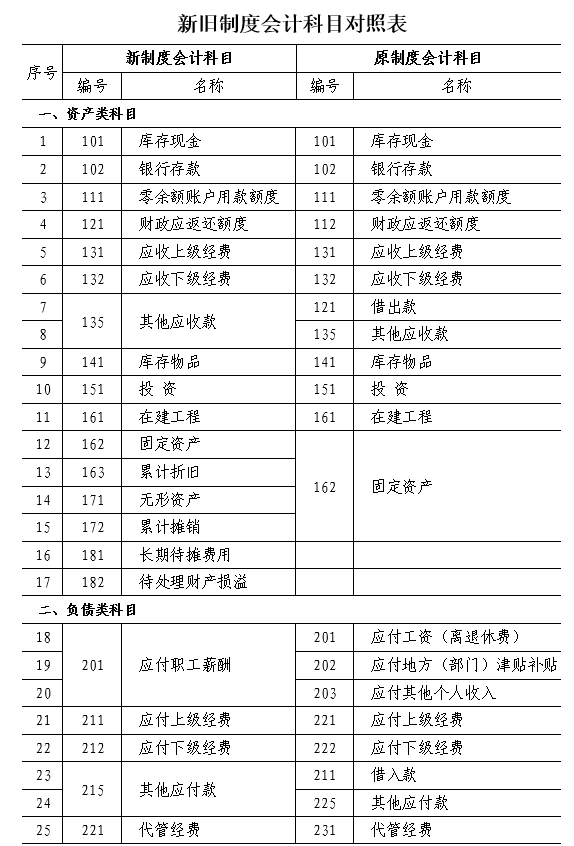
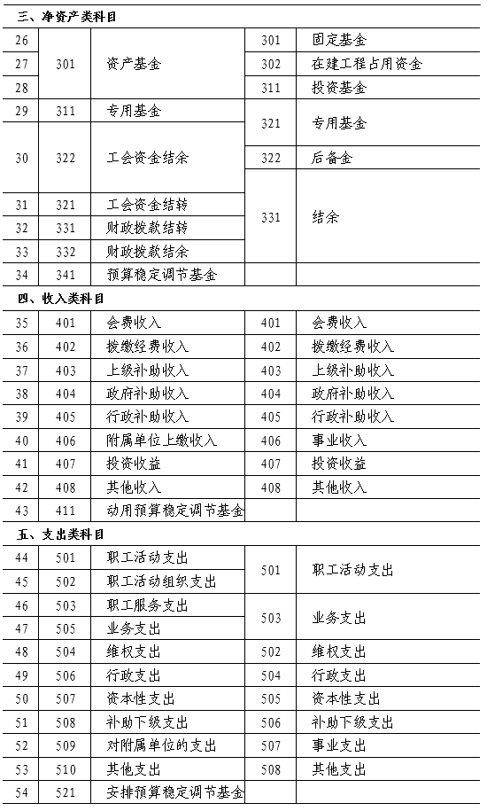

# 工会新旧会计制度有关衔接问题的处理规定（2021）

> **关于印发《工会新旧会计制度有关衔接问题的处理规定》的通知**
>
> **财会〔2021〕16号** 
>
> 中华全国总工会，各省、自治区、直辖市、计划单列市财政厅（局），新疆生产建设兵团财政局： 
>
> 　　为了适应工会组织财务改革的需要，进一步规范工会会计核算，提高会计信息质量，我部修订印发了《工会会计制度》（财会〔2021〕7号），自2022年1月1日起施行。为了确保新旧制度顺利衔接、平稳过渡，促进新制度的有效贯彻实施，我部制定了《工会新旧会计制度有关衔接问题的处理规定》，现予印发，请遵照执行。 
>
> 　　执行中有何问题，请及时反馈我部。 
>
> 　　[附件：工会新旧会计制度有关衔接问题的处理规定](00.assets/P020210706597045060179.pdf) 
>
>  
>
> 　　财 政 部 
>
> 　　2021年6月30日

-----------------------------

 

 

[TOC]

 

 

<h1>    工会新旧会计制度有关衔接问题的处理规定</h1>

我部对《工会会计制度》（财会〔2009〕7 号）（以下称原制度）进行了全面修订，于 2021 年 4 月 14 日印发了新

《工会会计制度》（财会〔2021〕7 号）（以下称新制度）， 自 2022 年 1 月 1 日起施行。为了确保新旧会计制度顺利过渡，现对各级工会执行新制度有关衔接问题规定如下：

## 一、新旧制度衔接总要求

（一）自 2022 年１月１日起，工会应当严格按照新制度进行会计核算、编报财务报表。

（二）工会应当按照本规定做好新旧会计制度衔接相关工作，主要包括以下几个方面：

1. 根据原账编制 2021 年 12 月 31 日的科目余额表。

2. 按照新制度设立 2022 年 1 月 1 日的新账。

3. 按照本规定要求，登记新账的科目余额，包括将原账 科目余额转入新账会计科目（新旧制度会计科目对照表见附表）、将未入账事项登记新账科目、对相关新账科目余额进 行调整、将基建账套相关数据并入新账等。原账科目是指按照原制度规定设置的会计科目。

4. 按照登记及调整后新账的各会计科目余额，编制 2022年 1 月 1 日的科目余额表，作为新账各会计科目的期初余额。

5. 根据新账各会计科目期初余额，按照新制度编制 2022年 1 月 1 日资产负债表。

（三）工会应当对资产进行清查盘点，进一步清理核实和归类统计固定资产、无形资产、库存物品等资产数据。按照相关规定依法确认为国有资产的，转账时应当将原账国有资产对应的科目余额转入新账相关资产科目的“国有资产” 明细科目；依法确认为工会资产的，将原账工会资产对应的科目余额转入新账相关资产科目的“工会资产”明细科目。

（四）及时调整会计信息系统。工会应当按照新制度要求对原有会计信息系统进行及时更新和调试，实现数据准确转换，确保新旧账套的有序衔接。

## 二、将原账会计科目余额转入新账

### （一）资产类。

1. “库存现金”、“银行存款”科目。

新制度设置了“库存现金”、“银行存款”科目。转账时，工会应当将原账的“库存现金”、“银行存款”科目余额转入新账的“库存现金”、“银行存款”科目。其中，存在代管经费的，还应当将原账“库存现金”、“银行存款” 科目余额中属于代管经费的金额，转入新账“库存现金”、“银行存款”科目下的“代管经费”明细科目。

2. “财政应返还额度”、“投资”科目。

新制度设置了“财政应返还额度”、“投资”科目，其核算内容与原账的上述相应科目的核算内容基本相同。转账时，工会应当将原账的上述科目余额直接转入新账的相应科目。

3. “库存物品”科目。

新制度设置了“库存物品”科目，并规定库存物品取得时应当同时确认资产基金。转账时，工会应当将原账的“库存物品”科目余额直接转入新账的“库存物品”科目，同时， 按照原账“库存物品”科目余额，将“结余”科目对应余额转入新账的“资产基金——库存物品”科目。

4. “应收上级经费”科目。

新制度设置了“应收上级经费”科目，该科目的核算内容包括工会应收未收的上级工会拨付或转拨的工会经费和 专项补助。转账时，工会应当按照相关规定将原账的“应收上级经费”科目余额中的工会建会筹备金转入新账的“其他 应收款”科目，将原账的“应收上级经费”科目余额减去建会筹备金后的差额转入新账的“应收上级经费”科目。

5. “应收下级经费”科目。

新制度设置了“应收下级经费”科目，该科目的核算内容包括工会应收未收的下级工会上缴的工会经费。转账时， 工会应当按照相关规定将原账的“应收下级经费”科目余额中的工会建会筹备金转入新账的“其他应收款”科目，将原账的“应收下级经费”科目余额减去建会筹备金后的差额转入新账的“应收下级经费”科目。

6. “借出款”科目。

新制度未设置“借出款”科目，但设置了“其他应收款” 科目。转账时，工会应当将原账的“借出款”科目余额，转入新账的“其他应收款”科目。

7. “其他应收款”科目。

新制度设置了“其他应收款”科目，该科目的核算内容包括原账“其他应收款”科目的核算内容。转账时，工会应 当将原账的“其他应收款”科目余额，转入新账的“其他应 收款”科目。

8. “在建工程”科目。

新制度设置了“在建工程”科目。转账时，对于在原账“在建工程”科目核算的建设项目，工会应当将原账的“在 建工程”科目余额转入新账的“在建工程”各明细科目。对 于未在原账“在建工程”科目核算的建设项目，按照新制度 规定，不再通过基建账单独核算，工会应当将基建账相关数据并入新账，具体处理参见本规定第五部分。

9. “固定资产”科目。

新制度设置了“固定资产”科目。由于新制度中固定资产价值标准与原制度相比有所提高，原账中作为固定资产核算的实物资产，将有一部分要按照新制度转为库存物品。同时，新制度设置了“无形资产”科目，原在“固定资产”科 目核算的无形资产，需转入新账的“无形资产”科目。

转账时，工会应当根据重新确定的固定资产目录，对原账中“固定资产”科目的余额进行分析：

（1） 对于达不到新制度中固定资产确认标准的实物资 产，应当将相应余额转入新账的“库存物品”科目，将相应的“固定基金”科目余额转入新账的“资产基金——库存物 品”科目。

（2） 对于原在“固定资产”科目核算的无形资产，应 当将相应余额转入新账的“无形资产”科目，将相应的“固定基金”科目余额转入新账的“资产基金——无形资产”科 目。

（3） 对于符合新制度中固定资产确认标准的，应当将 相应余额转入新账的“固定资产”科目，将相应的“固定基金”科目余额转入新账的“资产基金——固定资产”科目。

10. “零余额账户用款额度”科目。

新制度设置了“零余额账户用款额度”科目。由于原账的“零余额账户用款额度”科目年末无余额，该科目无需进行转账处理。

### （二）负债类。

1. “应付工资（离退休费）”、“应付地方（部门）津 贴补贴”、“应付其他个人收入”科目。

新制度设置了“应付职工薪酬”科目，该科目的核算内容包含了原账“应付工资（离退休费）”、“应付地方（部门）津贴补贴”、“应付其他个人收入”科目的核算内容。转账时，工会应当将原账的“应付工资（离退休费）”、“应付地方（部门）津贴补贴”、“应付其他个人收入”科目余额转入新账的“应付职工薪酬”科目。

2. “应付上级经费”科目。

新制度设置了“应付上级经费”科目，该科目的核算内容包括工会应上缴上级工会的工会拨缴经费。转账时，工会 应当按照相关规定将原账的“应付上级经费”科目余额中的 工会建会筹备金转入新账的“其他应付款”科目，将原账的 “应付上级经费”科目余额减去建会筹备金后的差额转入新账的“应付上级经费”科目。

3. “应付下级经费”科目。

新制度设置了“应付下级经费”科目，该科目的核算内容包括工会应付下级工会的各项补助及应转拨下级工会的 工会拨缴经费。转账时，工会应当按照相关规定将原账的“应 付下级经费”科目余额中的工会建会筹备金转入新账的“其 他应付款”科目，将原账的“应付下级经费”科目余额减去建会筹备金后的差额转入新账的“应付下级经费”科目。

4. “借入款”科目。

新制度未设置“借入款”科目，但设置了“其他应付款”科目。转账时，工会应当将原账的“借入款”科目余额，转 入新账的“其他应付款”科目。

5. “其他应付款”科目。

新制度设置了“其他应付款”科目，该科目的核算内容包括原账“其他应付款”科目的核算内容。转账时，工会应 当将原账的“其他应付款”科目余额，转入新账的“其他应 付款”科目。

6. “代管经费”科目。

新制度设置了“代管经费”科目。转账时，工会应当将原账的“代管经费”科目余额，转入新账的“代管经费”科 目。

### （三）净资产类。

1. “固定基金”、“在建工程占用资金”、“投资基金”科目。

新制度设置了“资产基金”科目，该科目的核算内容包含了原账“固定基金”、“在建工程占用资金”、“投资基金”科目的核算内容。转账时，工会应当将“固定基金”、“在建工程占用资金”、“投资基金”科目余额对应转入新账的“资产基金”相关明细科目：

（1） 工会应当对原账“固定基金”科目余额进行分析， 将原账在“固定资产”科目核算的不再符合新制度固定资产确认标准的库存物品对应余额转入新账的“资产基金——库

存物品”科目；将原账在“固定资产”科目核算的无形资产 对应余额转入新账的“资产基金——无形资产”科目；将原账“固定基金”科目余额减去转入新账“资产基金——库存 物品”和“资产基金——无形资产”科目金额后的余额转入新账的“资产基金——固定资产”科目。

（2） 工会应当将原账的“投资基金”科目余额转入新 账的“资产基金——投资”科目。

（3） 工会应当将原账的“在建工程占用资金”科目余 额转入新账的“资产基金——在建工程”科目。

2. “专用基金”科目。

新制度设置了“专用基金”科目，该科目的核算内容不再包括增收留成基金和财务专用基金，新制度下不再设置 “增收留成基金”、“财务专用基金”明细科目。转账时， 工会应当将原账的“专用基金——权益保障金”科目余额转入新账的“专用基金”科目，将原账的“专用基金——增收留成基金、财务专用基金”科目余额转入新账的“工会资金结余”科目。

3. “后备金”科目。

新制度未设置“后备金”科目。转账时，工会应当将原账的“后备金”科目余额转入新账的“工会资金结余”科目。

4. “结余”科目。

新制度未设置“结余”科目，但设置了“工会资金结转”、“工会资金结余”、“财政拨款结转”、“财政拨款结余” 科目。转账时，工会应当结合预算编制与执行情况进行分析， 将原账的“结余”科目余额（扣除转入新账中“资产基金——库存物品”科目金额）转入新账相关会计科目：

（1） 基层工会应当根据分析结果，将符合结转性质的 资金余额转入新账的“工会资金结转”科目；将剩余的资金 余额转入“工会资金结余”科目。

（2） 县级以上工会应当根据分析结果，将符合财政拨 款结转性质的资金余额转入“财政拨款结转”科目；将符合财政拨款结余性质的资金余额转入“财政拨款结余”科目； 将符合工会资金结转性质的资金余额转入“工会资金结转” 科目；将剩余的资金余额转入“工会资金结余”科目。

### （四）收入类、支出类。

由于原账中收入类、支出类科目年末无余额，无需进行转账处理。自 2022 年 1 月 1 日起，应当按照新制度设置收入类、支出类科目并进行账务处理。

### （五）其他要求。

工会存在其他本规定未列举的原账科目余额的，应当比照本规定转入新账的相应科目。新账的科目设有明细科目 的，应将原账中对应科目的余额加以分析，分别转入新账中 相应科目的相关明细科目。

工会在进行新旧衔接的转账时，应当编制转账工作底稿，并将转入新账的对应原科目余额及分拆原科目余额的依据作为原始凭证。

## 三、将原未入账事项登记新账

### （一）资产类。

1.无形资产。

工会在新旧制度转换时，应当将 2021 年 12 月 31 日前未入账的无形资产按照新制度规定记入新账。登记新账时， 按照确定的无形资产成本，借记“无形资产”科目，贷记“资产基金——无形资产”科目。

2.其他资产。

工会在新旧制度转换时，应当将 2021 年 12 月 31 日前未入账的其他资产按照新制度规定记入新账。登记新账时， 按照确定的资产及其成本，分别借记相关资产科目，贷记相关净资产科目。

### （二）负债类。

工会在新旧制度转换时，应当将 2021 年 12 月 31 日前未入账的负债按照新制度规定记入新账。登记新账时，按照确定的负债金额，借记“工会资金结余”科目，贷记相关负 债科目。

### （三）其他事项。

工会存在 2021 年 12 月 31 日前未入账的其他事项的， 应当比照本规定登记新账的相应科目。

工会对新账的会计科目补记未入账事项时，应当编制记账凭证，并将补充登记事项的确认依据作为原始凭证。

## 四、对新账的相关会计科目余额进行调整

### （一）转销已领用出库的库存物品对应余额。

工会应当对在原账“固定资产”科目核算的不符合新制度固定资产确认标准的库存物品进行分析，对于已领用出库的库存物品，应当将其成本一次性转销，按照确定的成本， 借记“资产基金——库存物品”科目，贷记“库存物品”科目，同时做好相关实物资产的登记管理工作。

### （二）补提折旧。

新制度设置了“累计折旧”科目，核算工会对固定资产计提的累计折旧。工会应当全面核查截至 2021 年 12 月 31 日符合新制度固定资产确认标准的固定资产的预计使用年 限、已使用年限、尚可使用年限等，并于 2022 年 1 月 1 日对前期未计提折旧的固定资产补提折旧，按照应计提的折旧金额，借记“资产基金——固定资产”科目，贷记“累计折 旧”科目。

### （三）补提摊销。

新制度设置了“累计摊销”科目，核算工会对无形资产计提的累计摊销。工会应当全面核查截至 2021 年 12 月 31 日无形资产的预计使用年限、已使用年限、尚可使用年限等， 并于 2022 年 1 月 1 日对前期未计提摊销的无形资产补提摊

销，按照应计提的摊销金额，借记“资产基金——无形资产” 科目，贷记“累计摊销”科目。

### （四）转销不符合新制度规定的代管经费对应余额。

新制度“代管经费”科目的核算内容与原制度相比有所调整，对于不符合新制度规定的代管经费，工会应当对相应余额予以转销，按照确定的金额，借记“代管经费”科目， 贷记“库存现金”、“银行存款”科目。

工会对新账的期初余额进行调整时，应当编制记账凭 证，并将调整事项的确认依据作为原始凭证。

## 五、将基建账套相关数据并入新账

新制度执行后，工会的基本建设工程项目均通过新账的“在建工程”科目核算，不再执行《国有建设单位会计制度》（财会字〔1995〕45 号）。新旧制度转换时，工会应当将基建账相关数据并入新账。工会将 2021 年 12 月 31 日原基建账中相关科目余额并入新账时：

按照基建账中“建筑安装工程投资”、“设备投资”、“待摊投资”、“预付工程款”等科目余额，借记新账中“在建工程”科目相关明细科目；按照基建账中“交付使用资产” 等科目余额，借记新账中“固定资产”等科目；按照基建账中“现金”、“银行存款”、“零余额账户用款额度”、“财政应返还额度”、“其他应收款”等科目余额，分别借记新账中“库存现金”、“银行存款”、“零余额账户用款额度”、“财政应返还额度”、“其他应收款”等科目；按照基建账中“基建投资借款”、“应付工程款”、“其他应付款”等科目余额，贷记新账中“其他应付款”科目；对基建账中“基建拨款”科目余额进行分析：按照归属于财政拨款结转结余的部分，贷记新账中“财政拨款结转”、“财政拨款结余” 科目，按照归属于工会资金结转的部分，贷记新账中“工会资金结转”科目；按照基建账中“建筑安装工程投资”、“设备投资”、“待摊投资”、“预付工程款”、“交付使用资产”等科目余额，贷记新账中“资产基金”科目相关明细科目；按照基建账中其他科目余额，分析调整新账中相应科目； 按照上述借贷方差额，贷记或借记新账中“工会资金结余” 科目。

基建并账后，工会可以通过在新账有关会计科目下设置与基本建设项目相关的明细科目或增加标记，或设置基建项目辅助账等方式，满足基本建设项目竣工决算报表编制的需要。

工会将基建账并入新账时，应当编制记账凭证，将基建 账各科目余额转入新账相关科目的依据作为原始凭证。

## 六、财务报表新旧衔接

### （一）编制 2022 年 1 月 1 日资产负债表和国有资产情况表。

工会应当根据 2022 年 1 月 1 日新账的会计科目余额，按照新制度编制 2022 年 1 月 1 日资产负债表和国有资产情况表（仅要求填列各项目“年初余额”）。

### （二）2022 年度财务报表的编制。

工会应当按照新制度编制2022 年财务报表。在编制2022 年度收入支出表、成本费用表时，不要求填列上年比较数。工会应当根据 2022 年 1 月 1 日新账会计科目余额，填列 2022 年收入支出表的“年初资金结转结余”项目和财政拨款收入支出表的“年初财政拨款结转结余”项目。

 

## 附表：新旧制度会计科目对照表

**新旧制度会计科目对照表**

