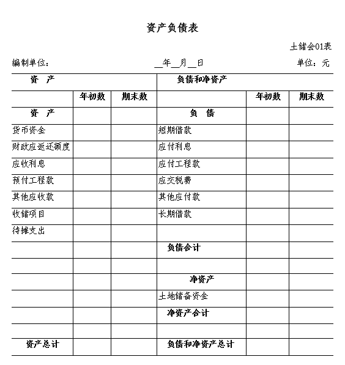
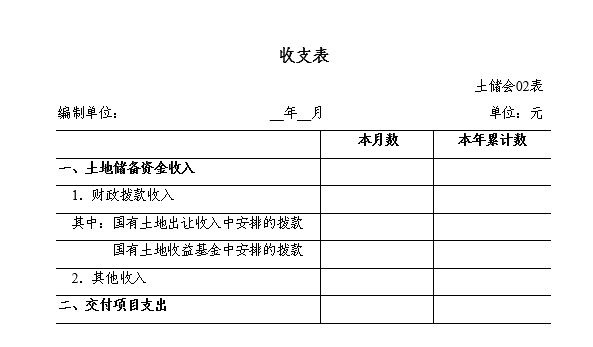
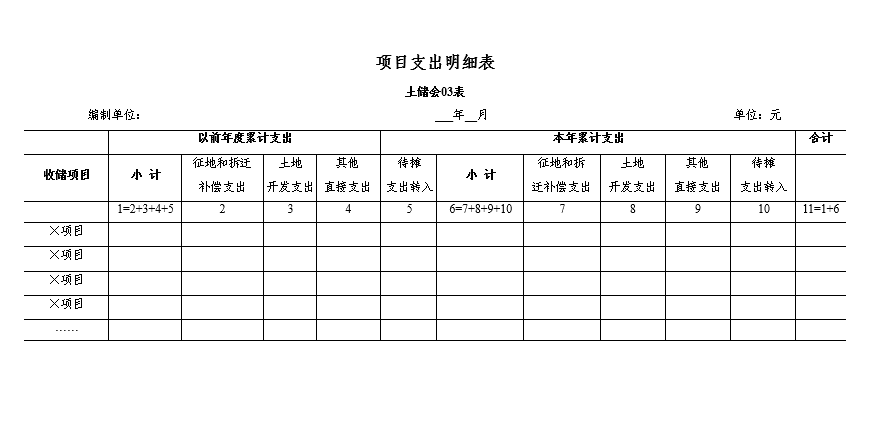

# 土地储备资金会计核算办法（试行）

> **财政部关于印发《土地储备资金会计核算办法（试行）》的通知**
>
> **财会[2008]10号**
>
> 各省、自治区、直辖市、计划单列市财政厅（局），新疆生产建设兵团财务局： 
>
>  为了规范土地储备资金的会计核算，根据《中华人民共和国会计法》、《土地储备资金财务管理暂行办法》（财综[2007]17号）以及有关法律、行政法规的规定，我部制定了《土地储备资金会计核算办法（试行）》，现予印发，自2009年1月1日起施行。执行中有何问题，请及时反馈我部。
>
>   附件：土地储备资金会计核算办法（试行） 
>
> 二〇〇八年八月十九日
>
>  

-----------------------------

[TOC]

## 第一章 总 则

**第一条** 为了规范土地储备资金的会计核算，根据《中华人民共和国会计法》、《土地储备资金财务管理暂行办法》（财综[2007]17号）以及有关法律、行政法规的规定，制定本办法。

**第二条** 本办法适用于土地储备机构管理的土地储备资金。

本办法所称土地储备资金是指土地储备机构按照国家有关规定征收、收购、优先购买、收回土地以及对其进行前期开发等所使用的资金。

土地储备机构在持有储备土地期间临时利用土地取得的应上缴国库的零星收入，不在本办法规范范围内。

**第三条** 土地储备资金应当作为独立的会计主体进行确认、计量和披露。土地储备资金应当独立于土地储备机构的固有财产及其管理的其他财产，实行分账核算。

**第四条** 土地储备资金的会计核算应当划分会计期间，分期结算账目和编制财务会计报告。会计期间分为年度、季度和月份。会计年度自公历1月1日起至12月31日止，季度、月份的起讫日期亦采用公历日期。

**第五条** 土地储备资金的会计核算主要以权责发生制为基础，对土地储备项目应进行成本核算。

**第六条** 土地储备资金的会计记账采用借贷记账法。

**第七条** 土地储备资金的会计核算应当遵循以下基本原则：

（一）土地储备资金的会计核算应当以实际发生的业务为依据，如实反映土地储备资金的收支情况和土地储备项目的成本信息，保证会计信息真实可靠、内容完整。

（二）土地储备资金的会计核算应当采用规定的会计政策，确保会计信息口径一致、相互可比。

（三）土地储备资金的会计核算应当及时进行，不得提前或者延后。

**第八条** 土地储备资金会计机构设置、会计人员配备、内部会计监督与控制以及相关会计基础工作等，应当遵循《中华人民共和国会计法》、《会计基础工作规范》（财会字[1996]19号）、《会计档案管理办法》（财会字[1998]32号）及内部控制规范等相关法律、行政法规和制度。

**第九条** 本办法由中华人民共和国财政部负责解释，需要变更时，由财政部修订。

**第十条** 本办法自2009年1月1日起施行。

 

## 第二章  会计科目及使用说明

 **第十一条** 土地储备机构应当根据本办法的规定设置和使用会计科目、编制会计凭证、登记会计账簿，对土地储备资金进行会计核算。

在不违反本办法的前提下，土地储备机构可以根据核算和管理工作需要对明细科目的设置作必要的补充。

**第十二条** 会计科目名称和编号

序号   编号      名称

一、资产类

1    1001       库存现金

2    1002       银行存款

3    1003       零余额账户用款额度

4    1004       财政应返还额度

5    1005       应收利息

6    1006       预付工程款

7    1007       其他应收款

8    1101       收储项目

9    1102       待摊支出

二、负债类

10    2001       短期借款

11    2002       应付利息

12    2003       应付工程款

13    2004       应交税费

14    2005       其他应付款

15    2101       长期借款

三、净资产类

16    3001       土地储备资金

四、收入类

17    4001       财政拨款收入

18    4002       其他收入

五、支出类

19    5001       交付项目支出

**第十三条** 会计科目使用说明

**第1001号科目  库存现金**

一、本科目核算土地储备资金的库存现金。

二、现金的主要账务处理如下：

（一）收到现金时，借记本科目，贷记有关科目。

（二）支付现金时，借记有关科目，贷记本科目。

三、本科目应设置“现金日记账”，由出纳人员根据收、付款凭证，按照业务发生顺序，逐笔登记，每日终了，应计算当日的现金收入合计数、现金支出合计数和结余数，并将结余数与实际库存数进行核对，做到账款相符。

四、本科目期末借方余额，反映土地储备资金的库存现金数额。

**第1002号科目  银行存款**

一、本科目核算土地储备资金的银行存款。

二、土地储备机构应严格按照国家有关支付结算办法的规定，办理土地储备资金银行存款收支结算。

三、银行存款的主要账务处理如下：

（一）收到财政部门拨入的土地储备资金时，借记本科目，贷记“财政拨款收入”科目。

（二）从银行提取现金时，借记“库存现金”科目，贷记本科目。

（三）收到的银行存款利息收入，借记本科目，贷记“应收利息”、“其他收入”等科目。

（四）支付银行存款时，借记“收储项目”、“预付工程款”、“应付利息”等科目，贷记本科目。

四、土地储备机构应设置“银行存款日记账”，由出纳人员根据收付款凭证，按照业务发生的顺序逐笔登记，并结出账面余额。“银行存款日记账”应定期与“银行对账单”核对，至少每月核对一次。月份终了，土地储备机构账面余额与银行对账单余额如有差额，应当逐笔查明原因进行处理，并应按月编制“银行存款余额调节表”，调节相符。

五、本科目期末借方余额，反映土地储备资金的银行存款数额。

**1003  零余额账户用款额度**

一、本科目核算实行国库集中支付的土地储备机构根据财政部门批复的土地储备资金用款计划收到的零余额账户用款额度。

不实行国库集中支付的，不设置本科目。

二、零余额账户用款额度的主要账务处理如下：

（一）在财政授权支付方式下，收到代理银行转来的“授权支付到账通知书”时，根据通知书所列数额，借记“零余额账户用款额度”科目，贷记“财政拨款收入”科目。发生实际支出时，借记“收储项目”、“待摊支出”等科目，贷记“零余额账户用款额度”科目。

（二）从零余额账户提取现金时，借记“库存现金”科目，贷记“零余额账户用款额度”科目。

（三）年度终了，依据代理银行提供的对账单作注销额度的相关账务处理，借记“财政应返还额度（财政授权支付）”科目，贷记“零余额账户用款额度”科目。如果土地储备资金本年度财政授权支付预算指标数大于零余额账户用款额度下达数，借记“财政应返还额度（财政授权支付）”科目，贷记“财政拨款收入”科目。

下年初，依据代理银行提供的额度恢复到账通知书作相关恢复额度的账务处理，借记“零余额账户用款额度”科目，贷记“财政应返还额度（财政授权支付）”科目。如果下年度收到财政部门批复的上年末未下达零余额账户用款额度，借记“零余额账户用款额度”科目，贷记“财政应返还额度（财政授权支付）”科目。

三、本科目期末借方余额，反映尚未支用的土地储备资金零余额账户用款额度。本科目年末应无余额。

**1004 财政应返还额度**

一、本科目核算实行国库集中支付的土地储备资金年终应收财政下年度返还的资金额度。

不实行国库集中支付的，不设置本科目。

二、本科目应设置“财政直接支付”和“财政授权支付”等明细科目，进行明细核算。

三、财政应返还额度的主要账务处理如下：

（一）财政直接支付年终结余资金的账务处理。

年度终了，根据本年度财政直接支付预算指标数与当年财政直接支付实际支出数的差额，借记本科目（财政直接支付），贷记“财政拨款收入”科目。

下年度恢复财政直接支付额度后，发生实际支出时，借记“收储项目”、“待摊支出”等科目，贷记本科目（财政直接支付）。

（二）财政授权支付年终结余资金的账务处理。

年度终了，依据代理银行提供的对账单注销额度，具体账务处理参见“零余额账户用款额度”科目。下年初依据代理银行提供的额度恢复到账通知书恢复额度，具体账务处理参见“零余额账户用款额度”科目。

四、本科目期末借方余额，反映应收财政下年度返还的土地储备资金额度。

**第1005号科目  应收利息**

一、本科目核算土地储备资金银行存款发生的应收利息。

二、土地储备机构应当按期计算确定土地储备资金银行存款应收利息。期末，按照计算确定的应收利息，借记本科目，贷记“其他收入”科目。实际收到利息时，借记“银行存款”科目，贷记本科目。

应收利息金额不大的，也可于实际收到利息时确认相关的利息收入。收到利息时，借记“银行存款”科目，贷记“其他收入”科目。

三、本科目期末余额，反映土地储备资金银行存款应收未收的利息。

**第1006号  预付工程款**

一、本科目核算土地储备机构为土地储备项目预付给有关施工、设计、监理等单位的工程款项。

二、本科目应按施工单位进行明细核算。

三、预付工程款的主要账务处理如下：

（一）土地储备项目发生预付工程款时，借记本科目，贷记“银行存款”、“零余额账户用款额度”等科目。

（二）办理土地储备项目工程款结算时，按照实际发生的项目支出，借记“收储项目”等科目，按照可抵扣的预付工程款，贷记本科目，按照应付未付的工程款项，贷记“应付工程款”科目。

四、本科目期末借方余额，反映为土地储备项目预付的工程款项。

**第1007号科目  其他应收款**

一、本科目核算除应收利息、预付工程款外为土地储备项目发生的其他各种应收及暂付款项。

二、本科目应按单位和个人进行明细核算。

三、其他应收款的主要账务处理如下：

（一）为土地储备项目发生其他各种应收、暂付款项时，借记本科目，贷记有关科目。

（二）收回其他应收、暂付款项时，借记有关科目，贷记本科目。

四、本科目期末借方余额，反映为土地储备项目发生的其他各种应收及暂付款项的余额。

**第1101号科目  收储项目**

一、本科目核算土地储备机构发生的可直接归属于土地储备项目的实际成本。

二、本科目应当按照土地储备项目设置明细账，并在土地储备项目下设置“征地和拆迁补偿支出”、“土地开发支出”、“其他直接支出”、“待摊支出转入”、“交付成本”等明细科目进行二级明细核算。

（一）“征地和拆迁补偿支出”明细科目，核算征收、收购、优先购买或收回土地需要支付的土地价款或征地和拆迁补偿费用，包括土地补偿费和安置补助费、地上附着物和青苗补偿费、拆迁补偿费，以及依法需要支付的与征收、收购、优先购买或收回土地有关的其他费用。在征地过程中对被征地农民采用社会保障安置的，所发生的被征地农民的社会保障支出也在本明细科目核算。对于所发生的被征地农民的社会保障支出，应在本明细科目下单独设置“被征地农民社会保障支出”三级明细科目进行核算。

（二）“土地开发支出”明细科目，核算征收、收购、优先购买或收回土地后进行必要的前期土地开发费用，包括前期土地开发性支出以及按照财政部门规定与前期土地开发相关的费用等，含因出让土地涉及的需要进行相关道路、供水、供电、供气、排水、通讯、照明、绿化、土地平整等基础设施建设支出。

（三）“其他直接支出”明细科目，核算经同级财政部门批准的可直接归属于土地储备项目成本的其他支出。

（四）“待摊支出转入”明细科目，核算分摊计入土地储备项目成本的待摊支出。

（五）“交付成本”明细科目，核算本期已交付项目的成本。

三、本科目的主要账务处理如下：

（一）为土地储备项目发生各项支出时，借记本科目，贷记“银行存款”、“零余额账户用款额度”等科目；采用财政直接支付方式的，借记本科目，贷记“财政拨款收入”科目。

（二）对出包工程，土地储备机构应定期与施工单位进行工程结算。办理结算时，按照实际发生的项目支出，借记本科目，按照可抵扣的预付工程款，贷记“预付工程款”科目，按照应付未付的工程款项，贷记“应付工程款”科目。

（三）结转待摊支出时，借记本科目（待摊支出转入），贷记“待摊支出”科目。

（四）单个收储项目完成收储后交付的，应按照该项目归集的成本进行结转，按照本科目“征地和拆迁补偿支出”、“土地开发支出”、“其他直接支出”、“待摊支出转入”各明细科目的借方余额合计，借记本科目（交付成本），按照本科目“征地和拆迁补偿支出”、“土地开发支出”、“其他直接支出”、“待摊支出转入”各明细科目的借方余额，贷记本科目（征地和拆迁补偿支出、土地开发支出、其他直接支出、待摊支出转入）；同时，将该项目成本结转入“交付项目支出”科目，借记“交付项目支出”科目，贷记本科目（交付成本）。

单个收储项目未全部完成收储、部分先交付的，应按合理的方法计算确定交付部分的成本并进行结转。计算方法一经确定，不得随意变更。单个收储项目部分交付时，按照计算确定的交付部分的成本，借记本科目（交付成本），贷记本科目（征地和拆迁补偿支出、土地开发支出、其他直接支出、待摊支出转入）；同时，将交付部分的成本结转入“交付项目支出”科目，借记“交付项目支出”科目，贷记本科目（交付成本）。待该收储项目最后未交付部分完成收储后交付时，按照最后交付部分的成本，借记本科目（交付成本），贷记本科目（征地和拆迁补偿支出、土地开发支出、其他直接支出、待摊支出转入）；同时，将最后交付部分的成本结转入“交付项目支出”科目，借记“交付项目支出”科目，贷记本科目（交付成本）。

四、本科目期末借方余额反映尚未交付的土地储备项目累计发生的收储成本。

**第1102号科目  待摊支出**

一、本科目核算为多个收储项目共同发生的、按照规定应当分摊计入项目成本的各项费用支出，如借款利息支出、金融机构手续费、可行性研究费、勘探设计费、储备保管费、评估费、临时用水用电费、临时设施支出等。

可直接计入单个收储项目的支出，在“收储项目”科目核算，不通过本科目核算。

二、本科目应当按照待摊支出的内容进行明细核算。

三、待摊支出的主要账务处理如下：

（一）为土地储备项目借款发生的利息支出，借记本科目、“收储项目”等科目，贷记“应付利息”、“银行存款”等科目。

（二）发生其他待摊支出时，借记本科目，贷记“库存现金”、“银行存款”、“零余额账户用款额度”等科目；采用财政直接支付方式的，借记本科目，贷记“财政拨款收入”科目。

（三）土地储备机构应按合理的方法（如按照各项目概预算占所有项目概预算总额的比例）将发生的待摊支出分摊计入有关项目成本，分摊时，借记“收储项目（待摊支出转入）”科目，贷记本科目。待摊支出的分配方法一经确定，不得随意变更。

四、本科目月末借方余额，反映为多个土地储备项目共同发生的尚未分摊的待摊支出。年末，待摊支出应分配完毕，本科目应无余额。

**第2001号科目  短期借款**

一、本科目核算土地储备机构为土地储备项目向银行或其他金融机构等借入的期限在一年以下（含一年）的各种借款。

二、本科目应按贷款人进行明细核算。

三、短期借款的主要账务处理如下：

（一）为土地储备项目借入的各种短期借款，借记“银行存款”科目，贷记本科目。

（二）短期借款应付的利息，借记“待摊支出”、“收储项目”等科目，贷记“应付利息”、“银行存款”等科目。 

（三）归还借款时，借记本科目，贷记“银行存款”科目。

四、本科目期末贷方余额，反映为土地储备项目借入的尚未偿还的短期借款本金。

**第2002号科目  应付利息**

一、本科目核算土地储备机构为土地储备项目借款而发生的应付利息。

二、土地储备机构应当按期计算确定为土地储备项目借款而发生的应付利息。期末，按照计算确定的应付利息，借记“待摊支出”、“收储项目”等科目，贷记本科目。实际支付利息时，借记本科目，贷记“银行存款”科目。

应付利息金额不大的，也可于实际支付利息时确认相关的利息成本。支付利息时，借记“待摊支出”、“收储项目”等科目，贷记“银行存款”科目。

三、本科目期末余额，反映为土地储备项目借款应付未付的利息。

**第2003号科目  应付工程款**

一、本科目核算土地储备机构为土地储备项目应付给有关施工、设计、监理等单位的工程款项。

二、本科目应按施工单位进行明细核算。

三、应付工程款的主要账务处理如下：

（一）办理土地储备项目工程款结算时，按照实际发生的项目支出，借记“收储项目”等科目，按可抵扣的预付工程款，贷记“预付工程款”科目，按照应付未付的工程款项，贷记本科目。

（二）支付应付工程款时，借记本科目，贷记“银行存款”等科目。

四、本科目期末贷方余额，反映为土地储备项目应付未付的工程款项。

**第2004号科目  应交税费**

一、本科目核算按税法等规定计算的为土地储备项目应交纳的各种税费。

二、本科目按应交的税费项目进行明细核算。

三、应交税费的主要账务处理如下：

（一）按规定计算的为土地储备项目应交的各种税费，借记“收储项目”科目，贷记本科目。涉及多个土地储备项目的，可通过“待摊支出”科目进行归集，然后按合理的方法进行分摊。

（二）实际交纳各项税费时，借记本科目，贷记“银行存款”等科目。

四、本科目期末贷方余额，反映土地储备项目应交未交的税费金额。

**第2005号科目 其他应付款**

一、本科目核算除应付利息、应付工程款、应交税费外为土地储备项目发生的其他各种应付、暂存款项。

二、本科目应按单位和个人进行明细核算。

三、其他应付款的主要账务处理如下：

（一）为土地储备项目发生其他各种应付、暂存款项时，借记有关科目，贷记本科目。

（二）实际支付时，借记本科目，贷记“银行存款”等科目。

四、本科目期末贷方余额，反映为土地储备项目发生的其他各种应付及暂存款项的余额。

**第2101号科目  长期借款**

一、本科目核算土地储备机构为土地储备项目向银行或其他金融机构等借入的期限在一年以上（不含一年）的各种借款。

二、本科目应按贷款人进行明细核算。

三、长期借款的主要账务处理如下：

（一）为土地储备项目借入的各种长期借款，借记“银行存款”科目，贷记本科目。

（二）长期借款应付的利息，借记“收储项目”、“待摊支出”等科目，贷记“应付利息”、“银行存款”等科目。

（三）归还借款时，借记本科目，贷记“银行存款”科目。

四、本科目期末贷方余额，反映为土地储备项目借入的尚未偿还的长期借款本金。

**第3001号科目  土地储备资金**

一、本科目核算土地储备资金各项收入与交付项目支出的差额。

二、期末，将各收入科目贷方余额转入本科目，借记“财政拨款收入”、“其他收入”科目，贷记本科目。将“交付项目支出”科目借方余额转入本科目，借记本科目，贷记“交付项目支出”科目。

三、本科目期末余额，反映土地储备资金各项收入与交付项目支出的累计差额。

**第4001号科目  财政拨款收入**

一、本科目核算当期财政部门拨付的土地储备资金。

二、本科目应设置“国有土地出让收入中安排的拨款”和“国有土地收益基金中安排的拨款”等明细科目，进行明细核算。

三、财政拨款收入的主要账务处理如下：

（一）土地储备机构收到财政部门拨付的土地储备资金时，借记“银行存款”、“零余额账户用款额度”等科目，贷记本科目。采用财政直接支付的方式支付收储支出时，借记“收储项目”、“待摊支出”等科目，贷记本科目。

（二）期末，将本科目贷方余额转入“土地储备资金”科目，借记本科目，贷记“土地储备资金”科目。

四、本科目期末结转后无余额。

**第4002号科目  其他收入**

一、本科目核算土地储备项目除财政拨款外的其他收入，如利息收入。

二、其他收入的主要账务处理如下：

（一）取得的其他收入，借记“银行存款”、“应收利息”等科目，贷记本科目。

（二）期末，将本科目贷方余额转入“土地储备资金”科目，借记本科目，贷记“土地储备资金”科目。

三、本科目期末结转后无余额。

**第5001号科目  交付项目支出**

一、本科目核算本期已交付的土地储备项目的实际支出。

二、交付项目支出的主要账务处理如下：

（一）项目全部或部分交付时，借记本科目，贷记“收储项目（交付成本）”科目。

（二）期末，将本科目借方余额转入“土地储备资金”科目，借记“土地储备资金”科目，贷记本科目。

三、本科目期末结转后无余额。

 

## 第三章  财务报表及编制说明

 

  **第十四条**  土地储备机构应当根据本办法的规定编制土地储备资金财务报表。

**第十五条** 土地储备资金财务报表包括资产负债表、收支表、项目支出明细表及附注。

资产负债表、收支表、项目支出明细表按照本办法第十七条至第二十条的规定编报。

附注是对在资产负债表、收支表、项目支出明细表中列示项目的文字描述或明细资料，以及对未能在这些报表中列示项目的说明等。附注可由土地储备机构根据需要自行编制。

**第十六条** 土地储备资金财务报表应当至少按照月份和年度编制，做到数字真实、计算准确、手续完备、内容完整、编报及时。

**第十七条** 财务报表格式

| **报表编号** | **财务报表名称** | **编制期** |
| ------------------ | ---------------------- | ---------------- |
| 土储会01表         | 资产负债表             | 月报、年报       |
| 土储会02表         | 收支表                 | 月报、年报       |
| 土储会03表         | 项目支出明细表         | 月报、年报       |

**第十八条**　资产负债表编制说明

（一）本表反映月末、年末等会计期间终了时土地储备资金全部资产、负债以及净资产的构成情况。

（二）本表“年初数”栏各项数字，应根据上年末本表“期末数”所列数字填列。

（三）本表各项目的内容和填列方法：

1．“货币资金”项目，反映库存现金、银行存款等货币资金的期末合计余额，本项目应根据“库存现金”、“银行存款”、“零余额账户用款额度”科目期末余额加总填列。

2．“财政应返还额度”项目，反映期末财政应返还额度的余额。本项目应根据“财政应返还额度”科目的期末余额填列。

3．“应收利息”项目，反映土地储备资金银行存款应收未收的利息。本项目应根据“应收利息”科目的期末余额填列。

4．“预付工程款”项目，反映为土地储备项目预付的工程款项。本项目应根据“预付工程款”科目的期末余额填列。

5．“其他应收款”项目，反映除应收利息、预付工程款外为土地储备项目发生的其他各种应收及暂付款项。本项目应根据“其他应收款”科目的期末余额填列。

6．“收储项目”项目，反映尚未交付的土地储备项目累计发生的收储成本。本项目应根据“收储项目”科目的期末余额填列。

7．“待摊支出”项目，反映为多个土地储备项目共同发生的尚未分摊的待摊支出。本项目根据“待摊支出”科目的期末余额填列。编制年度资产负债表时，本项目应填“0”。

8．“短期借款”项目，反映为土地储备项目借入的尚未偿还的短期借款本金。本项目应根据“短期借款”科目的期末余额填列。

9．“应付利息”项目，反映为土地储备项目借款应付未付的利息。本项目应根据“应付利息”科目的期末余额填列。

10．“应付工程款”项目，反映土地储备项目应付未付的工程款项。本项目应根据“应付工程款”科目的期末余额填列。

11．“应交税费”项目，反映土地储备项目尚未交纳的税费。本项目应根据“应交税费”科目的期末余额填列。

12．“其他应付款”项目，反映除应付利息、应付工程款、应交税费外为土地储备项目发生的其他各种应付及暂存款项。本项目应根据“其他应付款”科目的期末余额填列。

13．“长期借款”项目，反映为土地储备项目借入的尚未偿还的长期借款本金。本项目应根据“长期借款”科目的期末余额填列。

14．“土地储备资金”项目，反映土地储备资金各项收入与交付项目支出的累计差额。本项目应根据“土地储备资金”科目的期末余额填列。

**第十九条** 收支表编制说明

（一）本表反映土地储备资金在月份、年度等会计期间内的收入和费用情况。

（二）本表“本月数”栏反映各项目的本月实际发生数，在编报年度财务报表时，将“本月数”栏改成“上年累计数”栏，填列上年全年累计实际发生数。

本表“本年累计数”栏反映各项目自年初起至本月末止的累计实际发生数。

（三）本表中“本月数”栏各项目的内容及填列方法：

1．“土地储备资金收入”项目，反映当期土地储备资金收入总额。本项目应根据本表“财政拨款收入”和“其他收入”项目金额加总计算填列。

2．“财政拨款收入”项目，反映当期财政部门拨付的土地储备资金。本项目应根据“财政拨款收入”科目贷方发生额填列。“国有土地出让收入中安排的拨款”、“国有土地收益基金中安排的拨款”项目分别根据“财政拨款收入”科目所属明细科目贷方发生额填列。

3．“其他收入”项目，反映当期除财政拨款外的其他收入，如利息收入。本项目应根据“其他收入”科目贷方发生额填列。

4．“交付项目支出”项目，反映本期已交付的土地储备项目的实际支出。本项目应根据“交付项目支出”科目借方发生额填列。

  **第二十条**  项目支出明细表编制说明

（一）本表反映收储项目以前年度的累计支出和本年自年初至本月末止累计实际发生的支出，包括本年尚未交付的收储项目和本年度收储完毕并交付的项目。不含以前年度已交付的项目。

（二）本表中“以前年度累计支出”栏，反映土地储备项目本年之前累计发生的支出。各具体栏目的内容及填列方法如下：

1．“小计”（1栏），反映土地储备项目以前年度累计发生的各类支出小计，根据第2栏至第5栏的数字加总填列。

2．“征地和拆迁补偿支出”（2栏），反映土地储备项目以前年度累计发生的征地和拆迁补偿支出。根据“收储项目”科目所属“征地和拆迁补偿支出”明细科目的上年末余额填列，或根据上年12月份本表本项目对应的第2栏和第7栏的数字加总填列。

3．“土地开发支出”（3栏），反映土地储备项目以前年度累计发生的土地开发支出。根据“收储项目”科目所属“土地开发支出”明细科目的上年末余额填列，或根据上年12月份本表本项目对应的第3栏和第8栏的数字加总填列。

4．“其他直接支出”（4栏），反映土地储备项目以前年度累计发生的其他直接支出。根据“收储项目”科目所属“其他直接支出”明细科目的上年末余额填列，或根据上年12月份本表本项目对应的第4栏和第9栏的数字加总填列。

5．“待摊支出转入”（5栏），反映土地储备项目以前年度累计分摊的待摊支出。根据“收储项目”科目所属“待摊支出转入”明细科目的上年末余额填列，或根据上年12月份本表本项目对应的第5栏和第10栏的数字加总填列。

（三）本表中“本年累计支出”栏，反映土地储备项目本年自年初至本月末止累计发生的各项实际支出。各具体栏目的内容及填列方法如下：

1．“小计”（6栏），反映土地储备项目本年自年初至本月末止累计发生的各类支出小计，根据第7栏至第10栏的数字加总填列。

2．第7栏至第10栏，分别反映土地储备项目本年自年初至本月末止累计发生的征地和拆迁补偿支出、土地开发支出、其他直接支出和累计分摊的待摊支出，分别根据“收储项目”科目所属“征地和拆迁补偿支出”、“土地开发支出”、“其他直接支出”、“待摊支出转入”各明细科目本年自年初至本月末止的借方发生额填列。

（四）本表中“合计”（11栏），反映土地储备项目以前年度累计发生和本年累计发生的各类支出的合计数，根据第1栏和第6栏的数字加总填列。

 