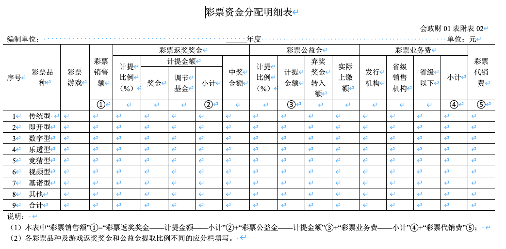

# 关于彩票机构执行《政府会计制度——行政事业单位会计科目和报表》的补充规定

  

根据《政府会计准则——基本准则》，结合行业实际情况，现就彩票发行机构和彩票销售机构（以下简称彩票机构）执行《政府会计制度——行政事业单位会计科目和报表》（以下简称新制度）做出如下补充规定：

## 一、关于新增一级科目及其使用说明

（一）彩票机构应当增设 “2308 彩票销售结算” 、“2309 应付返奖奖金” 、“2310 应付代销费”一级科目。

（二）关于增设科目的使用说明

2308 彩票销售结算

一、本科目核算彩票机构彩票销售资金的归集和分配情况。 

二、本科目应当按照彩票品种及游戏名称、彩票发行销售方式进行明细核算。

三、彩票销售结算的主要账务处理如下：

（一）彩票机构实现彩票销售时，按照彩票销售结算的金额，借记“预收账款”等科目，贷记本科目。

（二）期末彩票机构分配彩票销售资金时，按照分配的彩票销售资金的金额，借记本科目，按照分配的彩票公益金、彩票机构业务费等金额，贷记“应缴财政款”科目，按照分配的应付返奖奖金的金额，贷记“应付返奖奖金”科目，按照分配的代销费金额，贷记“应付代销费”科目。

四、本科目期末应无余额。

2309 应付返奖奖金

一、本科目核算彩票机构按照彩票游戏规则确定的比例从彩票销售额中提取，用于支付给中奖者的资金，包括当期返奖奖金、奖池、调节基金和一般调节基金。 

二、本科目应当按照“当期返奖奖金”、“奖池”、“调节基金”、“一般调节基金”设置明细科目。在“当期返奖奖金”、“奖池”、“调节基金”明细科目下，按照彩票品种及游戏名称设置明细科目进行明细核算。

当期返奖奖金是指按照彩票游戏规则确定的比例在当期彩票奖金中提取并用于支付给中奖者的奖金。

奖池是指彩票游戏提取奖金与实际中出奖金的累积资金差额。

调节基金是指按照彩票销售额的一定比例提取的资金、逾期未退票的票款和浮动奖取整后的余额。调节基金应当专项用于支付各种不可预见的奖金风险支出或开展派奖。

停止销售的彩票游戏兑奖期结束后，奖池资金和调节基金有结余的，转为一般调节基金，用于不可预见情况下的奖金风险支出或开展派奖。

三、应付返奖奖金的主要账务处理如下：

（一）当期返奖奖金

1.提取当期返奖奖金时，按照彩票资金分配比例计算确定的当期返奖奖金金额，借记“彩票销售结算”科目，贷记本科目（当期返奖奖金——××游戏）。

2.兑付中奖者奖金时，按照实际兑付金额，借记本科目（当期返奖奖金——××游戏），贷记“银行存款”、“其他应交税费”、“预收账款——预收彩票销售款”[通过彩票代销者兑奖]等科目。

3.逾期未兑付的弃奖奖金转入彩票公益金时，按照实际转出的金额，借记本科目（当期返奖奖金——××游戏），贷记“应缴财政款”科目。

4.彩票机构之间因联网游戏奖金结算产生的应收款项， 按照实际发生的金额，借记“应收账款——应收彩票联网游戏结算款”科目，贷记本科目（当期返奖奖金——××游戏）；产生的应付款项，按照实际发生的金额，借记本科目（当期返奖奖金——××游戏），贷记“应付账款——应付彩票联网游戏结算款”科目。

（二）奖池

1.彩票游戏设置奖池的，兑付当期返奖奖金后，按照提取的当期返奖奖金与当期实际中出奖金的差额，借记或贷记本科目（当期返奖奖金——××游戏），贷记或借记本科目（奖池——××游戏）。 

2.使用奖池资金兑付中奖者奖金时，按照实际兑付金额，借记本科目（奖池——××游戏），贷记“银行存款”等科目。 

（三）调节基金

1.彩票游戏设置调节基金的，在提取调节基金时，按照彩票资金分配比例计算确定的调节基金金额，借记“彩票销售结算”科目，贷记本科目（调节基金——××游戏）。 

2.彩票游戏设置奖池的，奖池资金达到一定额度后，按照彩票游戏规则中规定将超过部分转入该彩票游戏的调节基金时，按照实际转出的金额，借记本科目（奖池——××游戏），贷记本科目（调节基金——××游戏）。 

3.使用调节基金支付各种不可预见的奖金风险支出和开展派奖时，按照实际支出的金额，借记本科目（调节基金——××游戏），贷记“银行存款”等科目。 

4.使用调节基金弥补奖池资金时，按照实际弥补奖池资金的金额，借记本科目（调节基金——××游戏），贷记本科目（奖池——××游戏）。

（四）一般调节基金

1.停止销售的彩票游戏兑奖期结束后，奖池资金和调节基金有结余的，转入一般调节基金时，按照实际转出的金额，借记本科目（奖池、调节基金——××游戏），贷记本科目（一般调节基金）。

2.使用一般调节基金弥补某游戏奖池资金时，按照实际弥补奖池资金的金额，借记本科目（一般调节基金），贷记本科目（奖池——××游戏）。

四、本科目期末贷方余额，反映彩票机构尚未支付的奖金和调节基金。

2310 应付代销费

一、本科目核算彩票机构按照彩票代销合同的约定比例从彩票销售额中提取，用于支付给彩票代销者的资金。

二、本科目应当按照彩票代销者和彩票结算方式进行明细核算。

三、应付代销费的主要账务处理如下：

（一）提取应付代销费时，按合同约定比例计算确定的金额，借记“彩票销售结算”科目，贷记本科目。

（二）实行内扣方式结算应付代销费的，结算彩票代销者代销费时，按照从彩票代销者缴交的彩票销售资金中直接抵扣的资金金额，借记本科目，贷记“预收账款——预收彩票销售款”科目。

（三）不实行内扣方式结算应付代销费的，向彩票代销者支付代销费时，按照实际支付的金额，借记本科目，贷记“银行存款”等科目。

四、本科目期末贷方余额，反映彩票机构尚未支付给彩票代销者的代销费。

## 二、关于在新制度一级科目下设置明细科目

（一）彩票机构应当在“1212 应收账款”科目下设置“应收彩票联网游戏结算款”明细科目，用于核算彩票机构与其他彩票机构因彩票联网游戏结算发生的应收款项。在“应收彩票联网游戏结算款”明细科目下按照省（自治区、直辖市）、彩票游戏名称等进行明细核算。

（二）彩票机构应当在“1302 库存物品”科目下设置“库存彩票”明细科目，用于核算彩票机构购进的已验收入库彩票的实际成本。

（三）彩票机构应当在“2103 应缴财政款”科目下设置“应缴发行机构业务费”、“应缴销售机构业务费”、“应缴中央公益金”、“应缴地方公益金”等明细科目，用于核算彩票机构应缴国库的彩票机构业务费和彩票公益金等。

（四）彩票机构应当在“2302 应付账款”科目下设置“应付彩票联网游戏结算款”明细科目，用于核算彩票机构与其他彩票机构因彩票联网游戏结算发生的应付款项。在“应付彩票联网游戏结算款”明细科目下按照省（自治区、直辖市）、彩票游戏名称等进行明细核算。

（五）彩票机构应当在“2305 预收账款”科目下设置“预收彩票销售款”明细科目，用于核算彩票机构预收彩票代销者预存的彩票销售款。

（六）彩票机构应当在“2307 其他应付款”科目下设置“彩票投注设备押金”明细科目，用于核算彩票机构收取彩票代销者交付的彩票投注设备押金。

（七）彩票机构应当在“3101 专用基金”科目下设置“彩票兑奖周转金”明细科目，用于核算财政部门累计拨入结存的彩票兑奖周转金。

## 三、关于报表及编制说明

彩票机构除按新制度编制财务报表和预算会计报表外，还应按照本规定编制返奖奖金变动明细表和彩票资金分配明细表。

（一）资产负债表

1.新增项目

彩票机构应当在资产负债表的流动负债部分“应付职工薪酬”与“应付票据”项目之间增加“应付返奖奖金” 、“应付代销费”项目。

2.新增项目的填列方法

（1）“应付返奖奖金”项目，反映彩票机构应返还给中奖者的奖金。本项目应当根据“应付返奖奖金”科目的期末余额填列。

（2）“应付代销费”项目，反映彩票机构按彩票代销合同的约定比例从彩票销售额中提取，用于支付给彩票代销者的资金。本项目应当根据“应付代销费”科目的期末余额填列。

（二）返奖奖金变动明细表

1.本表反映彩票机构在某一会计年度内返奖奖金的兑付情况，格式详见附表1。

2.返奖奖金变动明细表的填列方法

本表中“年初余额”、“本年增加数”、“本年减少数”、“年末余额”、“调节基金”、“奖池”和“一般调节基金”各项目，应当根据“应付返奖奖金”科目各明细科目中的相关信息分析填列。 

（三）彩票资金分配明细表

1.本表反映彩票机构在某一会计年度内彩票资金的分配情况，格式详见附表2。

2.彩票资金分配明细表的填列方法

本表中“彩票销售额”、“彩票返奖奖金”、“彩票公益金”、“彩票业务费”和“彩票代销费”各栏，以及各栏的明细栏内各项数字，应当根据“彩票销售结算”、“应缴财政款”、“应付返奖奖金”、“应付代销费”等科目的明细科目中的相关信息分析填列。 

## 四、关于库存彩票的账务处理

（一）彩票机构购入的彩票验收入库时，按照发生的彩票印制费等确定的成本，借记“库存物品——库存彩票”科目，贷记“应付账款”、“零余额账户用款额度”、“银行存款”等科目。

（二）彩票机构发出库存彩票时，按照确定的发出彩票的实际成本，借记“业务活动费用”科目，贷记“库存物品——库存彩票”科目。 

（三）发生彩票退回时，借记“库存物品——库存彩票”科目，贷记“业务活动费用”科目[退回本年发出的库存彩票]或“以前年度盈余调整”科目[退回以前年度发出的库存彩票]。

（四）对于盘盈、盘亏及毁损、报废的库存彩票，彩票机构应当及时查明原因，按照规定报经批准后进行账务处理。

1.库存彩票盘盈时，按照同类库存彩票的入账成本确认入账价值，借记“库存物品——库存彩票”科目，贷记“待处理财产损溢”科目；库存彩票盘亏或毁损、报废时，按照待处置库存彩票的账面价值，借记“待处理财产损溢——待处理财产价值”科目，贷记“库存物品——库存彩票”科目。 

2.报经批准予以处理盘盈的库存彩票时，按照待处理的库存彩票价值，借记“待处理财产损溢”科目，贷记“单位管理费用”科目。

3.报经批准予以处理盘亏或损毁、报废的库存彩票时，按照待处置库存彩票的账面价值，借记“资产处置费用”科目，贷记“待处理财产损溢——待处理财产价值”科目。

处置毁损、报废库存彩票过程中所取得的收入、发生的相关费用，以及处置收入扣除相关费用后的净收入的账务处理，参见新制度“待处理财产损溢”科目。

## 五、关于预收彩票销售款的账务处理

（一）彩票机构收到彩票代销者预存的销售款时，按照实际收到的金额，借记“银行存款”等科目，贷记“预收账款——预收彩票销售款”科目。

（二）彩票机构实现彩票销售时，按照冲销预收彩票销售款的金额，借记“预收账款——预收彩票销售款”科目，贷记“彩票销售结算”科目。

（三）彩票代销者兑付中奖者奖金时，彩票机构按照实际兑付金额，借记“应付返奖奖金——当期返奖奖金——××游戏”科目，贷记“预收账款——预收彩票销售款”等科目。

（四）实行内扣方式结算应付代销费的，结算彩票代销者代销费时，彩票机构按照从彩票代销者缴交的彩票销售资金中直接抵扣的资金金额，借记“应付代销费”科目，贷记“预收账款——预收彩票销售款”科目。

## 六、关于彩票投注设备押金的账务处理

（一）彩票机构收取彩票代销者交付的彩票投注设备押金时，按照实际收到的金额，借记“银行存款”等科目，贷记“其他应付款——彩票投注设备押金”科目。

（二）彩票机构向彩票代销者退回彩票投注设备押金时，按照实际支付的金额，借记“其他应付款——彩票投注设备押金”科目，贷记“银行存款”等科目。

## 七、关于彩票兑奖周转金的账务处理

（一）彩票机构取得财政部门拨付的彩票兑奖周转金时，按照财政授权支付额度到账通知书中的授权支付额度，借记“零余额账户用款额度”科目，贷记“财政拨款收入——政府性基金预算财政拨款”科目；同时，按照相同的金额，借记“资金结存——零余额账户用款额度”科目，贷记“财政拨款预算收入”科目。

（二）报经批准将彩票兑奖周转金从零余额账户转入彩票机构的银行存款账户时，按照实际转入的金额，借记“银行存款”科目，贷记“零余额账户用款额度”科目；同时，按照相同的金额，借记“资金结存——货币资金”科目，贷记“资金结存——零余额账户用款额度”科目。

（三）按规定提取专用基金时，按照提取的金额，借记“业务活动费用”科目，贷记“专用基金——彩票兑奖周转金”科目；同时，按照相同的金额，借记“事业支出”科目，贷记“资金结存——货币资金”科目。

## 八、生效日期

本规定自2019年1月1日起施行。

 

## 附表1 返奖奖金变动明细表

会政财01表附表01

编制单位：                         年度                        单位：元

| 项 目          | 行次 | 传统型 | 即开型 | 数字型 | 乐透型 | 竞猜型 | 视频型 | 基诺型 | 一般调节基金 | 合计 |
| -------------- | ---- | ------ | ------ | ------ | ------ | ------ | ------ | ------ | ------------ | ---- |
| 一、年初余额   | 1    |        |        |        |        |        |        |        |              |      |
| 其中：调节基金 | 2    |        |        |        |        |        |        |        | ——           |      |
| 奖池           | 3    |        |        |        |        |        |        |        | ——           |      |
| 二、本年增加数 | 4    |        |        |        |        |        |        |        |              |      |
| 其中：调节基金 | 5    |        |        |        |        |        |        |        | ——           |      |
| 奖池           | 6    |        |        |        |        |        |        |        | ——           |      |
| 三、本年减少数 | 7    |        |        |        |        |        |        |        |              |      |
| 其中：调节基金 | 8    |        |        |        |        |        |        |        | ——           |      |
| 奖池           | 9    |        |        |        |        |        |        |        | ——           |      |
| 四、年末余额   | 10   |        |        |        |        |        |        |        |              |      |
| 其中：调节基金 | 11   |        |        |        |        |        |        |        | ——           |      |
| 奖池           | 12   |        |        |        |        |        |        |        | ——           |      |

 

## 附表2 彩票资金分配明细表

会政财01表附表02

说明： 

（1）本表中“彩票销售额”①=“彩票返奖奖金——计提金额——小计”②+“彩票公益金——计提金额”③+“彩票业务费——小计”④+“彩票代销费”⑤； 

（2）各彩票品种及游戏返奖奖金和公益金提取比例不同的应分栏填写。 