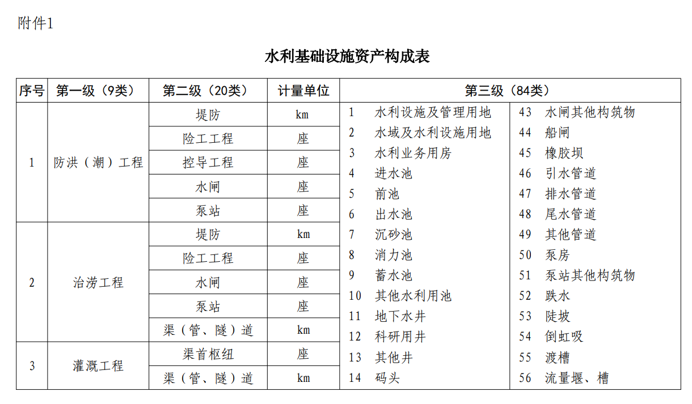
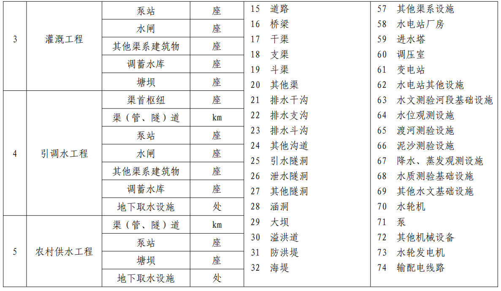
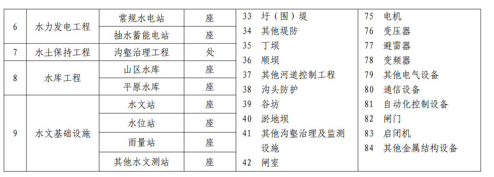
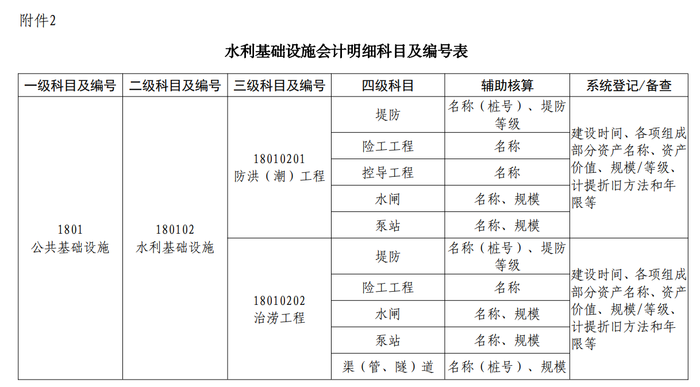
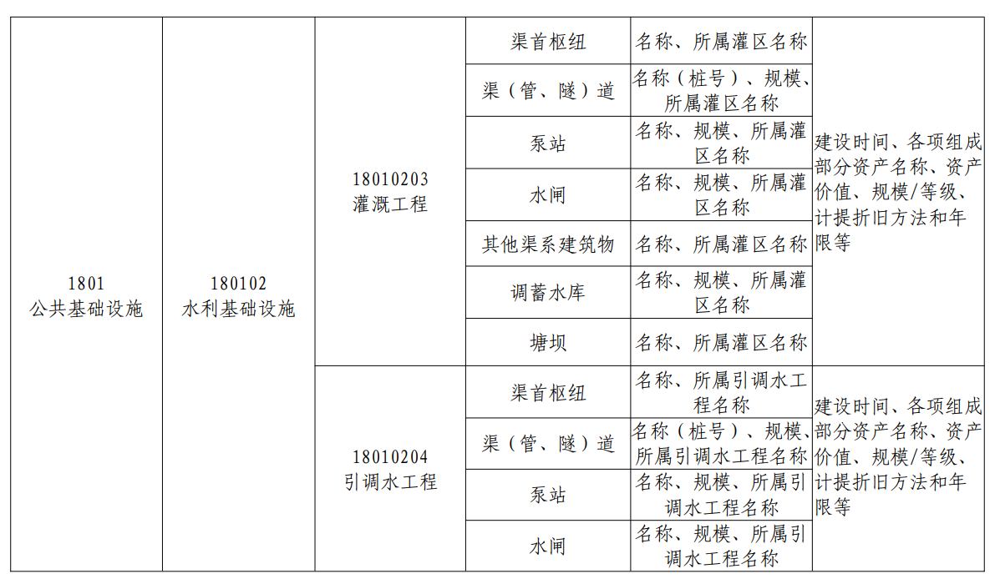
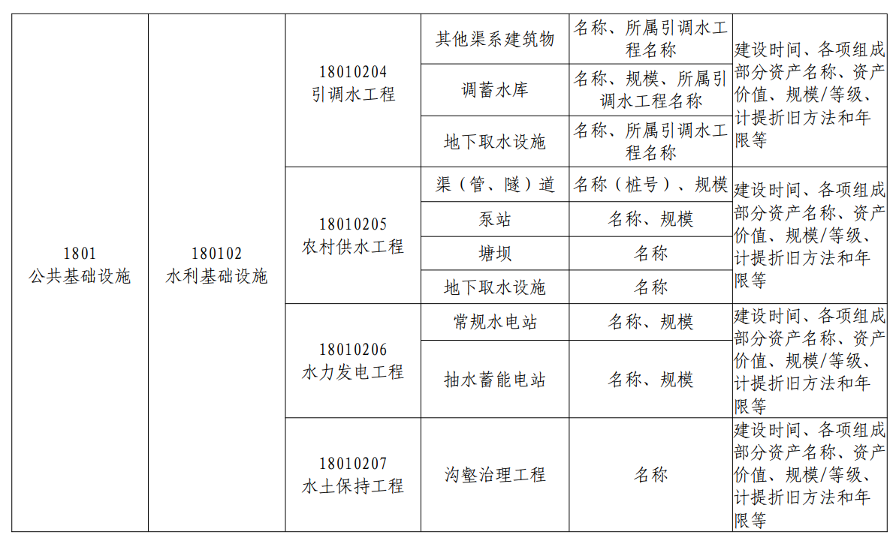
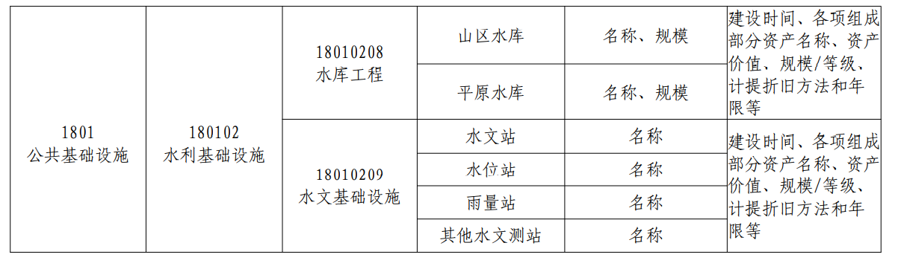

# 关于进一步加强水利基础设施政府会计核算的通知

 财会〔2021〕29号

各省、自治区、直辖市、计划单列市财政厅（局）、水利（水务）厅（局），新疆生产建设兵团财政局、水利局，水利部直属各单位：

为了确保政府会计准则制度在水利行业全面有效实施，根据《政府会计准则第5号——公共基础设施》（财会〔2017〕11号，以下简称5号准则）、《政府会计准则第10号——政府和社会资本合作项目合同》（财会〔2019〕23号，以下简称10号准则）、《政府会计制度——行政事业单位会计科目和报表》（财会〔2017〕25号，以下简称《政府会计制度》）和《财政部关于进一步做好政府会计准则制度新旧衔接和加强行政事业单位资产核算的通知》（财会〔2018〕34号）等规定，结合水利行业实际，现就进一步加强水利基础设施政府会计核算有关事项通知如下： 

## 一、总体要求

水利基础设施是国有资产的重要组成部分，是我国经济社会发展的有力基础支撑。科学合理确认、计量、记录和报告水利基础设施资产，对加强水利基础设施资产管理，使水利基础设施更好服务发展、造福人民具有重要意义。各级财政部门和水行政主管部门必须坚持以习近平新时代中国特色社会主义思想为指导，紧紧围绕权责发生制政府综合财务报告制度改革的总体目标和任务，扎实推进水利基础设施政府会计核算，进一步全面完整反映政府水利基础设施“家底”，夯实政府财务报告和行政事业性国有资产报告的核算基础，为推动新阶段水利高质量发展提供基础保障。

## 二、关于水利基础设施的界定

本通知所称的水利基础设施，是指各级水行政主管部门及其所属事业单位（以下简称水利行政事业单位）为满足社会公共防洪（潮）、治涝、供水、灌溉、发电等方面需求而控制的，持续提供公共服务的水利工程全部或部分有形资产。

下列各项不属于本通知所称的水利基础设施：

1.独立于水利基础设施、不构成水利基础设施使用不可缺少组成部分的管理用房屋建筑物、设备、车辆和船只等。

2.不再提供公共服务的水利工程。

3.为改善水利工程周边环境，提升景观效果而控制的水景观及绿化工程。

水利基础设施的会计核算应当遵循5号准则、财会〔2018〕34号文件和《政府会计制度》等规定。但是，列入文物文化遗产的水利基础设施，其会计核算适用政府会计准则制度中关于文物文化资产的相关规定；采用政府和社会资本合作模式（即PPP模式）形成的水利基础设施，其会计核算适用10号准则及其应用指南。

对于已经作为水利基础设施核算、但不属于本通知界定的水利基础设施的相关资产，应当在2022年1月1日将其重分类为固定资产、其他类别的公共基础设施等。

## 三、关于水利基础设施的记账主体

各级水利行政事业单位应当根据水利基础设施管理体制，按照“谁承担管理维护职责，由谁记账”的原则，并结合直接承担后续支出责任情况，合理确定水利基础设施的记账主体。

由多个水利行政事业单位共同管理维护的水利基础设施，应当由对该资产负有主要管理维护职责或者承担后续主要支出责任的水利行政事业单位作为记账主体予以确认。分为多个组成部分由不同水利行政事业单位分别管理维护的水利基础设施，应当由各个水利行政事业单位作为记账主体分别对其负责管理维护的水利基础设施的相应部分予以确认。负有管理维护水利基础设施职责的水利行政事业单位通过政府购买服务方式委托企业或其他会计主体代为管理维护水利基础设施的，该水利基础设施应当由委托方作为记账主体予以确认。

相关记账主体对水利基础设施的确认应当协调一致，确保资产确认不重复、不遗漏。

对于已按财会〔2018〕34号文件有关规定入账的存量水利基础设施，其记账主体与上述规定不一致的，应当自2022年1月1日起根据本通知规定予以调整。记账主体按规定增加水利基础设施的，借记“公共基础设施——水利基础设施”科目，贷记“累计盈余”科目；按规定减少水利基础设施的，做相反的会计分录。

## 四、关于水利基础设施的构成

按照水利工程功能，水利基础设施包括防洪（潮）工程、治涝工程、灌溉工程、引调水工程、农村供水工程、水力发电工程、水土保持工程、水库工程和水文基础设施等9大类。

按照单体工程特征，水利基础设施包括堤防、险工工程、控导工程、水闸、泵站、渠（管、隧）道、渠首枢纽、其他渠系建筑物、调蓄水库、塘坝、地下取水设施、常规水电站、抽水蓄能电站、沟壑治理工程、山区水库、平原水库、水文站、水位站、雨量站和其他水文测站等20小类。

防洪（潮）工程是为控制或抗御洪水以减免洪灾损失而修建的各种工程，包括堤防、险工工程、控导工程、水闸、泵站等，不含防洪水库。

治涝工程是为排除涝区内多余降水，防治涝灾发生而修建的各种工程，包括堤防、险工工程、水闸、泵站、渠（管、隧）道等。

灌溉工程是从水源取水并输送、分配到田间的整体灌溉设施，包括渠首枢纽、渠（管、隧）道、泵站、水闸、其他渠系建筑物（渡槽、倒虹吸、陡坡、跌水等）、调蓄水库（总库容≥10万m3）、塘坝等。

引调水工程是为满足供水、灌溉、生态需水要求，兴建的跨水系、跨区域的水资源配置工程，包括渠首枢纽、渠（管、隧）道、泵站、水闸、其他渠系建筑物、调蓄水库（总库容≥10万m3）、地下取水设施等。

农村供水工程是向农村的乡镇、村庄等居民点和分散农户供给生活和生产等用水，以满足村镇居民、企事业单位日常用水需要为主的集中式供水工程，包括渠（管、隧）道、泵站、塘坝、地下取水设施等。

水力发电工程是为开发利用水能资源，将水能转换为电能而修建的工程建筑物和机械、电气设备以及金属结构的综合体，包括常规水电站、抽水蓄能电站等。

水土保持工程是为防治水土流失，保护、改良与合理利用水土资源，改善生态环境所采取的工程措施，包括沟壑治理工程等。

水库工程是在河道、山谷或低洼地带修建挡水坝或堤堰形成的具有拦洪蓄水和调节水流功能的总库容大于等于10万m3的水利工程，包括山区水库、平原水库等，不包括灌溉工程、引调水工程中的调蓄水库。

水文基础设施是为满足水文生产所必须建设的设施，包括水文站、水位站、雨量站、其他水文测站（蒸发站、墒情站等）等。

对于堤防、水闸、泵站、渠道等单体工程，应根据单体工程发挥的功能作用列入相应功能分类。对于发挥多个功能的单体工程，如灌排结合的泵站，根据其发挥的主要功能确定所属类别。

水利基础设施资产构成见附件1。

## 五、关于水利基础设施的明细核算

各记账主体应当以水利基础设施构成为基本依据，按照水利基础设施的功能类别和单体工程特征进行明细核算，同时按照单体工程的名称、规模等进行辅助核算。各记账主体在做好水利基础设施明细核算的同时，还应当按照资产管理有关规定，做好资产管理系统登记或备查簿登记，按照规定的水利公共基础设施资产信息卡样式登记资产信息卡。

各记账主体可以根据管理需要增加明细核算层级，按照单体工程资产组成部分等进行明细核算。

水利基础设施会计明细科目及编号见附件2。

对于已按财会〔2018〕34号文件有关规定入账的存量水利基础设施，其明细核算与上述要求不一致的，应当在2022年1月1日按照本通知规定予以调整。

属于文物文化资产的水利基础设施和采用PPP模式形成的水利基础设施，其明细核算可以参照本通知执行。

## 六、关于水利基础设施的初始计量

（一）水利基础设施初始计量的原则。

对于2019年1月1日起新增的水利基础设施，应当按照5号准则的规定进行初始计量。原已记入固定资产的水利基础设施，应当按照规定将其重分类为水利基础设施。

对于其他尚未入账的水利基础设施，应当按照财会〔2018〕34号文件有关规定进行初始计量。其中，对于在2002年原《基本建设财务管理规定》【注：《基本建设财务管理规定》（财建〔2002〕394号）已于2016年《基本建设财务规则》（财政部令第81号）施行后废止】施行之后办理竣工财务决算的，一般应当按照其初始购建成本入账；对于建设年代久远（截至2019年年初至少已使用50年）、其初始购建有关的原始凭据已不可考的水利基础设施，在原《基本建设财务管理规定》施行之后经过改扩建或大型修缮的，可以按照改扩建或大型修缮的成本入账，但应当在财务报表附注中对相关情况进行披露。

分属于不同记账主体的同一水利基础设施，初始入账成本的确定应当采用一致的会计政策。

对于已按财会〔2018〕34号文件有关规定入账的存量水利基础设施，无需根据本通知规定对其初始入账成本进行调整。

（二）初始购建成本的确定。

水利基础设施的初始购建成本，应当按照5号准则、财会〔2018〕34号文件等政府会计准则制度的有关规定确定。

水利基础设施建设项目实行项目法人责任制和资本金制度的，各级水利行政事业单位为建造水利基础设施发生的过渡性融资利息、初步设计审查费、概算评审费、安全风险评估费等，属于工程项目建设期间发生的，计入水利基础设施的成本；不属于建设期间发生的，计入当期费用。

（三）重置成本标准的确定。

以重置成本作为初始入账成本的存量水利基础设施，其重置成本标准应当按照以下权限确定：

中央级流域管理机构承担管理维护职责的水利基础设施重置成本标准，由国务院水行政主管部门负责制定。省内跨行政区划的水利基础设施重置成本标准，由省级水行政主管部门负责制定。省(自治区、直辖市)以下区域内的水利基础设施重置成本标准，由省级水行政主管部门负责明确制定单位。在确定重置成本标准时，可以聘请会计师事务所等中介机构参与。

2022年6月30日之前，负责制定重置成本标准的部门和单位应当以适当方式公布相关水利基础设施的重置成本标准。

（四）重置成本标准参考因素。

确定存量水利基础设施重置成本时，应当以定额标准为基础，重点考虑以下因素：

堤防应主要参考工程级别、结构类型、规模；

险工工程应主要参考结构类型、规模；

控导工程应主要参考结构类型、规模；

水闸应主要参考工程等别、规模、地质条件；

泵站应主要参考工程等别、规模、地质条件；

渠（管、隧）道应主要参考结构类型、过（输）水能力、规模；

渠首枢纽应主要参考结构类型、规模；

其他渠系建筑物应主要参考结构类型、规模；

水库（含调蓄水库、山区水库、平原水库）应主要参考工程等别、结构类型、地形条件、地质条件、规模；

塘坝应主要参考结构类型、规模；

地下取水设施应主要参考规模、地质条件；

常规水电站应主要参考工程等别、结构类型、规模；

抽水蓄能电站应主要参考工程布置、工程等别、结构类型、规模；

沟壑治理工程应主要参考结构类型、规模；

水文测站（含水文站、水位站、雨量站、其他水文测站）应主要参考水文测站级（类）别、规模。

各记账主体应当按照财会〔2018〕34号文件的有关规定，结合水利基础设施具体数量（如长度、面积等）、成新率及重置成本标准等因素，计算确定水利基础设施的入账成本。

## 七、关于水利基础设施的折旧

在国务院财政部门对水利基础设施折旧（摊销）年限作出规定之前，各记账主体在水利基础设施首次入账时暂不考虑补提折旧（摊销），初始入账后也暂不计提折旧（摊销）。

各记账主体在本通知发布前已经核算水利基础设施且计提折旧（摊销）的，可继续沿用之前的折旧（摊销）政策。

## 八、关于组织保障

（一）提高政治站位，严格责任落实。

各级财政部门、水行政主管部门要提高政治站位，充分认识水利基础设施入账的重要意义，高度重视水利基础设施的会计核算工作，要切实加强组织领导，建立健全工作机制，制定实施方案，细化分解目标任务，明确各有关部门分工和责任，有序推进水利基础设施入账工作。各记账主体要切实担负起主体责任，明确工作方案，充实会计人员，落实工作责任，确保认识到位、组织到位、人员到位，并于2022年12月31日之前按照政府会计准则制度及本通知规定将存量水利基础设施纳入政府会计核算。

（二）加强业务指导，做好沟通协调。

各地财政部门、水行政主管部门要根据本通知精神，结合地方实际，完善各项工作流程，研究制定地方水利基础设施会计核算实施细则。要加强沟通、强化协同、形成合力，加强对下级行政事业单位开展水利基础设施会计核算工作的指导，督促各有关记账主体在组织开展水利基础设施专项资产清查的基础上，加强水利基础设施资产系统基础信息管理，及时、有效做好水利基础设施入账工作。鼓励各地方创新工作方式，探索建立健全政府会计核算考核机制，推动考核评价结果应用。

（三）强化宣传贯彻实施，做好培训工作。

各地财政部门、水行政主管部门要积极做好水利基础设施政府会计核算工作的政策解读和宣传贯彻培训工作，形成自上而下推动水利基础设施政府会计核算的良好氛围。要积极采取各种方式拓宽培训渠道，推动培训工作直达基层，使会计及相关人员及时、全面地掌握政府会计准则制度的各项规定和具体要求，切实提高业务素质和管理水平，确保水利基础设施政府会计核算工作落到实处、见到实效。

附件：1.水利基础设施资产构成表

​            2.水利基础设施会计明细科目及编号表

  财政部   水利部

​                               2021年12月3日

## 附件：1.水利基础设施资产构成表

## 附件2.水利基础设施会计明细科目及编号表

