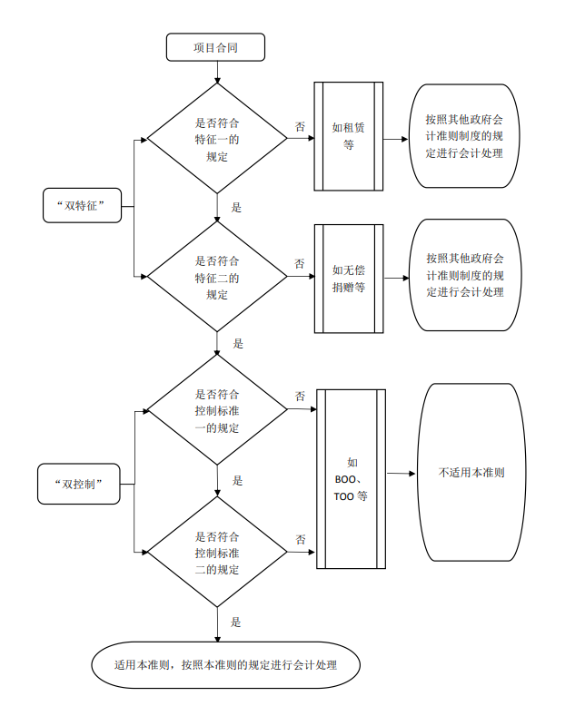

# 《政府会计准则第 10 号——政府和社会资本合作项目合同》应用指南

[TOC]

##  一、关于《政府会计准则第 10 号——政府和社会资本合作项目合同》（以下简称本准则）适用范围的判断

（一）适用本准则的情形。

本准则主要规范了政府方对依法依规签订的PPP 项目合同的确认、计量和相关信息的列报。

本准则所指的政府方，是指政府授权或指定的 PPP 项目实施机构，通常为政府有关职能部门或事业单位。对于由多级政府跨区域或本级政府跨部门共同实施的 PPP 项目合同， 应当根据合同约定确定具体的政府会计主体。

本准则所指的 PPP 项目合同应同时具有如下两个特征（以下简称“双特征”）：（1）社会资本方在合同约定的 运营期间内代表政府方使用PPP 项目资产提供公共产品和服务（以下简称特征一）；（2）社会资本方在合同约定的期 间内就其提供的公共产品和服务获得补偿（以下简称特征 二）。

本准则适用于符合“双特征”要求，同时满足如下“双控制”标准的 PPP 项目合同：（1）政府方控制或管制社会资本方使用PPP 项目资产必须提供的公共产品和服务的类型、对象和价格（以下简称控制标准一）；（2）PPP 项目合同终止时，政府方通过所有权、收益权或其他形式控制 PPP 项目资产的重大剩余权益（以下简称控制标准二）。

采用建设-运营-移交（BOT）、转让-运营-移交（TOT）、 改建-运营-移交（ROT）方式运作的 PPP 项目合同，通常情况下同时满足“双特征”与“双控制”标准，适用本准则。采用建设-拥有-经营-移交（BOOT）、委托运营（O&M）等其他运作方式的项目合同，同时满足“双特征”、“双控制” 标准的，也适用本准则。

政府方应当按照图 1 所示来判断确定本准则的适用范围。

图 1 本准则适用范围判断流程

（二）不适用本准则的情形。

项目合同未同时满足“双特征”、“双控制”标准的， 不适用本准则，包括但不限于以下情形：

**1. 不满足“双特征”的情形。**

（1） 政府方作为出租人的租赁合同，因承租方虽然可能使用项目资产提供公共产品和服务，但并非代表政府方来提供，不满足特征一的规定，不适用本准则。对于租赁合同， 政府方应当按照其他政府会计准则制度的规定进行会计处理。

（2） 政府方作为接受捐赠方的无偿捐赠合同，因捐赠 方未获得补偿，不满足特征二的规定，不适用本准则。政府方接受捐赠取得的资产，应当按照其他政府会计准则制度的规定进行会计处理。

**2. 满足“双特征”，但不满足“双控制”标准的情形。**

（1） 采用建设-拥有-运营（BOO）方式的项目合同，社 会资本方拥有项目资产所有权，且政府方未控制项目资产的重大剩余权益，不满足“双控制”标准，不适用本准则。

（2） 采用转让-拥有-运营（TOO）方式的项目合同，政府方将项目资产所有权有偿转让给社会资本方，并由社会资本方负责运营和维护，政府方未控制项目资产的重大剩余权益，不满足“双控制”标准，不适用本准则。政府方转让资产时应当按照其他政府会计准则制度的规定进行会计处理。

## 二、关于本准则第二条“双特征”的说明

（一）关于“合同约定的运营期间”，指的是社会资本 方对 PPP 项目资产的使用期或运营期，通常在PPP 项目合同中有明确约定。

（二）关于“社会资本方代表政府方使用PPP 项目资产提供公共产品和服务”，指的是根据合同约定或政府方授权， 社会资本方享有建设、运营、管理、维护本项目设施等权利， 同时承担代表政府方提供公共产品和服务的义务。

（三）关于“社会资本方就其提供的公共产品和服务获得补偿”，指的是社会资本方就其在运营期内运营或维护项目资产等按照合同约定获得回报。

## 三、关于本准则第三条“双控制”标准的说明

（一）关于控制标准一的说明。

1. 关于“控制”，指的是政府方通过具有法律效力的合 同条款等方式，有权决定社会资本方提供的公共产品和服务的类型、对象和价格。通常情况下，政府方和社会资本方在PPP 项目合同中应当明确规定社会资本方提供的公共产品和服务的类型、对象和价格。

2. 关于“管制”，是指社会资本方提供的公共产品和服 务的类型、对象和价格，虽未在PPP 项目合同中进行明确规定，但受有关法律法规或监管部门规章制度的约束。

3. 如果定价的基础或框架受到监管约束，政府方对价格 的“控制或管制”不需要完全控制价格，这种情况仍然符合控制标准。如设定政府调价机制，进行调价前应当经过政府 方审核同意，即满足控制标准一的价格控制要求。如果项目合同条款给予社会资本方自主定价权，但约定政府方有权参与分享PPP 项目资产的超额收益部分，则仍然满足控制标准一中的价格控制要求。

（二）关于控制标准二的说明。

控制标准二中的“重大剩余权益”，指的是PPP 项目合同终止时，在项目资产剩余使用寿命内使用、处置该项目资 产所能获得的权益。政府方对“重大剩余权益”的控制具体表现为以下两种情形：

1. PPP 项目合同终止时，社会资本方应当将项目资产移交给政府方，且移交的项目资产预期仍能为政府方带来经济利益流入或者产生服务潜力。

2. 政府方能够通过合同条款限制社会资本方处置或抵 押项目资产，保障重大剩余权益不受损害。

（三）“双控制”标准的应用。

**1.关于项目资产更新改造时“双控制”标准的应用。**

在合同约定的运营期间，对不可分离的项目资产进行更

新改造的（包括更换部分设施设备），应当将更新改造前后 的项目资产视为一个整体来考虑。如果政府方控制了更新改造后项目资产的重大剩余权益，则项目合同仍然适用本准则。 

**2.关于项目资产部分受政府方控制时“双控制”标准的应用。**

项目资产部分受政府方控制的，分为以下两种情况：

（1） 项目资产在功能设置和空间分布上可分割且能独 立运营的，应当单独进行分析。如果政府方不能控制该部分 资产，则该部分资产不适用本准则。

（2） 使用 PPP 项目资产提供不受政府方控制的辅助性服务，并不减损政府方对 PPP 项目资产的控制，在应用“双控制”标准时不应当考虑该项服务。

**3.关于运营期占项目资产全部使用寿命时“双控制”标 准的应用。**

对于运营期占项目资产全部使用寿命的项目合同，即使项目合同结束时项目资产不存在重大剩余权益，如果该项目合同满足前述“双控制”标准中的控制标准一，则仍然适用 本准则。

## 四、关于本准则第二十条“政府方承担向社会资本方支付款项的义务”的说明

本准则第二十条规定，按照 PPP 项目合同约定，政府方承担向社会资本方支付款项义务的，相关义务应当按照《政 府会计准则第 8 号——负债》有关规定进行会计处理，会计处理结果不影响 PPP 项目资产及净资产的账面价值。政府方按照《政府会计准则第 8 号——负债》有关规定确认负债的， 应当同时确认当期费用，在以后期间支付款项时，相应冲减负债的账面余额。

按照我国PPP 有关规章制度规定，规范的PPP 项目应建立按效付费机制，不得通过降低考核标准等方式，提前锁定、 固化政府支出责任。因此，本准则中“政府方承担的向社会资本方支付款项的义务”，是指在项目运营期的每一个会计期间内，当社会资本方提供的公共产品或服务满足合同约定的绩效考核要求时，政府方根据合同约定按期应向社会资本方进行补偿的义务。对于这种义务的会计处理，分为以下两种情况：（1）政府方在义务发生的当期及时向社会资本方支付款项的，在支付款项时确认当期费用，同时在预算会计中确认预算支出。（2）政府方在义务发生的当期未及时向社会资本方支付款项的，应当按照应付未付的金额确认当期费用和负债（应付账款等）；在后续实际支付款项时冲减负债的账面余额，同时在预算会计中确认预算支出。

对于 PPP 项目合同中政府承担的法律风险、政策风险以及因政府方原因导致项目合同终止的违约风险等，不属于政府方应承担的现时义务，不满足负债的确认条件。但是，当 相关事项发生，政府方承担的潜在义务转化为现时义务，满足预计负债的确认条件时，政府方应当按照其他政府会计准则制度的相关规定进行会计处理。

## 五、关于会计科目设置及主要账务处理

（一）应增设的会计科目。

1. 政府方应当设置“1841 PPP 项目资产”一级科目，核算按照本准则规定确认的 PPP 项目资产，并按照资产类别、项目等进行明细核算。本科目的期末借方余额，反映 PPP 项目资产的账面余额。

2. 政府方应当设置“1842 PPP 项目资产累计折旧（摊销）”一级科目，核算按照本准则规定计提的PPP 项目资产累计折旧（摊销），并按照资产类别、项目等进行明细核算。本科目期末贷方余额，反映政府方计提的 PPP 项目资产折旧（摊销）的累计数。

3. 政府方应当设置“3601 PPP 项目净资产”一级科目， 核算按照本准则规定所确认的 PPP 项目净资产。本科目的期末贷方余额，反映 PPP 项目净资产的账面余额。

（二）主要账务处理。

**1.PPP 项目资产取得时的账务处理。**

（1） 社会资本方投资建造形成的 PPP 项目资产，政府方应当在资产验收合格交付使用时，按照确定的成本（包括 该项资产自建造开始至验收合格交付使用前所发生的全部 必要支出），借记“PPP 项目资产”科目，贷记“PPP 项目净资产”科目。

对于已交付使用但尚未办理竣工财务决算手续的PPP 项目资产，政府方应当按暂估价值，借记“PPP 项目资产”科目，贷记“PPP 项目净资产”科目；待办理竣工财务决算后， 政府方应当按照实际成本与暂估价值的差额，借记或贷记“PPP 项目资产”科目，贷记或借记“PPP 项目净资产”科目。

（2） 社会资本方从第三方购买形成的 PPP 项目资产， 政府方应当在资产验收合格交付使用时，按照确定的成本

（包括该项资产的购买价款、相关税费以及验收合格交付使用前发生的可归属于该项资产的运输费、装卸费、安装费和专业人员服务费等），借记“PPP 项目资产”科目，贷记“PPP 项目净资产”科目。

（3） 使用社会资本方现有资产形成的 PPP 项目资产， 政府方应当在PPP 项目开始运营日，按照该项资产的评估价值，借记“PPP 项目资产”科目，贷记“PPP 项目净资产” 科目。

（4） 使用政府方现有资产形成的 PPP 项目资产，无需进行资产评估的，政府方应当在PPP 项目开始运营日，按照该资产的账面价值，借记“PPP 项目资产”科目，按照资产已计提的累计折旧或摊销，借记“公共基础设施累计折旧（摊销）”等科目，按照资产的账面余额，贷记“公共基础设施” 等科目；按照相关规定需要进行资产评估的，政府方应当按照资产评估价值，借记“PPP 项目资产”科目，按照资产已计提的累计折旧或摊销，借记“公共基础设施累计折旧（摊销）”等科目，按照资产的账面余额，贷记“公共基础设施” 等科目，按照资产评估价值与账面价值的差额贷记“其他收入”科目或借记“其他费用”科目。

（5） 社会资本方对政府方原有资产进行改建、扩建形成的PPP 项目资产，政府方应当在资产验收合格交付使用时， 按照资产改建、扩建前的账面价值加上改建、扩建发生的支出，再扣除资产被替换部分账面价值后的金额，借记“PPP 项目资产”科目，按照资产改建、扩建前已计提的累计折旧或摊销，借记“公共基础设施累计折旧（摊销）”等科目， 按照资产的账面余额，贷记“公共基础设施”等科目，按照PPP 项目资产初始入账金额与原有资产账面价值的差额，贷记“PPP 项目净资产”科目。

**2. PPP 项目资产在项目运营期间的账务处理。**

（1） 对于为维护 PPP 项目资产的正常使用而发生的日常维修、养护等后续支出，不计入PPP 项目资产的成本。

（2） 对于为增加 PPP 项目资产的使用效能或延长其使用年限而发生的大修、改建、扩建等后续支出，政府方应当在资产验收合格交付使用时，按照相关支出扣除资产被替换部分账面价值的差额，借记“PPP 项目资产”科目，贷记“PPP 项目净资产”科目。

（3） 在 PPP 项目运营期间，政府方应当按月对 PPP 项目资产计提折旧（摊销）[^1]，但社会资本方持续进行良好维护使得其性能得到永久维护的PPP 项目资产除外。对于作为PPP 项目资产单独计价入账的土地使用权，政府方应当按照其他政府会计准则制度的规定进行摊销。

政府方初始确认的PPP 项目净资产金额等于PPP 项目资产初始入账金额的，按月计提 PPP 项目资产折旧（摊销）时， 应当按照计提的 PPP 项目资产折旧（摊销）金额，借记“PPP 项目净资产”科目，贷记“PPP 项目资产累计折旧（摊销）” 科目。

政府方初始确认的PPP 项目净资产金额小于PPP 项目资产初始入账金额的，按月计提 PPP 项目资产折旧（摊销）时， 应当按照计提的 PPP 项目资产折旧（摊销）金额的相应比例

（即PPP 项目净资产初始入账金额占PPP 项目资产初始入账金额的比例），借记“PPP 项目净资产”科目，按照计提的PPP 项目资产折旧（摊销）金额，贷记“PPP 项目资产累计折旧（摊销）”科目，按照当期计提的折旧（摊销）金额与所冲减的 PPP 项目净资产金额的差额，借记“业务活动费用” 等科目。

**3. PPP 项目合同终止时的账务处理。**

（1）  PPP 项目合同终止时，PPP 项目资产按规定移交至政府方的，政府方应当根据PPP 项目资产的性质和用途，将其重分类为公共基础设施等资产。无需对所移交的 PPP 项目资产进行资产评估的，政府方应当按移交日 PPP 项目资产的账面价值，借记“公共基础设施”等科目，按照已计提的累计折旧（摊销），借记“PPP 项目资产累计折旧（摊销）” 科目，按照 PPP 项目资产的账面余额，贷记“PPP 项目资产” 科目；按规定需要对所移交的 PPP 项目资产进行资产评估的， 政府方应当按照资产评估价值，借记“公共基础设施”等科目，按照已计提的累计折旧（摊销），借记“PPP 项目资产累计折旧（摊销）”科目，按照 PPP 项目资产的账面余额， 贷记“PPP 项目资产”科目，按照资产评估价值与 PPP 项目资产账面价值的差额，贷记“其他收入”科目或借记“其他费用”科目。

（2） PPP 项目合同终止时，政府方应当将尚未冲减完的 PPP 项目净资产账面余额转入累计盈余，即按 PPP 项目净资产的账面余额，借记“PPP 项目净资产”科目，贷记“ 累计盈余”科目。

**4. 其他相关业务的账务处理。**

对于上述规定中未明确的其他相关经济业务或事项，政府方应当按照其他政府会计准则制度的规定进行账务处理。

## 六、关于财务报表项目

**（一）关于资产负债表。**

1. 政府方应当在“保障性住房净值”和“长期待摊费用”项目之间依次增加“PPP 项目资产”、“减：PPP 项目资产累计折旧（摊销）”、“PPP 项目资产净值”项目。

2. 政府方应当在“权益法调整”项目和“无偿调拨净资 产”项目之间增加“PPP 项目净资产”项目。

**（二）关于净资产变动表。**

1. 政府方应当在“本年数”、“上年数”两栏中的“权 益法调整”和“净资产合计”项目之间增加“PPP 项目净资产”列项目。

2. 政府方应当在“（六）权益法调整”和“五、本年年 末余额”项目之间增加“PPP 项目净资产”行项目。

## 七、关于新旧衔接规定

（一）关于本准则首次执行时已入库的 PPP 项目合同。

对于符合本准则“双特征”和“双控制”标准且已纳入 全国 PPP 综合信息平台项目库的 PPP 项目合同，在本准则首次执行日，有关衔接规定如下：

1. 项目资产已由政府方确认为公共基础设施、固定资产等资产的，政府方应当按照所确认资产的账面价值，将其重分类为PPP 项目资产。具体进行账务处理时，按照资产的账面价值，借记“PPP 项目资产”科目，按照计提的累计折旧或摊销（如果有），借记“公共基础设施累计折旧（摊销）”、 “固定资产累计折旧”等科目，按照资产账面余额，贷记“公共基础设施”、“固定资产”等科目。

2. 项目资产未由政府方确认，但已由社会资本方确认的， 政府方应当按照社会资本方确认的资产账面原值，确认PPP 项目资产，同时确认 PPP 项目净资产。具体进行账务处理时， 按照确定的资产入账成本，借记“PPP 项目资产”科目，贷记“PPP 项目净资产”科目。

3. 政府方和社会资本方均未确认的项目资产，政府方应当及时确认入账，并按照以下原则确定其初始入账成本：可以取得相关原始凭据的，其成本按照有关原始凭据注明的金额确定；没有相关凭据可供取得，但按规定经过资产评估的， 其成本按照资产评估价值确定；没有相关凭据可供取得、也未经资产评估的，其成本按照重置成本确定。具体进行账务处理时，按照确定的资产入账成本，借记“PPP 项目资产” 科目，贷记“PPP 项目净资产”科目。

（二）关于本准则首次执行时未入库的特许经营项目协议。

对于符合本准则“双特征”和“双控制”标准但未纳入全国 PPP 综合信息平台项目库的特许经营项目协议，在本准则首次执行日，有关衔接规定如下：

1. 协议中不含提前锁定、固化政府支出责任等兜底条款的，在本准则首次执行日，政府方应当参照已入库项目的新旧衔接规定进行会计处理。

2. 协议中含有提前锁定、固化政府支出责任等兜底条款的，政府方应当按照《政府会计准则第 5 号——公共基础设施》、《政府会计准则第 8 号——负债》等准则规定，对政府方控制的公共基础设施及相应的负债进行会计处理。

（三）关于 PPP 项目资产折旧（摊销）政策规定。

在国务院财政部门对PPP 项目资产折旧（摊销）年限作出规定之前，政府方在 PPP 项目资产首次入账时暂不考虑补提折旧（摊销），初始入账后也暂不计提折旧（摊销）。

## 八、附则

本应用指南自 2021 年 1 月 1 日起施行。

[^1]: 在国务院财政部门对 PPP 项目资产折旧（摊销）年限作出规定之前，政府方对 PPP 项目资产暂不计提折旧。